Here's a list of the most useful shortcuts in CM - more graphical and intuitive than the built in shortcut list (Ribbon
Bar->View->Shortcuts).

[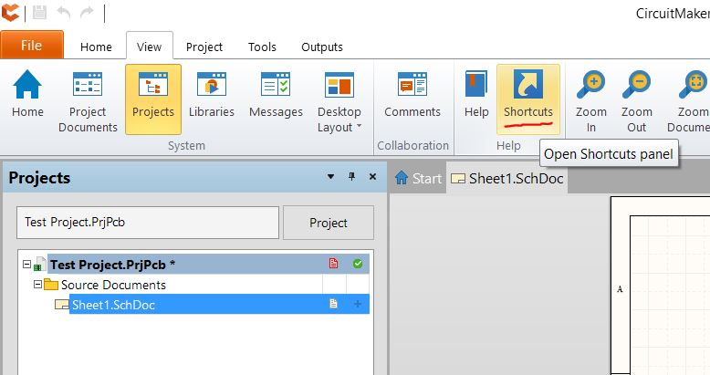](<shortcut-link.jpg>)_Above - Shortcut List Location_

Pro Tip: When the tools aren't working correctly, press ESC a few times.

## Schematic Shortcuts

| Crtl+Scroll | Zoom |  |
| --- | --- | --- |
| Center Button - Click Hold and Drag | Zoom |  |
| Pg Up/Down | Zoom (Great for laptops) |  |
| Right Button - Click Hold Drag | Pan |  |
| Ctrl+A | Select **A** ll | [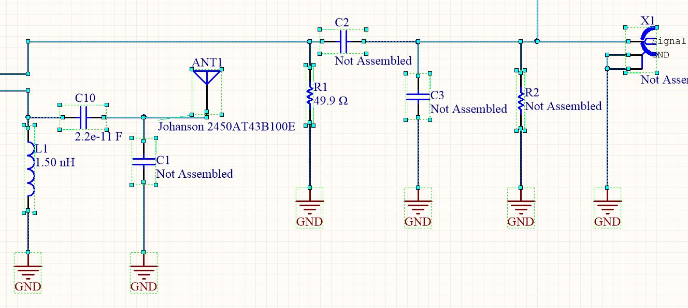](<sch-ctrl-a.jpg>) |
| Crtl+C | **C** opy |  |
| Ctrl+X | Cut |  |
| Ctrl+V | Paste |  |
| Ctrl+D | **D** uplicate | [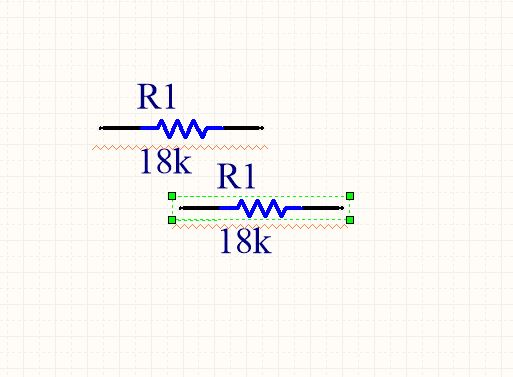](<sch-ctrl-d.jpg>) |
| W | **W** ire (for opening wiring tool) | [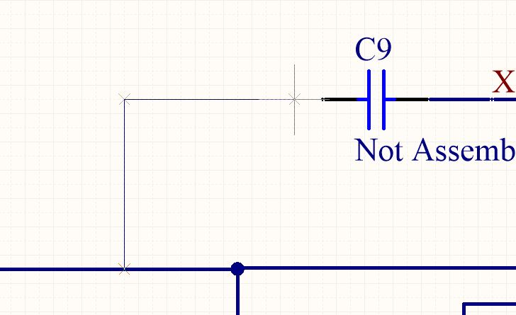](<sch-w.jpg>) |
| Space | Change Wiring Path - Only works when wiring | [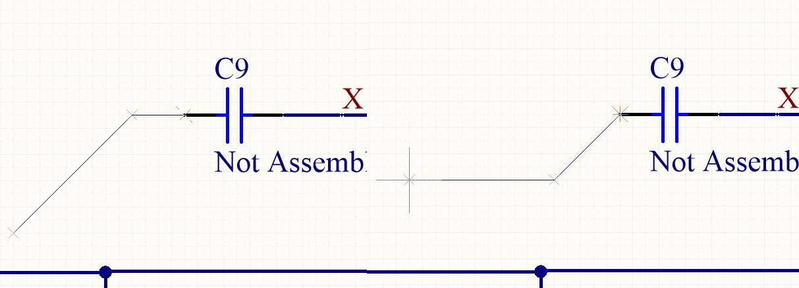](<sch-space-2.jpg>) |
| Shift+Space | Change Wiring Angles - Only works when wiring | [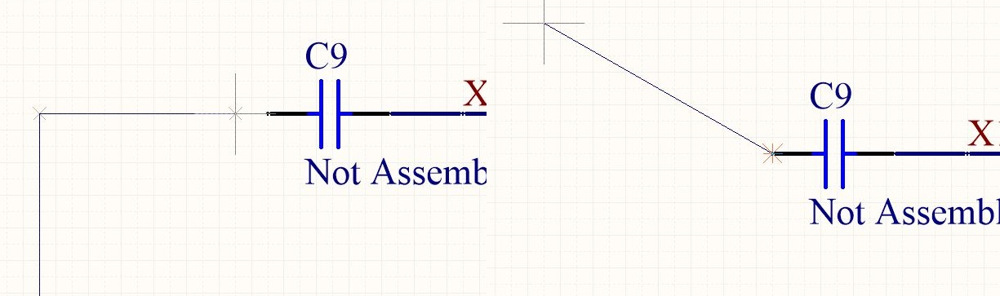](<sch-shift-space-3.jpg>) |
| Space | Rotate Selected Object | [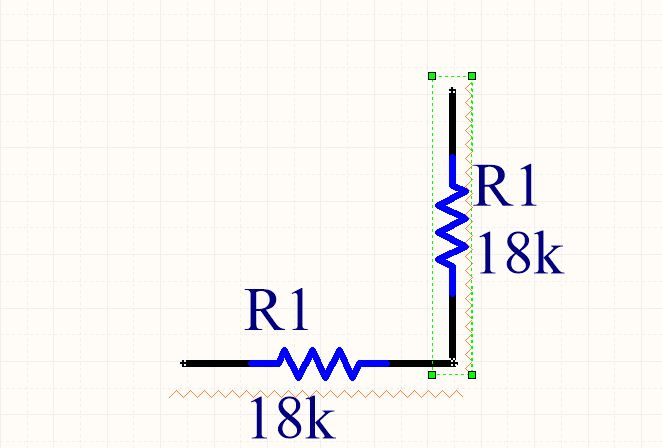](<sch-rotate.jpg>) |
| Tab or Double Click | Edit Properties of selected object | [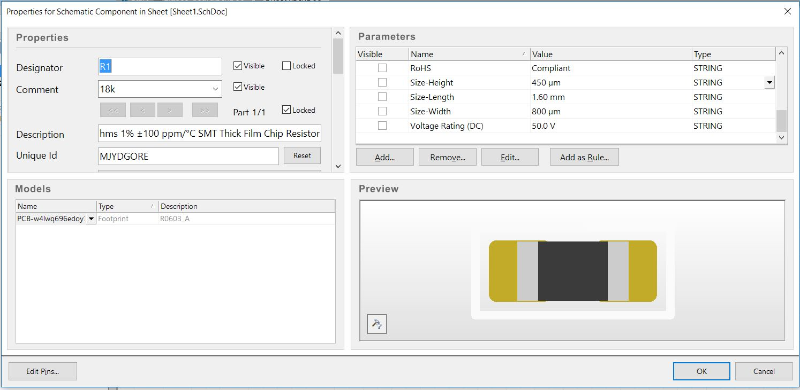](<sch-tab.jpg>) |
| G | Toggle **G** rid Size (look in bottom left-hand corner) | [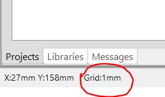](<sch-g.jpg>) |
| Z | Add Ground | [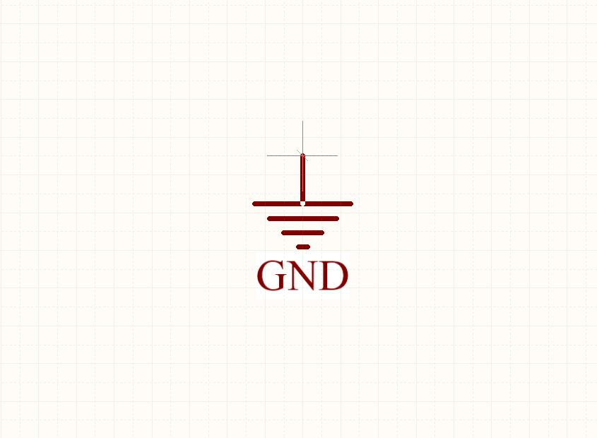](<sch-z.jpg>) |
| V | Add **V** CC (press TAB to quickly change net name) | [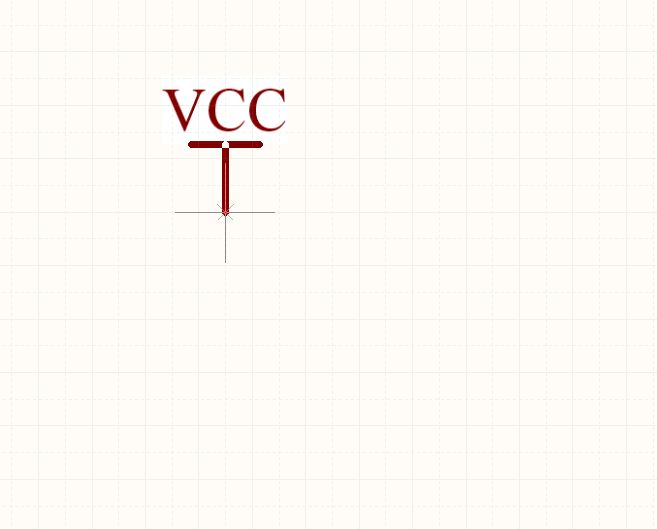](<sch-v.jpg>) |
| T | **T** ext (press TAB to change text) | [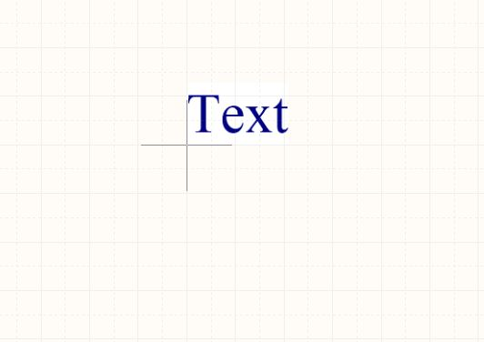](<sch-t.jpg>) |
| N | **N** et Label (press TAB to change text) | [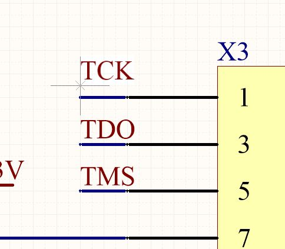](<sch-n.jpg>) |
| C | Place **C** omponent | [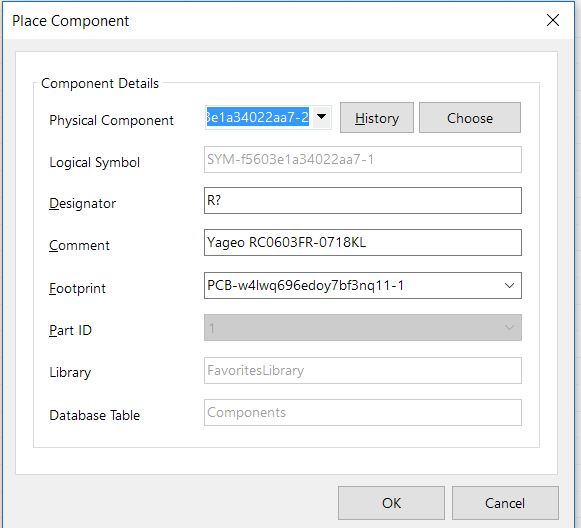](<sch-c.jpg>) |
| X | Flip left/right (**X** -Axis) |  |
| Y | Flip up/down (**Y** -Axis) |  |
| Esc | **E** xit Tool |  |
| Ctrl+Tab | Go to Next Tab | [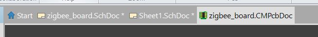](<sch-ctrl-tab.jpg>) |
| Ctrl+Shift+Tab | Go to Previous Tab |  |

## PCB Shortcuts

| Crtl+Scroll | Zoom |  |
| --- | --- | --- |
| Center Button - Click Hold and Drag | Zoom |  |
| Pg Up/Down | Zoom (Great for laptops) |  |
| Shift+Pg Up/Down | Precise Zoom (Great for laptops) |  |
| Right Button - Click Hold Drag | Pan |  |
| Esc | Exit Tool (so very useful) |  |
| Ctrl+A | Select All | [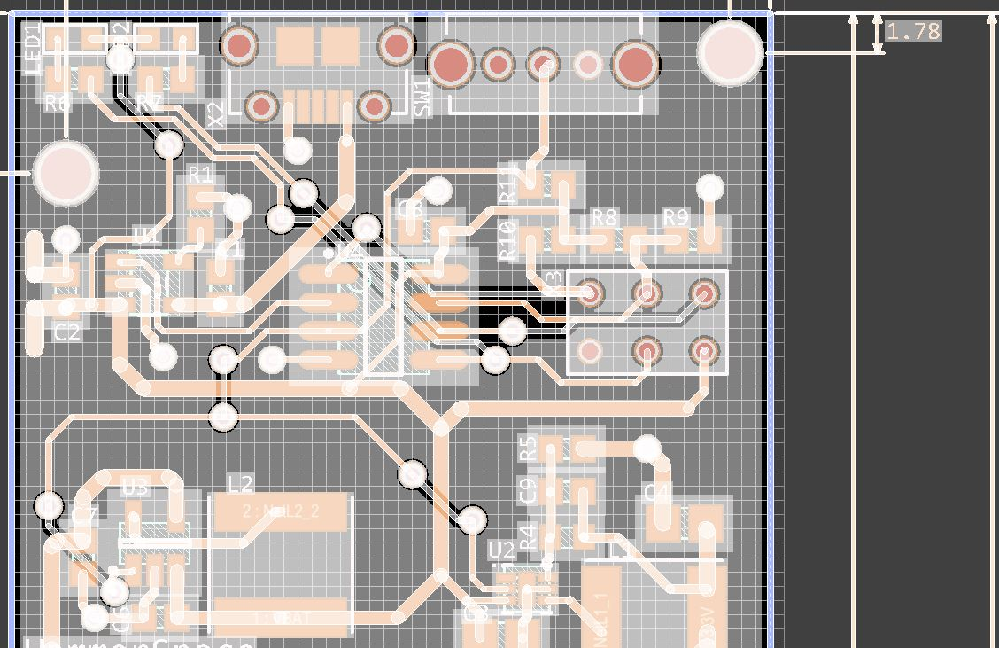](<pcb-ctrl-a.jpg>) |
| Crtl+C | Copy |  |
| Ctrl+X | Cut |  |
| Ctrl+V | Paste |  |
| R | Route Trace | [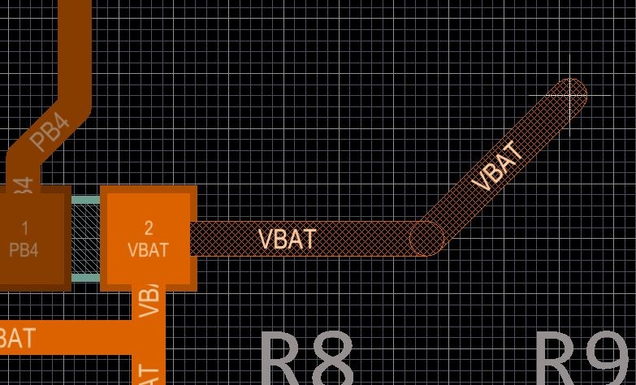](<pcb-r.jpg>) |
| Space | Change Routing Path - Only works when routing | [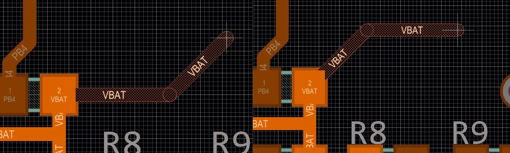](<pcb-space-2.jpg>) |
| Shift+Space | Change Routing Angles - Only works when routing | [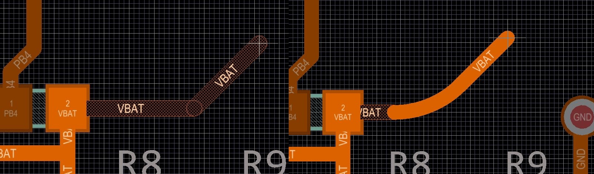](<pcb-shift-space-2.jpg>) |
| Space | Rotate Selected Object |  |
| G | Toggle Grid Size (look in bottom left-hand corner) | [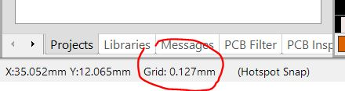](<pcb-g.jpg>) |
| Shift+S | Single Layer View (Toggle visibility of all layers except for the active layer) | [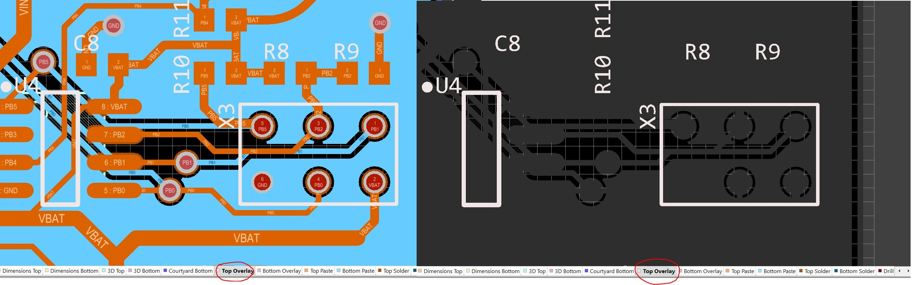](<pcb-shift-s-3.jpg>) |
| Backspace | Undo Trace Segements of selected trace | [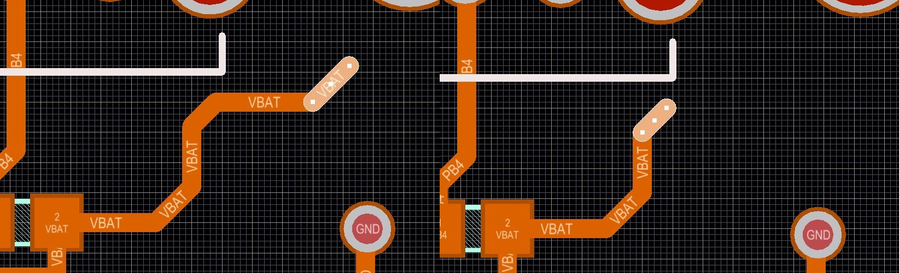](<pcb-backspace-3.jpg>) |
| Tab or Double Click | Edit Properties of selected object | [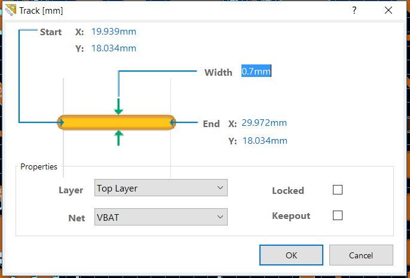](<pcb-tab.jpg>) |

Have a favorite not listed? Leave it in the comments below.
