While this is not my design, this is my analysis and derivations.

I used this in my [sound reactive lighting project](</blog/led-sound-reactor/>).  I had only one op-amp to spare for a
triangle wave generator, so I couldn't use the popular [two op-amp
design](<http://www.circuitstoday.com/triangular-wave-generator>).

For those who are not interested in the details, you can find the final formulas in an example [here](#example-design).

## Overview

[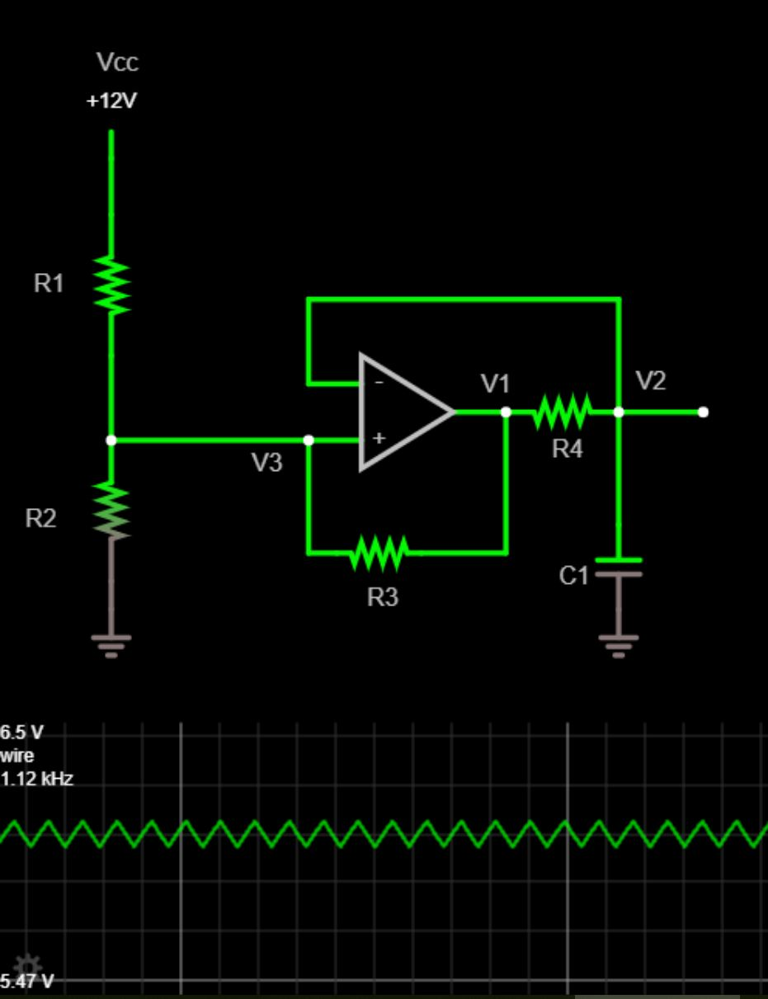](<triangle-wave-60.jpg>)

_view this circuit
simulation [here](<http://falstad.com/circuit/circuitjs.html?cct=$+17+0.000005+0.8031194996067259+65+5+50%0Aa+640+416+752+416+8+11.715+0+1000000+5.639494375233213+5.473682756038428+100000%0Ar+528+304+528+384+0+100000%0Ar+528+432+528+512+0+100000%0Ac+816+480+816+528+0+1.0000000000000001e-7+5.639494375233213%0Aw+528+304+528+272+0%0Aw+640+352+640+400+0%0Ar+656+496+704+496+0+520000%0Ar+752+416+816+416+0+24900%0Aw+640+432+528+432+0%0Aw+528+432+528+384+0%0Aw+640+432+640+496+0%0Aw+640+496+656+496+0%0Aw+704+496+752+496+0%0Aw+752+496+752+416+0%0Aw+816+416+816+480+0%0Aw+864+416+816+416+0%0Aw+640+352+816+352+0%0Aw+816+352+816+416+0%0Aw+528+512+528+528+0%0Ag+528+528+528+544+0%0Ag+816+528+816+544+0%0AR+528+272+528+240+0+0+40+12+0+0+0.5%0Ax+484+348+501+351+4+14+R1%0Ax+479+481+496+484+4+14+R2%0Ax+673+526+690+529+4+14+R3%0Ax+778+442+795+445+4+14+R4%0Ax+782+514+799+517+4+14+C1%0Ax+520+222+543+225+4+14+Vcc%0Ax+608+450+625+453+4+14+V3%0Ax+738+405+755+408+4+14+V1%0Ax+826+403+843+406+4+14+V2%0Ao+15+8+0+4362+10+0.1+0+2+15+3%0A>)_

**This single op-amp circuit uses positive feedback with hysteresis to create a square wave, which charges and discharges an RC circuit, which roughly produces a triangle wave.**

Before we begin, assume the op-amp is acting like an [ideal comparator](<https://en.wikipedia.org/wiki/Comparator>).
The highest voltage the comparator can output is VCC and the lowest is 0V.  These high and low output voltages are
determined by the power supply connected to the op amp (which isn't shown in the schematic).

Start at V1 .  For now, let's ignore R3 .  Currently, V1 is equal to VCC  - this voltage comes  from the comparator
output.  The output is VCC  because the noninverting input is greater than the inverting input.

Connected to the comparator output is R4 and C1 .  Together, they act as an
[integrator](<https://en.wikipedia.org/wiki/Passive_integrator_circuit>).  As the voltage on the capacitor ramps up, it
produces the up ramp of a triangle wave.  This triangle wave appears at V2.

As V2 is increasing, it eventually becomes greater than V3.  When this occurs, the comparator sees the inverting input
is now greater than the non-inverting input. Accordingly, the comparator switches its output from a high voltage (VCC)
to a low voltage (0V).  With a comparator output of 0V, C1 drains through R4 .  This produces the down ramp of a
triangle wave.

Eventually, V2 becomes less than V3 - the comparator output goes back up to VCC and the cycle repeats.

So far, we've ignored R3 .  However, it is a very important resistor.  It allows for the cyclic action by adding
[hysteresis](<https://en.wikipedia.org/wiki/Hysteresis>).  It affects the voltage V3.  We'll look at R3 in more detail
below.

## Hysteresis and R3

[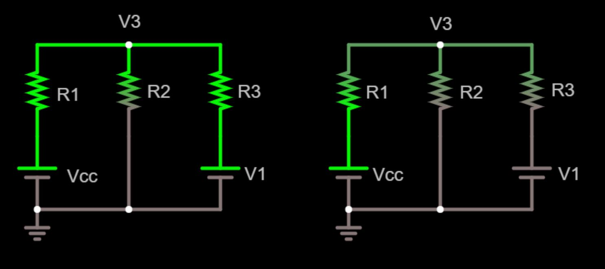](<triangle-wave-63.jpg>)

_Left: simplified diagram when comparator output is high (V1 = VCC )._

_Right: simplified diagram when comparator output is low (V1 = 0V)._

_View circuit
[here](<http://falstad.com/circuit/circuitjs.html?cct=$+16+0.000005+10.20027730826997+50+5+50%0Ar+32+224+32+144+0+1000%0Ar+112+224+112+144+0+1000%0Ar+192+224+192+144+0+1000%0Av+32+288+32+224+0+0+40+550+0+0+0.5%0Av+192+288+192+224+0+0+40+550+0+0+0.5%0Aw+32+288+112+288+0%0Aw+112+288+192+288+0%0Aw+112+224+112+288+0%0Aw+32+144+112+144+0%0Aw+112+144+192+144+0%0Aw+384+144+464+144+0%0Aw+304+144+384+144+0%0Aw+384+224+384+288+0%0Aw+384+288+464+288+0%0Aw+304+288+384+288+0%0Av+464+288+464+224+0+0+40+0+0+0+0.5%0Av+304+288+304+224+0+0+40+5+0+0+0.5%0Ar+464+224+464+144+0+1000%0Ar+384+224+384+144+0+1000%0Ar+304+224+304+144+0+1000%0Ag+32+288+32+304+0%0Ag+304+288+304+304+0%0Ax+58+264+84+267+4+16+Vcc%0Ax+49+193+69+196+4+16+R1%0Ax+128+190+148+193+4+16+R2%0Ax+207+190+227+193+4+16+R3%0Ax+401+191+421+194+4+16+R2%0Ax+481+189+501+192+4+16+R3%0Ax+319+191+339+194+4+16+R1%0Ax+213+262+232+265+4+16+V1%0Ax+487+262+506+265+4+16+V1%0A>)_

This simplified diagram shows all inputs for V3. In this diagram, we're simplified the comparator output (V1) as a
voltage source.  VCC , R1 , and R2 form a voltage divider where the divided voltage is V3 .  So does VCC , R3 , and R2.

When the comparator output V1 is high, the voltage at V3 increases.  This sets the upper threshold for the triangle
wave - the voltage the comparator's inverting input must reach in order to cause the comparator output to switch low (0V) and
begin the down ramp of the triangle wave.

When the output V1 is low, the voltage at V3 decreases.  This sets the lower threshold for the triangle wave - the
voltage the comparator's inverting input must reach to cause the comparator output to switch high (VCC) and begin the up
ramp of the triangle wave.

In short, R3 is adding hysteresis, making the triangle wave possible.  The amplitude of the wave depends on VCC, R1, R2,
R3, and the maximum voltage output swing of the op-amp.  We'll look at calculating this amplitude next.

## Determining Amplitude

Notice the way I set up the figure from the previous section.  It's ready for [Millman's
Theorem](<http://www.allaboutcircuits.com/textbook/direct-current/chpt-10/millmans-theorem/>).  It allows us to quickly
write the minimum and maximum voltages of the triangle waves:

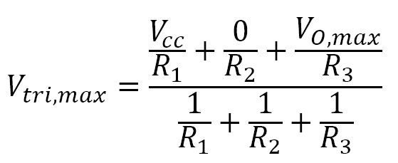

We won't be solving directly for Vtri,max or Vtri,min with these equations.   Let's introduce some more variables first:

- VO,max is the maximum output of the comparator (you can find this on the data sheet under Maximum Voltage Output
  Swing).  It is typically within 1 volt of VCC.

- VO,min is the minimum output of the comparator (you can find this on the
  data sheet under Minimum Voltage Output
  Swing).  It is typically within 1 volt of VEE.

- Vtri,amp is the desired amplitude (peak-to-peak voltage) of the
  triangle wave.  This is a value you choose.  It is
  equal to:

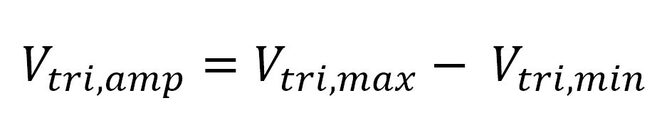

- Vtri,max is the maximum peak voltage of the triangle wave.  While this value won't be calculated for determining
  amplitude, we'll need it to determine frequency in the next section.

- Vtri,min is the minimum voltage of the triangle
  wave.  Like Vtri,max we will need this value to determine frequency.

Again, our goal is to solve for R3 . We can set the two equations from above equal to each other and get the following:

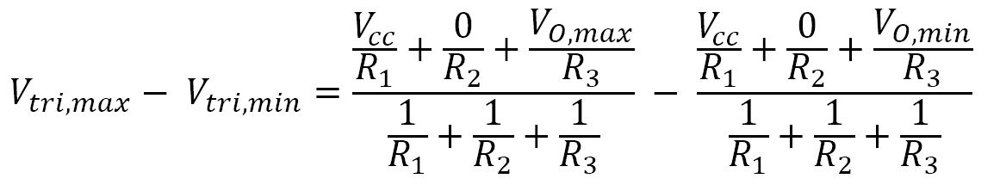

To further reduce this equation, we can set R1 equal to R2.  This is a fine assumption for 99% of applications.  We'll
also replace Vtri,max - Vtri,min with Vtri,amp .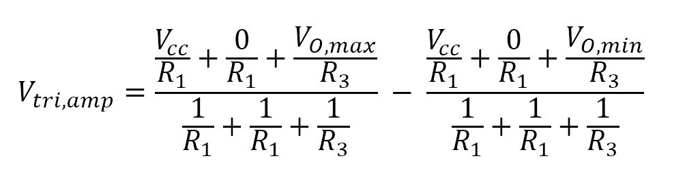

After reducing, we're left with the following formula:

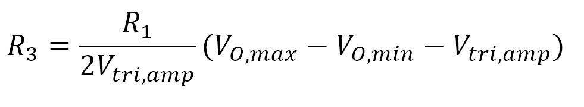

where all resistances are in ohms and voltages are in volts.

You choose the value of R1 in order to calculate R3 .  As it is a simple voltage divider, anything between 10 kΩ and 1
MΩ is fine.  In the example at the bottom of this page, I chose 100 kΩ.

## Determining Frequency

As mentioned early, the frequency is determined by the R4 and C1 integrator.  Our goal here will be to choose a value
for C1 then calculate R4 .

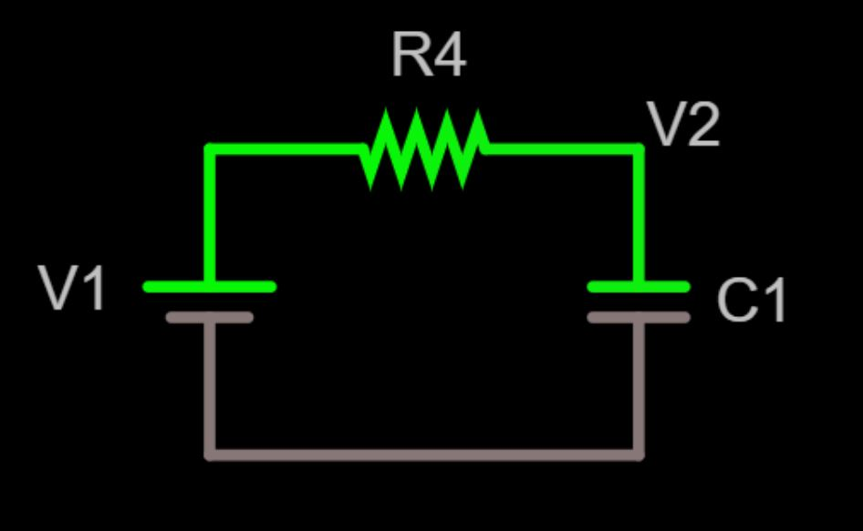

_simplified diagram of the RC section_

To determine the triangle wave frequency, we'll start with the [RC time
constant](<http://www.electronics-tutorials.ws/rc/rc_1.html>) equation: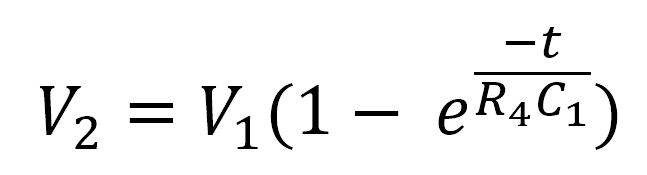

This is the formula for the rising section of the triangle wave.

Graphing the formula above as a function of time produces something like this:

[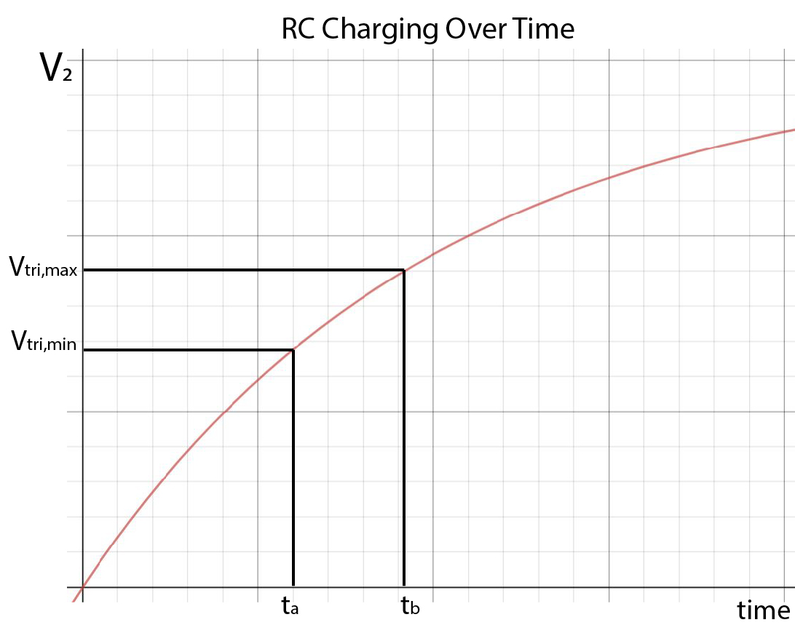](<triangle-wave-39.jpg>)

The graph above shows that Vtri,min occurs at time ta and Vtri,max occurs at time tb . The time from ta to tb is the
upramp of the triangle wave.

Vtri,min and Vtri,max will be needed to determine frequency.  Assuming R1 is equal to R2, we can calculate them with the
following formulas:

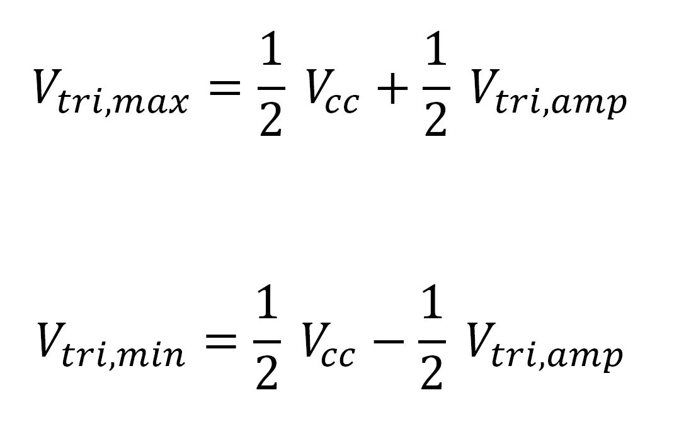

ta and tb don't need to be calculated.  However, what we need is Δt -  the time between ta and tb .  This Δt is one half
of the period, so we can express it in terms of frequency: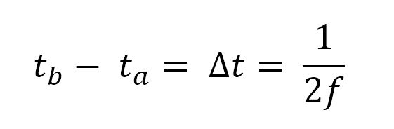

Notice the 2 in the denominator.  It's because we are calculating the up ramp of the triangle wave, which is only half
of a period.

We can create two equations.  One at time ta and another at time tb :

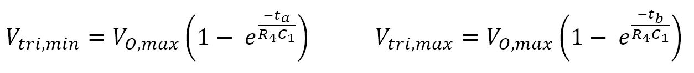

Rearranging in terms of t gives:

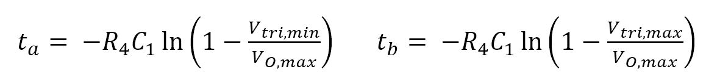

Subtracting these two equations from each other gives:

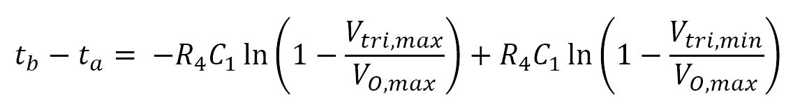

We now substitute tb - ta for frequency:

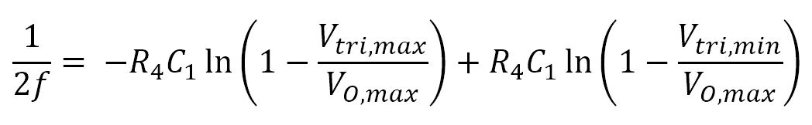

Solving for R4, we get: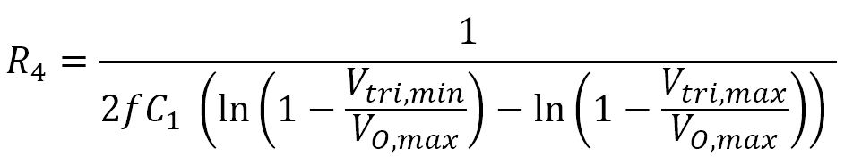

where f is the desired triangle-wave frequency.  Frequency is in Hz, capacitance is in farads, voltage in volts, and
resistance in ohms.

Note - you have to choose C1 first.  I recommend starting with 100nF.  See more details on this in the Example Design
section.

C2, R5 , R6 , and the output load will change the frequency.  As long as the output load is high impedance(100k+), the
frequency _shouldn't_ change more than 1%.

## Output Stage

If you want to remove DC bias from the output, then you'll need to add  a [coupling
capacitor](<http://www.learningaboutelectronics.com/Articles/What-is-a-coupling-capacitor>) on the output.

## Example Design

This is an example from my [Sound Reactor](/blog/led-sound-reactor/) project.

### Step 1 - Define Criteria

For this example, we'll use the following criteria:

- f = 1.1 kHz
- Vtri,amp  = 1 V
- VCC  = 12 V
- VO,max  = 11.715 V (this value came from the comparator datasheet when the comparator is powered by 12V.  I used the
  MC4558)
- VO,min  = 0.285 V (this value was from the comparator datasheet)

### Step 2 - Choose R1 = R2

R1 and R2 form a voltage divider.  I recommend anything in between 10 kΩ and 1 MΩ. Too low of a value will waste power.
Too high of a value will cause inaccurate results.  I chose R1 = R2 = 100 kΩ.

### Step 3 - Calculate R3

#### 

I calculated R3 = 521.5 kΩ, which is close to the standard 520 kΩ.

### Step 4 - Calculate Vtri,min and Vtri,max

This is an intermediate step to get values for R4 and C1 .

I calculated Vtri,min = 5.5 V and Vtri,max = 6.5 V.

### Step 5 - Calculate R4 and C1

Note - you have to choose C1 first.  The quick way is guess-and-check.  Guess a value for C1 and check if R4 is a
reasonable value.

I recommend starting with C1 = 100 nF.  If the resulting value of R4 is too high (>1 MΩ), choose a lower value for C1
and recalculate. If the resulting value of R4 is too low (<10 kΩ) choose a higher value for C1 and recalculate.

I started with C1 = 100 nF.  The calculation gave R4 = 25.9 kΩ.  I settled for an actual value of 24.9 kΩ.

### Results

### [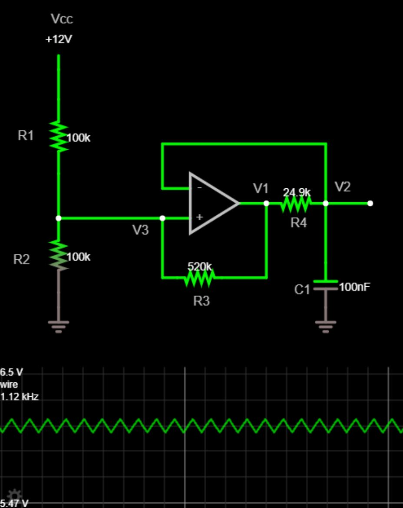](<triangle-wave-66.jpg>)

_view this
circuit [here](http://falstad.com/circuit/circuitjs.html?cct=$+17+0.000005+0.8031194996067259+65+5+50%0Aa+640+416+752+416+8+11.715+0+1000000+5.639494375233213+5.473682756038428+100000%0Ar+528+304+528+384+0+100000%0Ar+528+432+528+512+0+100000%0Ac+816+480+816+528+0+1.0000000000000001e-7+5.639494375233213%0Aw+528+304+528+272+0%0Aw+640+352+640+400+0%0Ar+656+496+704+496+0+520000%0Ar+752+416+816+416+0+24900%0Aw+640+432+528+432+0%0Aw+528+432+528+384+0%0Aw+640+432+640+496+0%0Aw+640+496+656+496+0%0Aw+704+496+752+496+0%0Aw+752+496+752+416+0%0Aw+816+416+816+480+0%0Aw+864+416+816+416+0%0Aw+640+352+816+352+0%0Aw+816+352+816+416+0%0Aw+528+512+528+528+0%0Ag+528+528+528+544+0%0Ag+816+528+816+544+0%0AR+528+272+528+240+0+0+40+12+0+0+0.5%0Ax+484+348+501+351+4+14+R1%0Ax+479+481+496+484+4+14+R2%0Ax+673+526+690+529+4+14+R3%0Ax+778+442+795+445+4+14+R4%0Ax+782+514+799+517+4+14+C1%0Ax+520+222+543+225+4+14+Vcc%0Ax+608+450+625+453+4+14+V3%0Ax+738+405+755+408+4+14+V1%0Ax+826+403+843+406+4+14+V2%0Ao+15+8+0+4362+10+0.1+0+2+15+3%0A)_

- f = 1.1 kHz
- Vtri,amp = 1 V
- R1 = R2 = 100 kΩ
- R3 = 520 kΩ
- R4 = 24.9 kΩ
- C1 = 100 nF

## Comparison to the Two Op-Amp Design

The most common design for an op-amp triangle wave generator uses two op-amps.  It looks something like this:

[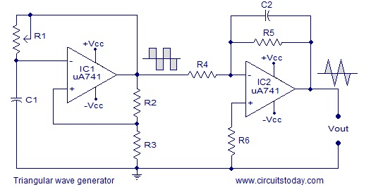](<triangle-wave-6.jpg>) _Typical Two Op-Amp Design_
([_source_](<http://www.circuitstoday.com/triangular-wave-generator>))

The two op-amp design generators a square wave then integrates it to produce a triangle wave.   It uses an active
integrator, instead of a passive RC integrator.

The two op-amp design uses 8 discrete components and 2 op-amps whereas the single op-amp design uses 5 discrete
components and 1 op-amp.

I believe the two op-amp design is overall less dependent on component tolerances and op-amp specs and therefore more
consistent from circuit to circuit.

Neither should be used for any circuit that needs accurate, precise, or stable frequencies or amplitudes.  Nor for
circuits that need a true triangle wave instead of the RC integrated approximation.

Overall, the single op-amp triangle wave generator is certainly simple to implement and practical for real world
circuits!
