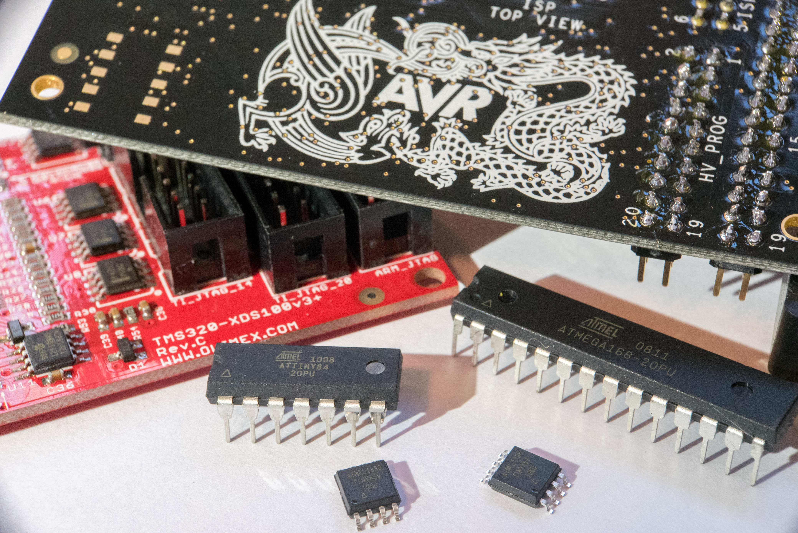
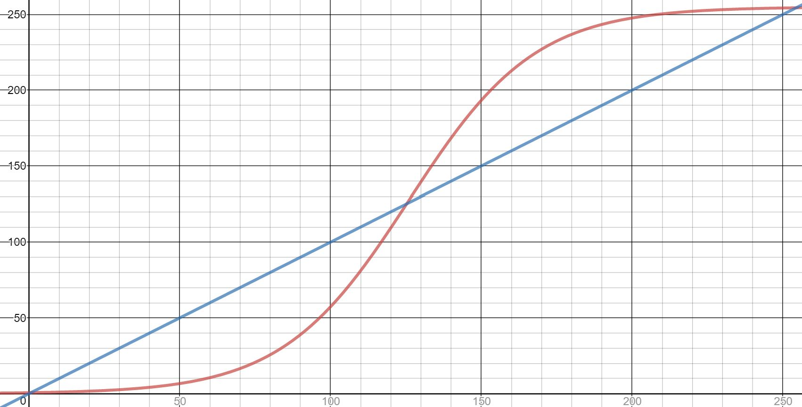

   
I usually forget bitwise operators, basic variables, and functions when coding in Atmel Studio for an ATtiny or ATmega project.

Normally, I look at some of my old code for reference. This is my focused and consolidated version of the important building blocks.

### Contents

[I/O Registers](</blog/atmel-coding-reference/#io-registers>)  
[Bitwise Operators](</blog/atmel-coding-reference/#bitwise-operators>)  
[Delays](</blog/atmel-coding-reference/#delays>)  
[Interrupts](</blog/atmel-coding-reference/#interrupts>)  
[Program Memory](</blog/atmel-coding-reference/#program-memory>)  
[PWM](</blog/atmel-coding-reference/#pwm>)  
 

## I/O Registers

  * DDR _x_ - Data Direction Register - Configures each pin as an input or output. The 0th bit refers to the 0th pin of the port and the 7th bit refers to the 7th bit of the port.
  * PORT _x_ - Data Register - The value of the pin, used for reading input or writing output
  * P _x_ _n_ - The nth bit of port x. PB0 refers to the 0th bit of port B and PE7 refers to the 7th bit of port E.
  * _x_ - letter (e.g. B, D, E, F, G)
  * _n_ - number (0, 1, 2, … 7)

Note that you still should refer to the datasheet for the specifics on these registers and how to set their values.

   
 

## Bitwise Operators

These commands affect a specific bit in the register without changing other values in the register.
    
    
    // ON - writes a 1. Makes Port B, Pin 3 output high
    PORTB |= ( 1 << PB3); 
    
    // OFF - writes a 0. Makes Port B, Pin 3 output low
    PORTB &= ~( 1 << PB3 ); 
    
    // TOGGLE - toggles the current value - a 0 will change to a 1 and a 1 will change to a 0
    PORTB ^= ( 1 << PB3 );  
    

 

Writing multiple bits in one line. Many people are cautious about this. Be brave.
    
    
    // ON - writes a 1 to multiple bits
    PORTB |= ( 1 << PB3 ) | ( 1 << PB5 ) | ( 1 << PB6 );  
    
    // OFF - writes a 0 to multiple bits
    PORTB &= ~( 1 << PB3) & ~( 1 << PB5 ) & (1 << PB6);  // Writes 0 to multiple bits
    
    // TOGGLE - toggles the current value of multiple bits
    PORTB ^= ( 1 << PB3) ^ (1 << PB5 ) ^ ( 1 << PB6 );
    
    

   
 

## Delays
    
    
    
    #define F_CPU 8000000UL // speed of clock, before prescaler (default 8MHz)
    #include <util/delay.h>
    
    int main(void) {
    
      _delay_ms(100);  // wait 100 milliseconds
    
      _delay_us(100); // wait 100 microseconds
    
    }
    
    

 

Blinking LED Example
    
    
    #define F_CPU 8000000UL // speed of clock, before prescaler (default 8MHz)
    
    #include <avr/io.h>
    #include <util/delay.h>
    
    int main(void) {
    
      DDRB |= ( 1 << PB3);  // this command makes the 3rd bit of port B an output
    
      while (1) {
    
        PORTB |= ( 1 << PB3); // make Port B, Pin 3 output high
    
        _delay_ms(1000);  // wait 1 second
    
        PORTB &= ~( 1 << PB3 ); // make Port B, Pin 3 output low
    
        _delay_ms(1000);  // wait 1 second
    
      }
    
    }
    
    

   
 

## Interrupts

This example is the minimum code for an interrupt. Refer to the datasheet for a list of all interrupts.
    
    
    #include <avr/interrupt.h>;
    
    ///////////////////////////////////////////////////////////////////////////////////////
    // @name: Timer 0 Compare A Interrupt
    // @call: When OCR0A is equal to compare value
    ///////////////////////////////////////////////////////////////////////////////////////
    ISR(TIM0_COMPA_vect){
    
    // interrupt code here
    
    }
    
    int main(void) {
    
    // set registers for Timer 0
    
    // enable Output Compare Interrupts in Timer 0 registers
    
    sei();  // enable interrupts
    
    while(1);  // wait for interrupts
    
    }
    

   
 

## Program Memory

This is for storing and reading large data to program memory.
    
    
    #include <avr/pgmspace.h>;
    
    // writing to program memory
    
    const unsigned char ANTI_LOG[] PROGMEM = {
      0x00, 0x00, 0x00, 0x00, 0x00, 0x00, 0x00, 0x00, 0x00, 0x00, 0x01, 0x01, 0x01, 0x01, 0x01, 0x01,
      0x01, 0x01, 0x01, 0x01, 0x01, 0x01, 0x01, 0x01, 0x01, 0x02, 0x02, 0x02, 0x02, 0x02, 0x02, 0x02,
      0x02, 0x02, 0x03, 0x03, 0x03, 0x03, 0x03, 0x03, 0x04, 0x04, 0x04, 0x04, 0x04, 0x05, 0x05, 0x05,
      0x05, 0x06, 0x06, 0x06, 0x07, 0x07, 0x07, 0x08, 0x08, 0x08, 0x09, 0x09, 0x0A, 0x0A, 0x0B, 0x0B,
      0x0C, 0x0C, 0x0D, 0x0D, 0x0E, 0x0F, 0x0F, 0x10, 0x11, 0x11, 0x12, 0x13, 0x14, 0x15, 0x16, 0x17,
      0x18, 0x19, 0x1A, 0x1B, 0x1C, 0x1D, 0x1F, 0x20, 0x21, 0x23, 0x24, 0x26, 0x27, 0x29, 0x2B, 0x2C,
      0x2E, 0x30, 0x32, 0x34, 0x36, 0x38, 0x3A, 0x3C, 0x3E, 0x40, 0x43, 0x45, 0x47, 0x4A, 0x4C, 0x4F,
      0x51, 0x54, 0x57, 0x59, 0x5C, 0x5F, 0x62, 0x64, 0x67, 0x6A, 0x6D, 0x70, 0x73, 0x76, 0x79, 0x7C,
      0x7F, 0x82, 0x85, 0x88, 0x8B, 0x8E, 0x91, 0x94, 0x97, 0x9A, 0x9C, 0x9F, 0xA2, 0xA5, 0xA7, 0xAA,
      0xAD, 0xAF, 0xB2, 0xB4, 0xB7, 0xB9, 0xBB, 0xBE, 0xC0, 0xC2, 0xC4, 0xC6, 0xC8, 0xCA, 0xCC, 0xCE,
      0xD0, 0xD2, 0xD3, 0xD5, 0xD7, 0xD8, 0xDA, 0xDB, 0xDD, 0xDE, 0xDF, 0xE1, 0xE2, 0xE3, 0xE4, 0xE5,
      0xE6, 0xE7, 0xE8, 0xE9, 0xEA, 0xEB, 0xEC, 0xED, 0xED, 0xEE, 0xEF, 0xEF, 0xF0, 0xF1, 0xF1, 0xF2,
      0xF2, 0xF3, 0xF3, 0xF4, 0xF4, 0xF5, 0xF5, 0xF6, 0xF6, 0xF6, 0xF7, 0xF7, 0xF7, 0xF8, 0xF8, 0xF8,
      0xF9, 0xF9, 0xF9, 0xF9, 0xFA, 0xFA, 0xFA, 0xFA, 0xFA, 0xFB, 0xFB, 0xFB, 0xFB, 0xFB, 0xFB, 0xFC,
      0xFC, 0xFC, 0xFC, 0xFC, 0xFC, 0xFC, 0xFC, 0xFC, 0xFD, 0xFD, 0xFD, 0xFD, 0xFD, 0xFD, 0xFD, 0xFD,
      0xFD, 0xFD, 0xFD, 0xFD, 0xFD, 0xFD, 0xFD, 0xFE, 0xFE, 0xFE, 0xFE, 0xFE, 0xFE, 0xFE, 0xFF, 0xFF};
    
    
    int main(void) {
      // reading from program memory
      OCR0A = pgm_read_byte(&ANTI_LOG[3]); // write the value at index 3 of ANTI_LOG to register OCR0A
      
    }
    

   
 

## PWM

Simple PWM is accomplished by setting a timer and using the hardware based Output Compare and PWM.

The following examples were written on an ATtiny 45, but should work for an ATtiny25, ATtiny45, and ATtiny85. Other Atmel microcontrollers can be used with slight, if any, modification.
    
    
    /*
     * Simple PWM
     * Produces a PWM output on OC0A (PB0)
     */
    
    #include <avr/io.h>
    
    int main(void) {
    
      // configure Timer 0
      TCCR0A |= (1 << COM0A1) | (1 << COM0A0) | (1 << WGM01) | (1 << WGM00); // Fast PWM on OC0A
      OCR0A = 0x50; // OCR0A controls the duty cycle
      TCCR0B |= (1 << CS01); // Clock = prescaler/8
    
    }
    

   
 

This code does the exact same thing as the code above, but uses interrupts. This will sets us up for solving complex situations in the future.
    
    
    /*
     * Simple PWM using Interrupts
     * Produces a PWM output on OC0A (PB0)
     */
    
    #include <avr/io.h>
    #include <avr/interrupt.h>
    
    ///////////////////////////////////////////////////////////////////////////////////////
    // @name: Timer 0 Overflow Interrupt
    // @call: When Timer 0 overflows
    // @note: Used for 10-bit fast PWM output
    ///////////////////////////////////////////////////////////////////////////////////////
    ISR(TIM0_OVF_vect) {
    
      PORTB |= ( 1 << PB0 );  // turn on output
    
    }
    
    
    ///////////////////////////////////////////////////////////////////////////////////////
    // @name: Timer 0 Compare A Interrupt
    // @call: When OCR0A is equal to compare value
    // @note: Used for 10-bit fast PWM output
    ///////////////////////////////////////////////////////////////////////////////////////
    ISR(TIM0_COMPA_vect){
    
      PORTB &= ~( 1 << PB0);  // turn off output
    
    }
    
    
    int main(void) {
    
      // set registers for Timer 0
      TCCR0A |= (1 << WGM01) | (1 << WGM00); // Fast PWM, OC0A disconnected
      OCR0A = 0x50; // Initial duty cycle
      TCCR0B |= (1 << CS01); // Clock = prescaler/8
    
      DDRB |= ( 1 << PB0 );  // enable output
    
      sei();  // enable interrupts
    
      while(1);
    
    }
    

   
 

This example addresses how to change the PWM duty cycle. Note this example does _not_ use any delay functions.
    
    
    /* 
     * PWM using Interrupts
     * Produces a PWM that glows on an off gradually on OC0A (PB0)
     */
    
    #define F_CPU 8000000UL  // speed of clock, before prescaler (default 8MHz)
    
    #include <avr/io.h>
    #include <avr/interrupt.h>
    
    unsigned char cyclesPWM = 0; // counts number of PWM cycles
    unsigned char dutyPWM = 20; // 0 = 0% duty cycle, 255 = 100% duty cycle
    char indexDirPWM = 1; // 1 = increase duty cycle, -1 = decrease duty cycle
    
    ///////////////////////////////////////////////////////////////////////////////////////
    // @name: Timer 0 Overflow Interrupt
    // @call: When Timer 0 overflows
    // @note: Used for 10-bit fast PWM output
    ///////////////////////////////////////////////////////////////////////////////////////
    ISR(TIM0_OVF_vect) {
    
      cyclesPWM++;
      if (cyclesPWM >= 10){ // change the duty cycle every 10th cycle
        cyclesPWM = 0; // e.g. change PWM every 10th overflow
    
        cyclesPWM += indexDirPWM; // adjust PWM duty cycle by 1
    
        if (dutyPWM >= 254) // if duty cycle = 100%,
        indexDirPWM = -1; // ramp down
        else if (dutyPWM <= 0) // else if duty cycle = 0%
        indexDirPWM = 1; // ramp up
    
        OCR0A = dutyPWM;
      }
    
      PORTB |= ( 1 << PB0 ); // turn on output
    
    }
    
    
    ///////////////////////////////////////////////////////////////////////////////////////
    // @name: Timer 0 Compare A Interrupt
    // @call: When OCR0A is equal to compare value
    // @note: Used for 10-bit fast PWM output
    ///////////////////////////////////////////////////////////////////////////////////////
    ISR(TIM0_COMPA_vect){
    
      PORTB &= ~( 1 << PB0); // turn off output
    
    }
    
    
    int main(void) {
    
      TCCR0A |= (1 << WGM01) | (1 << WGM00); // Fast PWM, OC0A disconnected
      OCR0A = 0x50; // Initial duty cycle
      TCCR0B |= (1 << CS01); // Clock = prescaler/8
    
      sei();  // enable interrupts
    
      while(1);
    
    }
    

   
 

The simple linear PWM ramp in the example above doesn't look good when driving an LED seen by the human eye.

 

_simple linear ramp and anti-log ramp_

 

This example addresses that issue with a non-linear change in the duty cycle. An anti log function works best. The values came from user BG100 on [Stack Overflow](<http://electronics.stackexchange.com/a/11100/83064>).

 
    
    
    /* 
     * Non-Linear PWM using Interrupts
     * Produces a non-linear PWM that glows on an off gradually on OC0A (PB0)
     */
    #include <avr/io.h>
    #include <avr/interrupt.h>
    #include <avr/pgmspace.h>
    
    #define F_CPU 8000000UL // speed of clock, before prescaler (default 8MHz)
    
    const unsigned char ANTI_LOG[] PROGMEM = {
      0x00, 0x00, 0x00, 0x00, 0x00, 0x00, 0x00, 0x00, 0x00, 0x00, 0x01, 0x01, 0x01, 0x01, 0x01, 0x01,
      0x01, 0x01, 0x01, 0x01, 0x01, 0x01, 0x01, 0x01, 0x01, 0x02, 0x02, 0x02, 0x02, 0x02, 0x02, 0x02,
      0x02, 0x02, 0x03, 0x03, 0x03, 0x03, 0x03, 0x03, 0x04, 0x04, 0x04, 0x04, 0x04, 0x05, 0x05, 0x05,
      0x05, 0x06, 0x06, 0x06, 0x07, 0x07, 0x07, 0x08, 0x08, 0x08, 0x09, 0x09, 0x0A, 0x0A, 0x0B, 0x0B,
      0x0C, 0x0C, 0x0D, 0x0D, 0x0E, 0x0F, 0x0F, 0x10, 0x11, 0x11, 0x12, 0x13, 0x14, 0x15, 0x16, 0x17,
      0x18, 0x19, 0x1A, 0x1B, 0x1C, 0x1D, 0x1F, 0x20, 0x21, 0x23, 0x24, 0x26, 0x27, 0x29, 0x2B, 0x2C,
      0x2E, 0x30, 0x32, 0x34, 0x36, 0x38, 0x3A, 0x3C, 0x3E, 0x40, 0x43, 0x45, 0x47, 0x4A, 0x4C, 0x4F,
      0x51, 0x54, 0x57, 0x59, 0x5C, 0x5F, 0x62, 0x64, 0x67, 0x6A, 0x6D, 0x70, 0x73, 0x76, 0x79, 0x7C,
      0x7F, 0x82, 0x85, 0x88, 0x8B, 0x8E, 0x91, 0x94, 0x97, 0x9A, 0x9C, 0x9F, 0xA2, 0xA5, 0xA7, 0xAA,
      0xAD, 0xAF, 0xB2, 0xB4, 0xB7, 0xB9, 0xBB, 0xBE, 0xC0, 0xC2, 0xC4, 0xC6, 0xC8, 0xCA, 0xCC, 0xCE,
      0xD0, 0xD2, 0xD3, 0xD5, 0xD7, 0xD8, 0xDA, 0xDB, 0xDD, 0xDE, 0xDF, 0xE1, 0xE2, 0xE3, 0xE4, 0xE5,
      0xE6, 0xE7, 0xE8, 0xE9, 0xEA, 0xEB, 0xEC, 0xED, 0xED, 0xEE, 0xEF, 0xEF, 0xF0, 0xF1, 0xF1, 0xF2,
      0xF2, 0xF3, 0xF3, 0xF4, 0xF4, 0xF5, 0xF5, 0xF6, 0xF6, 0xF6, 0xF7, 0xF7, 0xF7, 0xF8, 0xF8, 0xF8,
      0xF9, 0xF9, 0xF9, 0xF9, 0xFA, 0xFA, 0xFA, 0xFA, 0xFA, 0xFB, 0xFB, 0xFB, 0xFB, 0xFB, 0xFB, 0xFC,
      0xFC, 0xFC, 0xFC, 0xFC, 0xFC, 0xFC, 0xFC, 0xFC, 0xFD, 0xFD, 0xFD, 0xFD, 0xFD, 0xFD, 0xFD, 0xFD,
      0xFD, 0xFD, 0xFD, 0xFD, 0xFD, 0xFD, 0xFD, 0xFE, 0xFE, 0xFE, 0xFE, 0xFE, 0xFE, 0xFE, 0xFF, 0xFF};
    
    unsigned char cyclesPWM = 0;
    char indexDirPWM = 1;
    unsigned char indexPWM = 70;
    
    ///////////////////////////////////////////////////////////////////////////////////////
    // @name: Timer 0 Overflow Interrupt
    // @call: When Timer 0 overflows
    // @note: Used for 10-bit fast PWM output
    ///////////////////////////////////////////////////////////////////////////////////////
    ISR(TIM0_OVF_vect) {
    
      cyclesPWM++;
      if (cyclesPWM >= 10){ // change the duty cycle every 10th cycle
        cyclesPWM = 0; // e.g. change PWM every 10th overflow
    
        indexPWM += indexDirPWM; // adjust PWM index
    
        if (indexPWM >= 254) // if duty cycle = 100%,
          indexDirPWM = -1; // ramp down
        else if (indexPWM <= 0) // else if duty cycle = 0%
          indexDirPWM = 1; // ramp up
    
        OCR0A = pgm_read_byte(&amp;ANTI_LOG[indexPWM]); // set new PWM
    
        }
    
      PORTB |= ( 1 << PB0 ); // turn on output
    
    }
    
    
    ///////////////////////////////////////////////////////////////////////////////////////
    // @name: Timer 0 Compare A Interrupt
    // @call: When OCR1A is equal to compare value
    // @note: Used for 10-bit fast PWM output
    ///////////////////////////////////////////////////////////////////////////////////////
    ISR(TIM0_COMPA_vect){
    
      PORTB &= ~( 1 << PB0 ); // turn off output
    
    }
    
    
    int main(void) {
    
      TCCR0A |= (1 << WGM01) | (1 << WGM00); // Fast PWM, OC0A disconnected
      OCR0A = 0x50; // Initial duty cycle
      TCCR0B |= (1 << CS01); // Clock = prescaler/8
    
      sei(); // enable interrupts
      while(1);
    
    }
    

If there is any reference info you find useful that isn't included, comment below!
