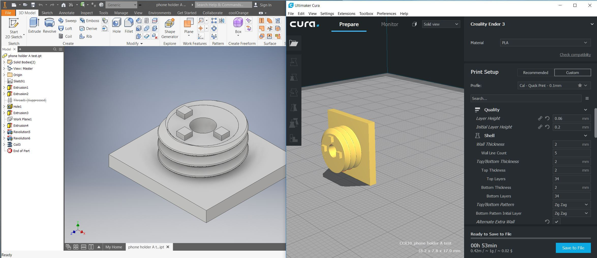
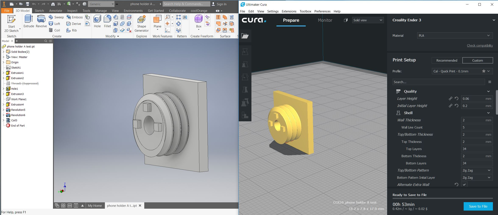
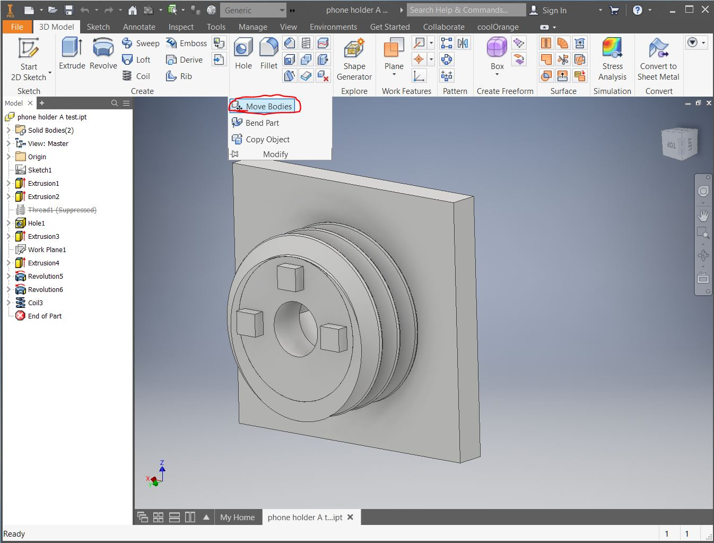
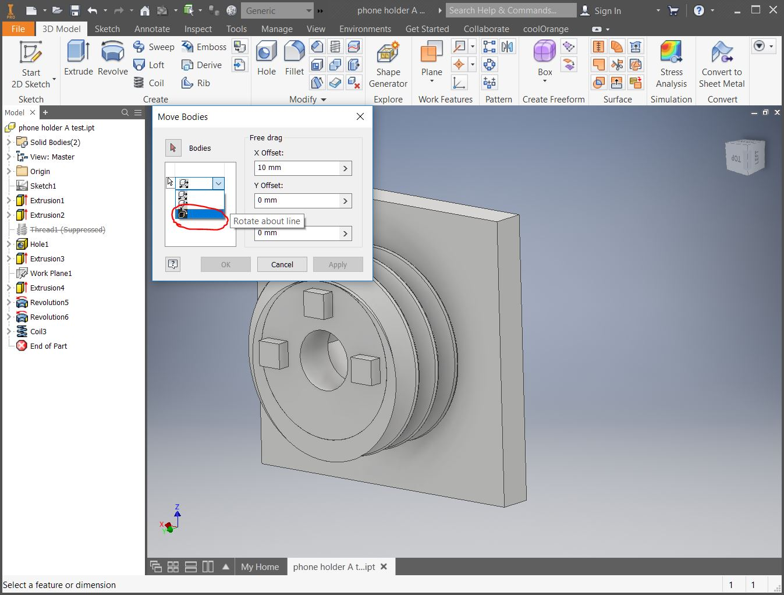
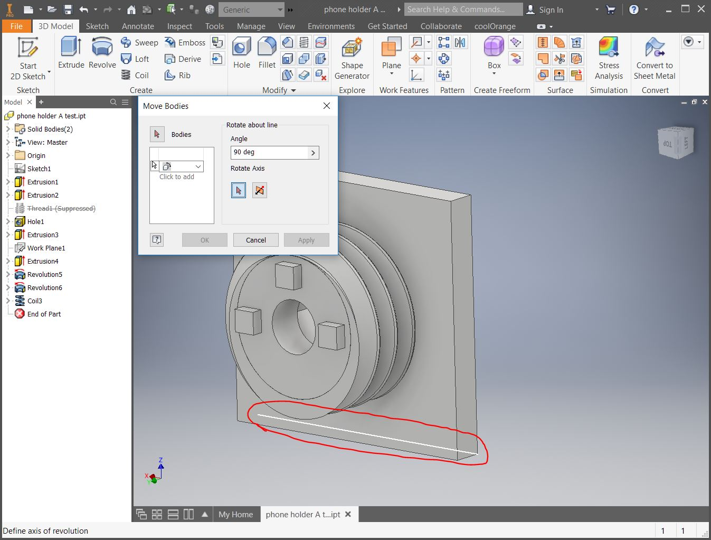
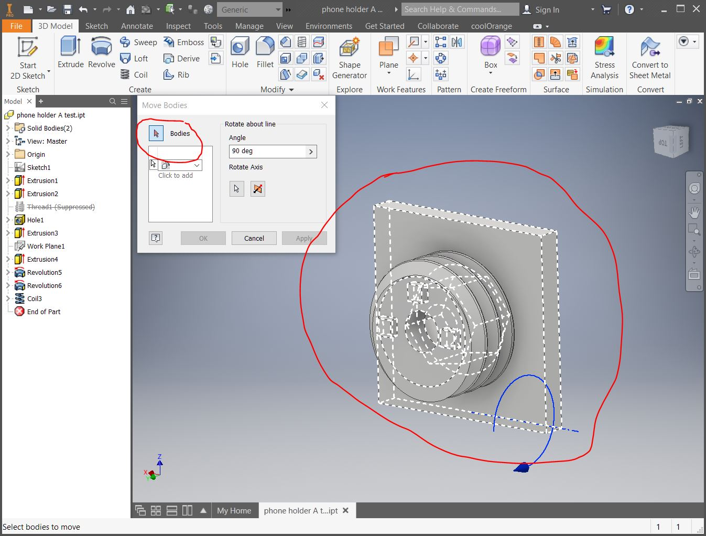
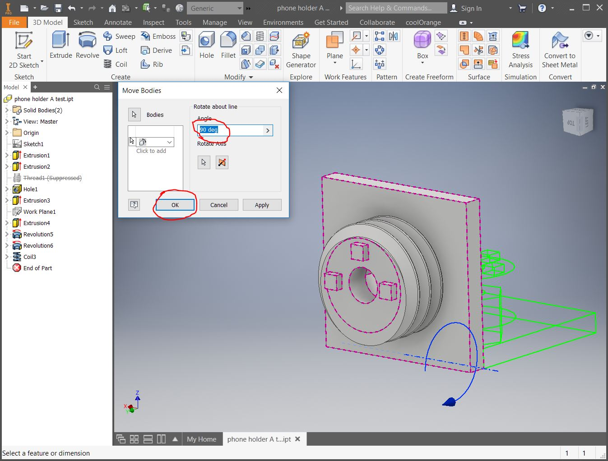
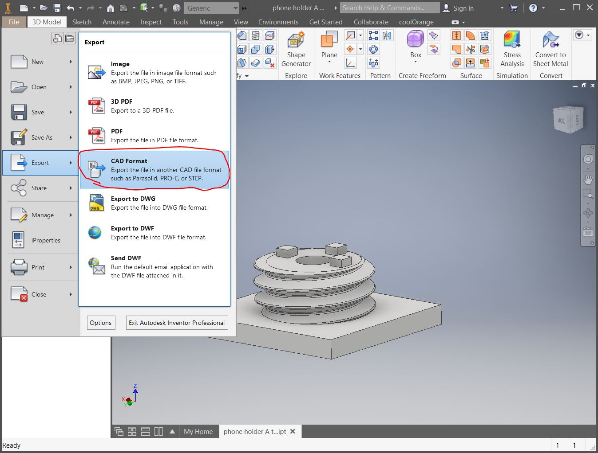
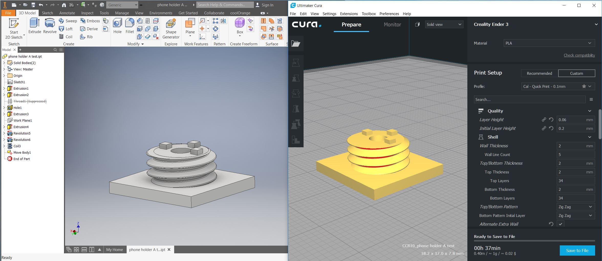

 

This how-to is for correcting axis orientations or rotation issues when exporting a file from Inventor to Cura.

 

_improper orientation causes this issue in Cura_

 

## Step 1

Open Inventor.

Export as an STL and import into Cura (how to export a STL here)

Do not rotate the model in Cura

 

 

## Step 2

Rotate your view in Inventor to match the Cura model. This will make the next steps more intuitive.

 

 

## Step 3

Under the Modify section, click "Move Parts"

 

 

## Step 4

In the "Move Bodies" dialog box, select the last item from the drop-down - "Rotate about line"

 

 

## Step 5

Select the line you'd like to rotate around.

This should be the same rotation you'd like the part in Cura to rotate.

 

 

## Step 6

Click "Bodies", then click your part.

 

 

## Step 7

You can change the angle, if needed.

Press OK to rotate the model.

 

## Step 8

Export a new STL and import into Cura

 

## Step 9

The model should now be properly oriented in Cura!

