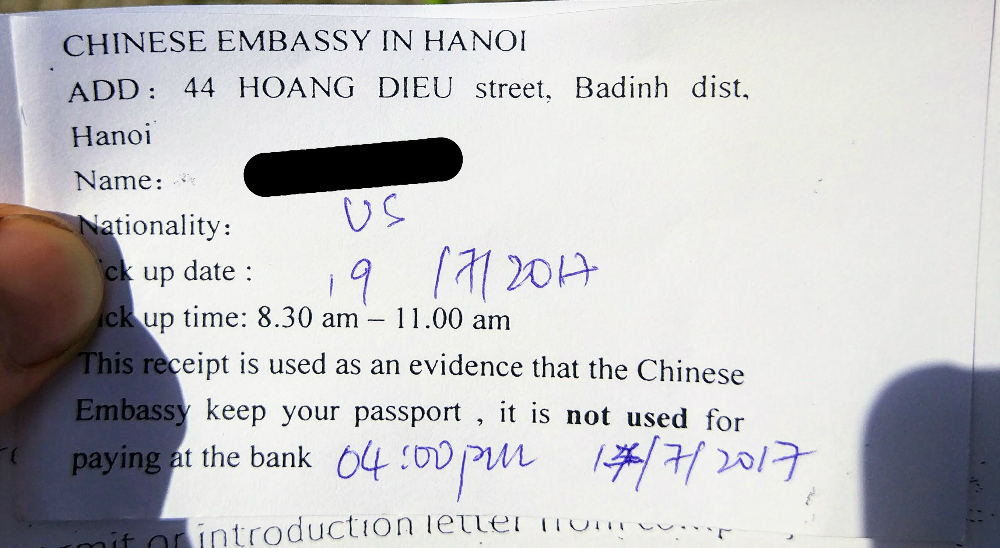
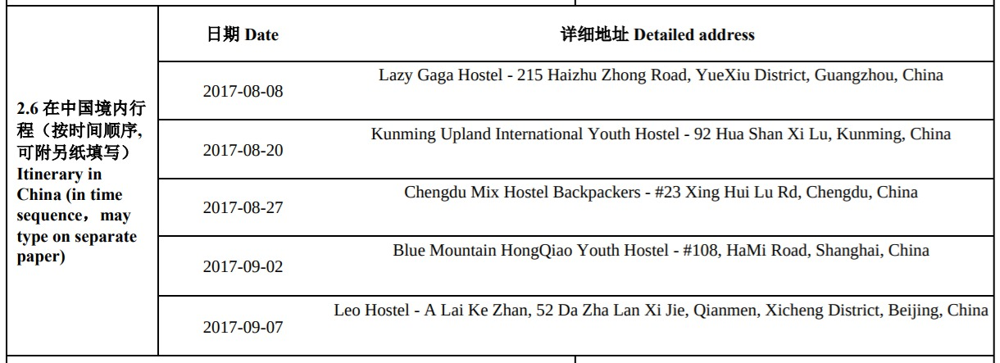
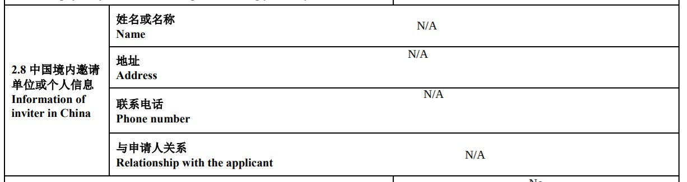
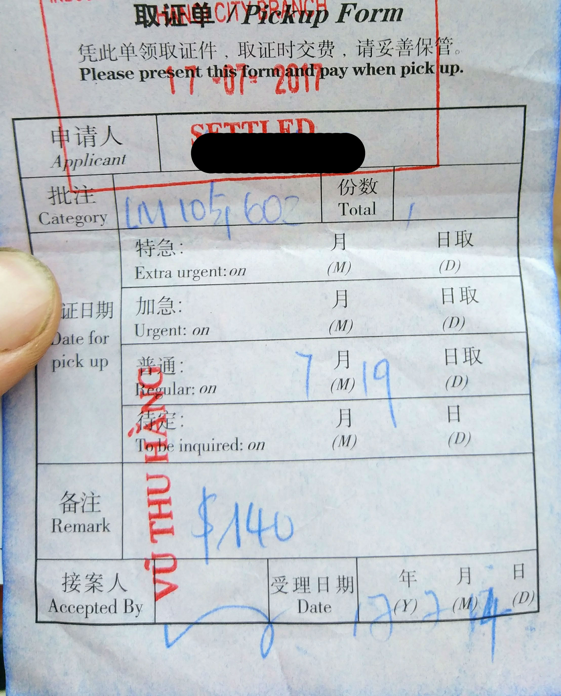

You can get a visa to China in Vietnam. It's not particularly easy, but it is quite possible. I write this because there is little tolerance for error - if you forget to submit some paperwork and get denied, you can't reapply in Vietnam. You'll have to apply in another country.

The following is for a US citizen, but the requirements are identical for most countries, except Americans pay much more for the visa!

## Schedule

This takes a total of 5 business days. Best case scenario would be submitting on Monday and collecting your passport on Friday.

Day 1 - Submit documents and passport to Chinese Embassy

Day 3 - Check application status at Chinese Embassy. Pay $140 at the ICBC Bank

Day 5 - Pick up passport at Chinese Embassy

 

## Map  

## Day 1

Go to the Chinese Embassy. It is located at 46 Hoang Dieu, Hanoi. The entrance is on the east side of the block, near the northwest corner of the park.

 

The embassy is open from 8:30am-11am. It feels like being at the DMV, so you may wait anywhere from 5 minutes to an hour. Show up 10 minutes before opening to shorten your wait time.

You’ll pass through security. The guard will sit you down and eventually send you to the proper desk.

After submitting the proper paperwork (listed below), you'll be given this receipt.

 

 

### What To Bring

#### 1\. Chinese Visa Application

Find the newest application form [here](<http://www.china-embassy.org/eng/visas/hrsq/#L>) or get a free paper copy from the Embassy. Your brain will quiver from the sheer volume of information required.

You’ll need an itinerary. See an example itinerary below (don't plagiarize!).

The application asks for a reference. As a tourist, you don't need this.

They asked for a local phone number. I provided them with my hostel’s phone number. They didn't call.

#### 2\. Two visa photos

One gets glued to the application. The security guard has gluesticks and a stapler. They staple the second visa photo through the front of your passport, even though your passport says “Contains sensitive electronics. Do not perforate.” Ha.

[This page](<http://www.china-embassy.org/eng/visas/zyxx/P020161206204655391310.jpg>) list the photo requirements - must be approximately 1.3″ x 1.9″.

#### 3\. Copy of passport information page and Vietnam visa

#### 4\. Proof of any insurance

e.g. traveler’s health insurance, health insurance

#### 5\. Proof of booking at your first hostel/hotel

#### 6\. Proof of sufficient finance

Copy of a bank statement. No minimum funds are stated, but $100 a day is recommended.

#### 7\. Air or train tickets both in and out of China

It may be possible to only have an entry ticket, but I didn't risk it. You can book refundable/reschedulable tickets if you don't know when you'll leave.

 

_Do I need to book all of my accomodation before submitting the application?_  
Probably not. In my itenarary, I listed hostels I planned to stay at but had not booked. I only booked the first hostel. I submitted this a copy of this first booking with my application.

_Do I need to book flight or trains in and out of the country?_  
Yes. At least entry transportation is required. I recommend buying exit transportation as well. You could book refundable tickets if you aren’t sure of your dates yet.

_Can I get a 1 year or 10 year visa?_  
Maybe. You have to have a good reason to need a long visa (student, work, spouse). Not having to reapply in the future is not a valid reason. LIkely, you’ll get a 60 day multiple entry visa.

 

## Day 3

Go back to the embassy. Hand them your receipt. They’ll hand you the following piece of paper, showing your application has been approved.

 

Now you go to the Industrial and Commercial Bank of China to pay $140. The bank will stamp your paper, proving your payment.

 

Bank location: 360 Kim Ma, Hanoi

 

_Can I pay in VND or RMB?_  
No, you must pay in US dollars. The bank recommended this nearby currency exchange at 389 Kim Ma, Hanoi:



## Day 5

Go to the embassy, submit your receipt from the bank, and collect your passport!

Visas can be picked up from 8:30am-11am or the afternoon hours 3:00pm-4:30pm. Afternoon is visa pickup only.

Let me know if anything in the process has changed in the comments below.
