Here's a list of the most useful shortcuts in CM - more graphical and intuitive than the built in shortcut list (Ribbon Bar->View->Shortcuts).

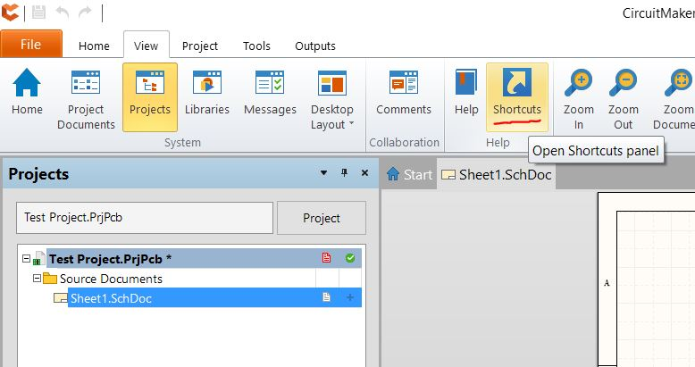_Above - Shortcut List Location_

Pro Tip: When the tools aren't working correctly, press ESC a few times.

# Schematic Shortcuts

Crtl+Scroll | Zoom |   
---|---|---  
Center Button - Click Hold and Drag | Zoom |   
Pg Up/Down | Zoom (Great for laptops) |   
Right Button - Click Hold Drag | Pan |   
Ctrl+A | Select **A** ll |  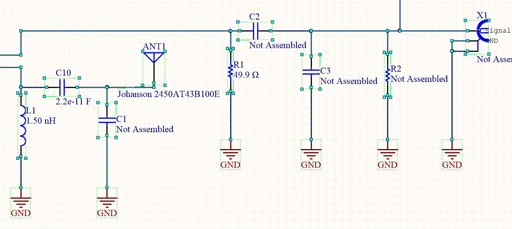  
Crtl+C | **C** opy |   
Ctrl+X | Cut |   
Ctrl+V | Paste |   
Ctrl+D | **D** uplicate |  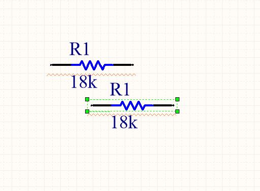  
W | **W** ire (for opening wiring tool) |  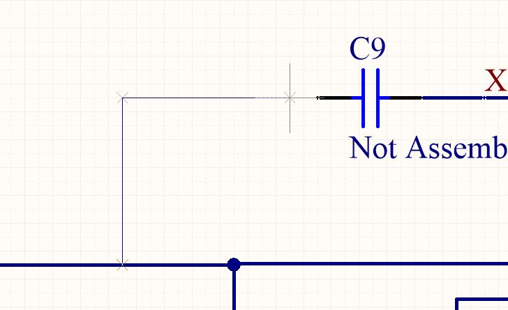  
Space | Change Wiring Path - Only works when wiring |  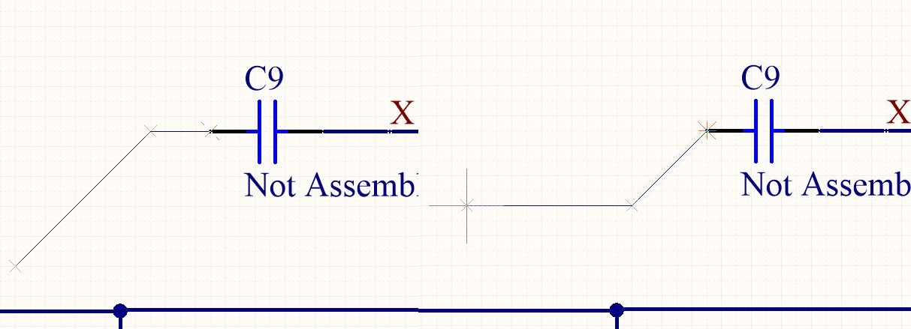  
Shift+Space | Change Wiring Angles - Only works when wiring |  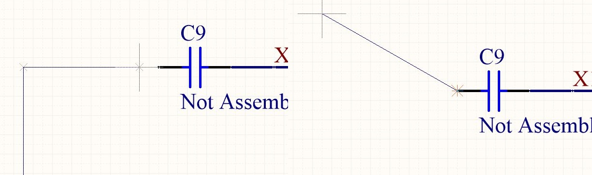  
Space | Rotate Selected Object |  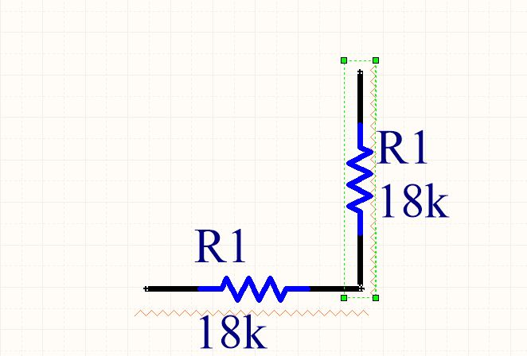  
Tab or Double Click | Edit Properties of selected object |  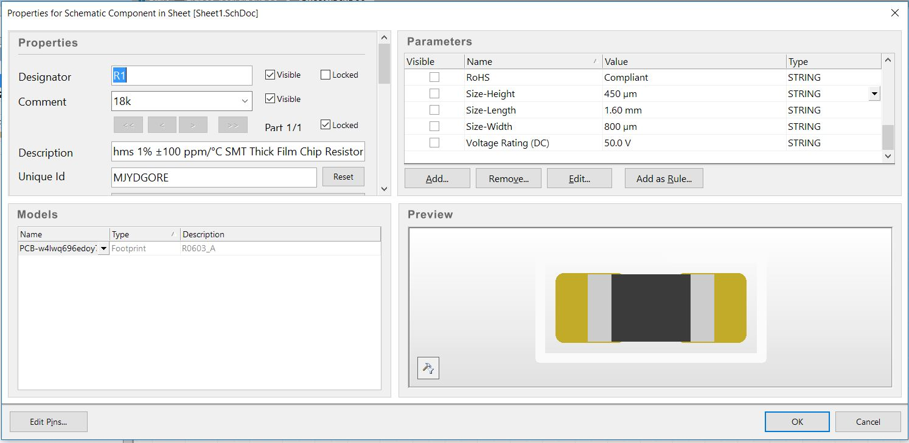  
G | Toggle **G** rid Size (look in bottom left-hand corner) |  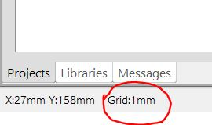  
Z | Add Ground |  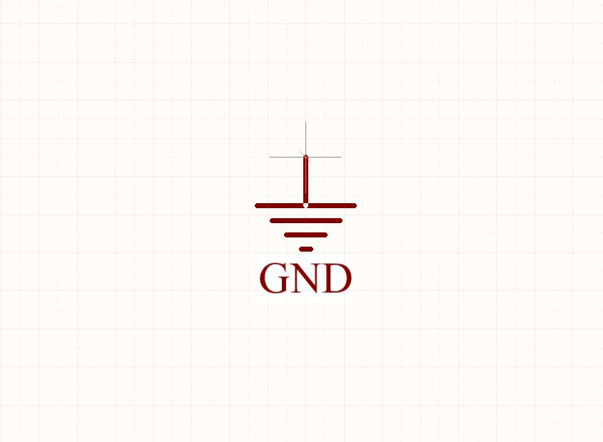  
V | Add **V** CC (press TAB to quickly change net name) |  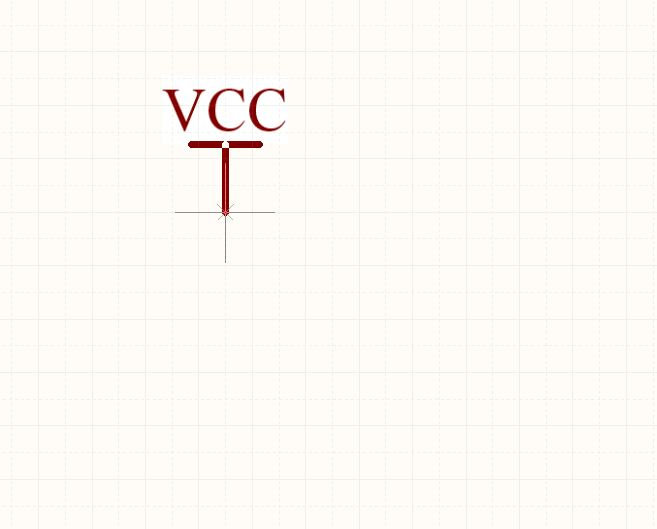  
T | **T** ext (press TAB to change text) |  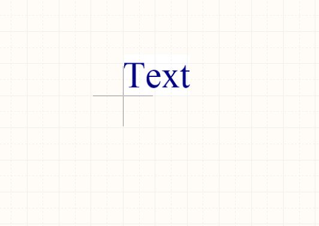  
N | **N** et Label (press TAB to change text) |  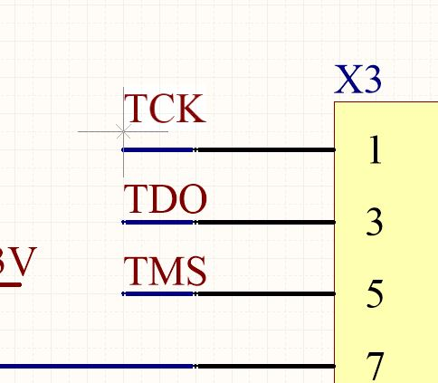  
C | Place **C** omponent |  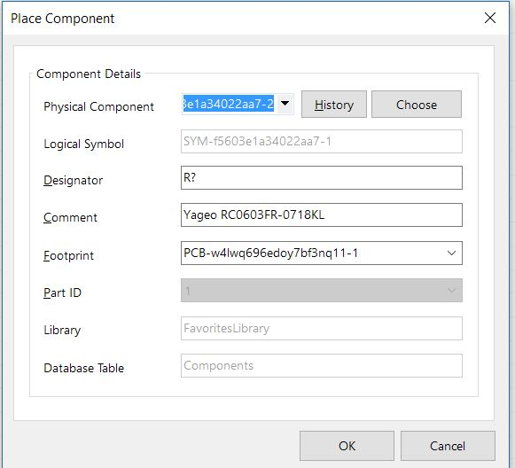  
X | Flip left/right (**X** -Axis) |   
Y | Flip up/down (**Y** -Axis) |   
Esc | **E** xit Tool |   
Ctrl+Tab | Go to Next Tab |  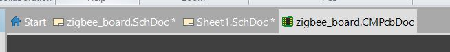  
Ctrl+Shift+Tab | Go to Previous Tab |    
  
 

 

# PCB Shortcuts

Crtl+Scroll | Zoom |   
---|---|---  
Center Button - Click Hold and Drag | Zoom |   
Pg Up/Down | Zoom (Great for laptops) |   
Shift+Pg Up/Down | Precise Zoom (Great for laptops) |   
Right Button - Click Hold Drag | Pan |   
Esc | Exit Tool (so very useful) |   
Ctrl+A | Select All |  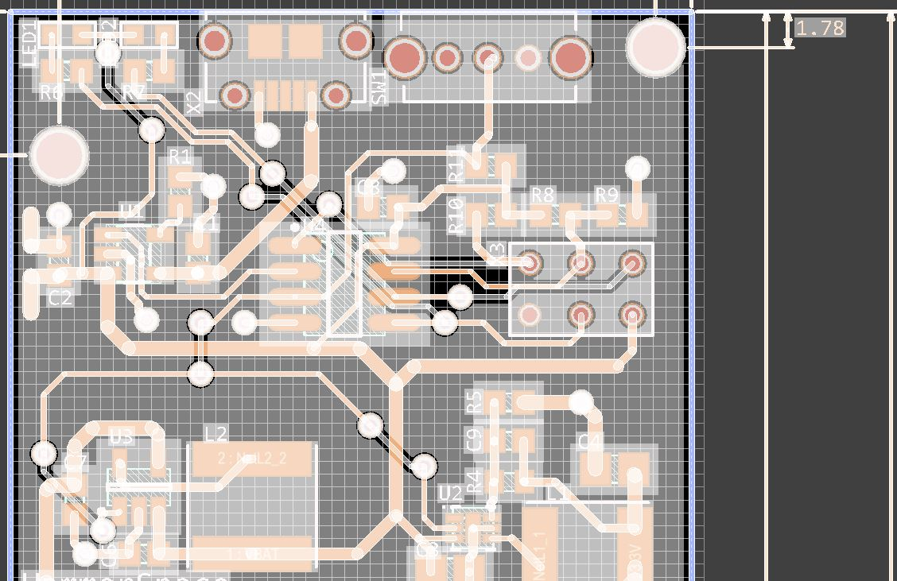  
Crtl+C | Copy |   
Ctrl+X | Cut |   
Ctrl+V | Paste |   
R | Route Trace |  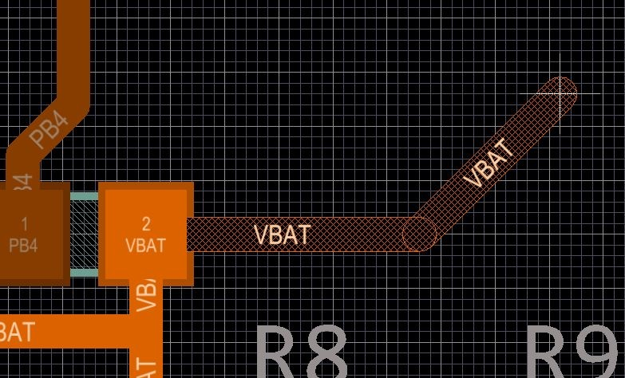  
Space | Change Routing Path - Only works when routing |  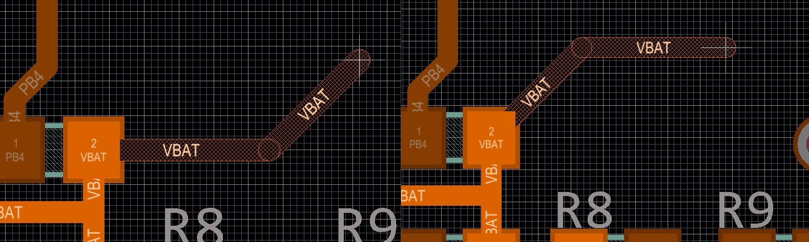  
Shift+Space | Change Routing Angles - Only works when routing |  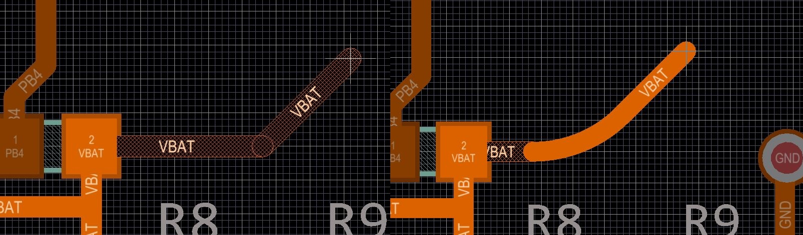  
Space | Rotate Selected Object |   
G | Toggle Grid Size (look in bottom left-hand corner) |  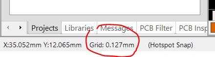  
Shift+S | Single Layer View (Toggle visibility of all layers except for the active layer) |  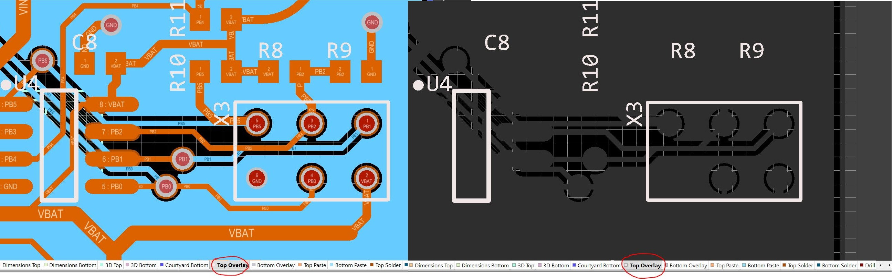  
Backspace | Undo Trace Segements of selected trace |  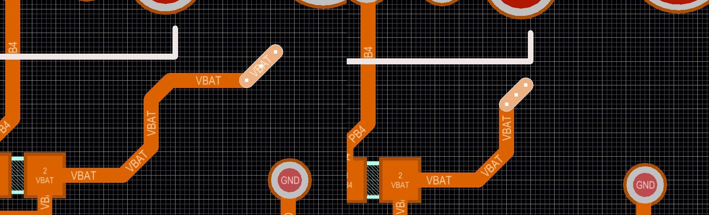  
Tab or Double Click | Edit Properties of selected object |  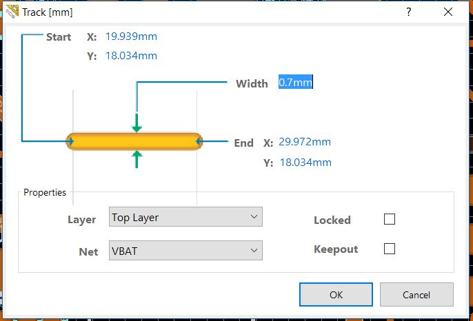  
  
 

Have a favorite not listed? Leave it in the comments below.
