 

[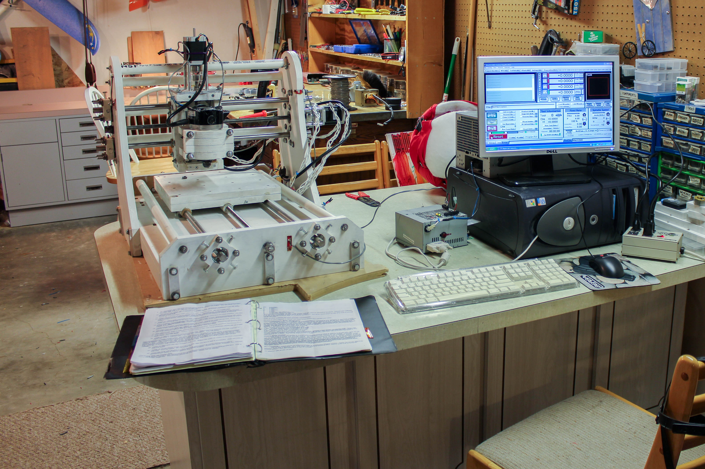](<cnc_overall_2.jpg>)

In May 2012, the end of my junior year of high school, I began to develop great interest in a personal CNC machine. A CNC machine is a beautiful thing, and the process of homebuilding a CNC machine emcompasses design, building, and utilization. The design demonstrates creativity and planning, building demonstrates an understanding of mechanics and craftsmanship, and utilization restarts the process at design again. A tool to make new things, limited mostly by one's creativity.

I built this machine for the experience, the usefulness of having a CNC machine, and mainly for isolation routing of printed circuit boards. Research and drawings took about 20 hours, then 30-40 hours in CAD software. The design and majority of features were self-imagined, but I found inspiration for a few key designs on www.cnczone.com. This includes PVC & threaded rod combination to stabilize the gantry, a torsion box base, and delrin for the anti-backlash nut material.

[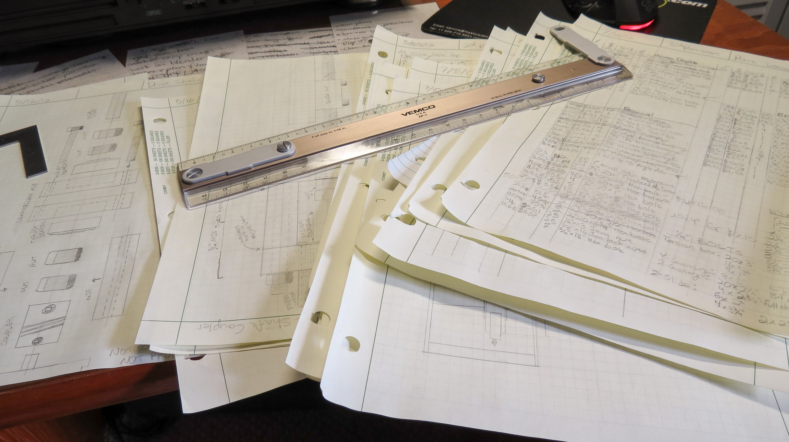](<cnc_papers.jpg>)

[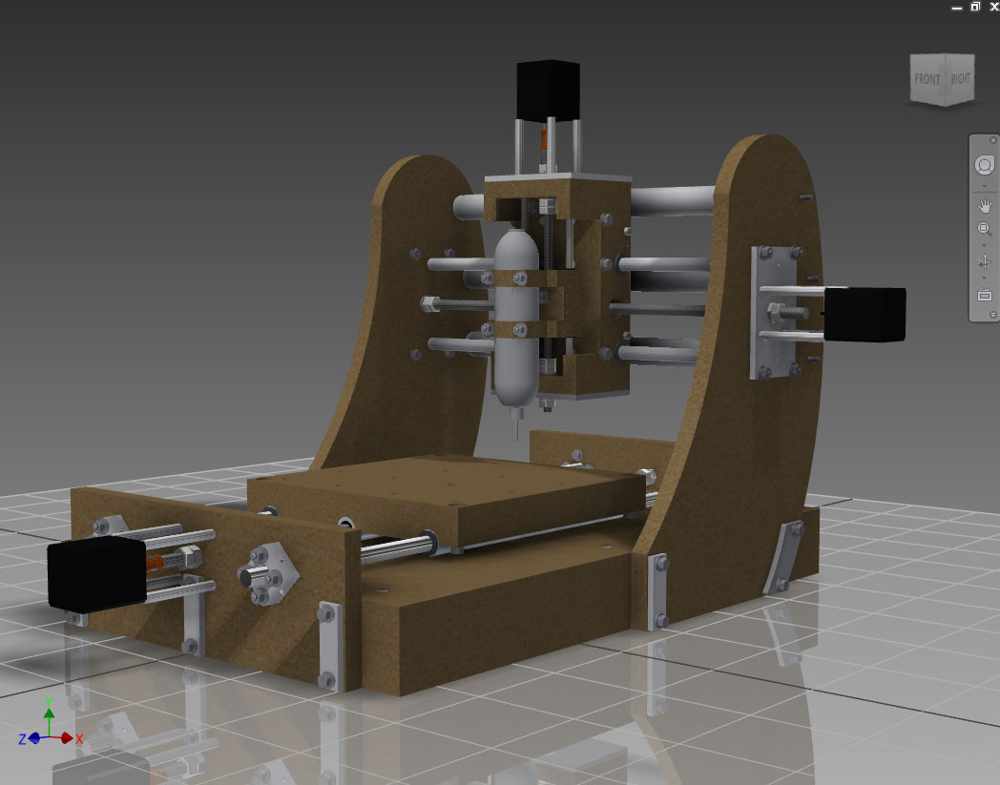](<cnc_computer_1.jpg>)

[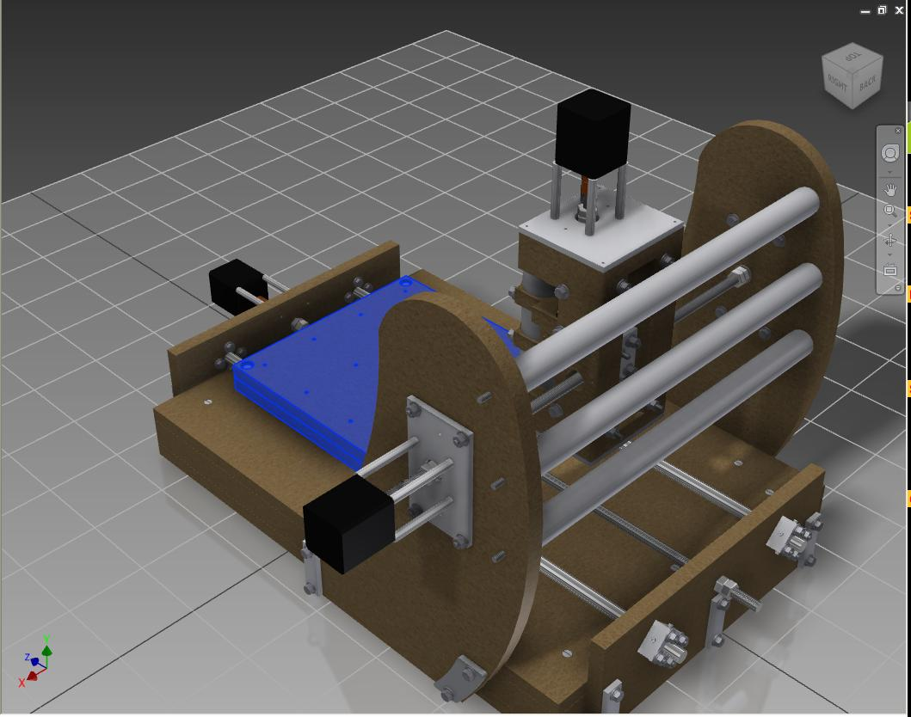](<cnc_computer_2.jpg>)

 

On a tight budget, I couldn't afford to make mistakes. As you can see, the design is very thorough and includes a tabulation of every part, down to the washer. This kind of detailed planning allows a $1000 machine to be built for $400. The building was the fun part, the large MDF pieces were cut on my high school's CNC machine, I lathed the couplers, and for the rest, I used a drill press and hand tools.

[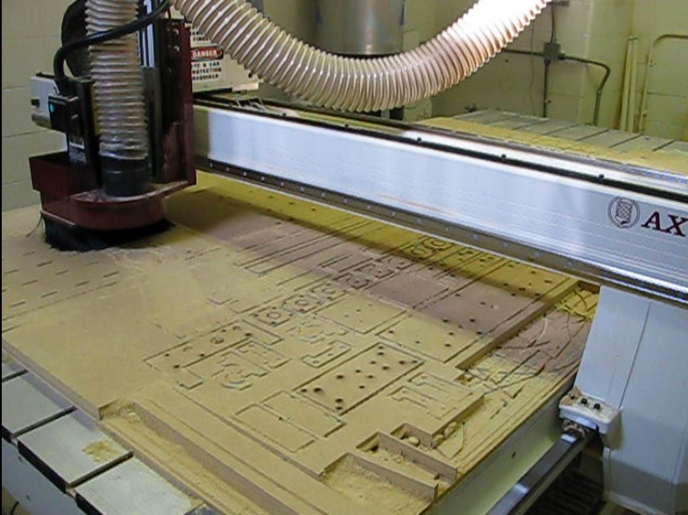](<cnc_cnc_cut.jpg>)Above: Cutting CNC Parts

 

[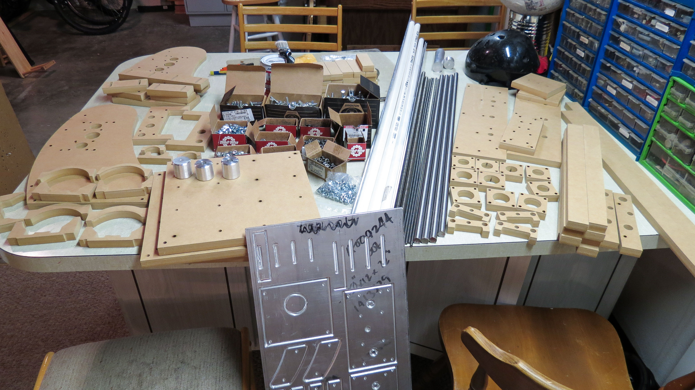](<cnc_parts.jpg>)

 

[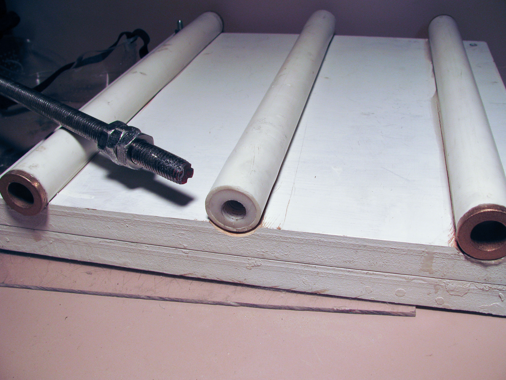](<cnc_x_backlash.jpg>)Above: The underside of the worktable. Bushing pressed into PVC guides on left and right, delrin pressed into center guide, and tapped with a homemade tap.

 

 

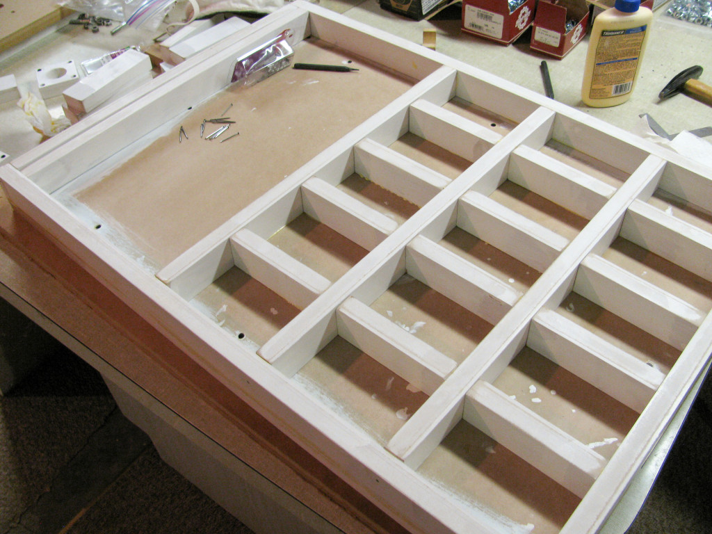Above: Torsion box base. This prevents warping of the MDF causing misalignment and binding.

 

[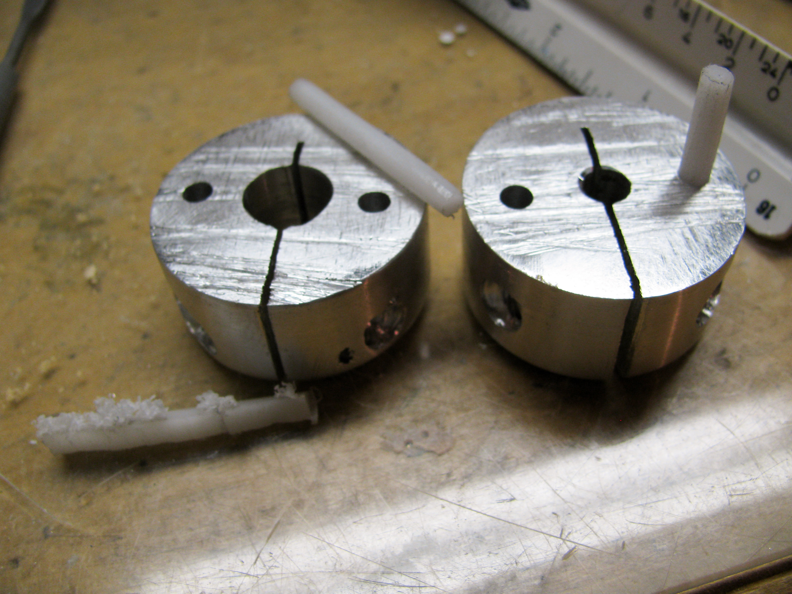](<cnc_coupler.jpg>)Above: Homemade couplers with 1/8″ delrin rods as as the coupling linkage.

 

[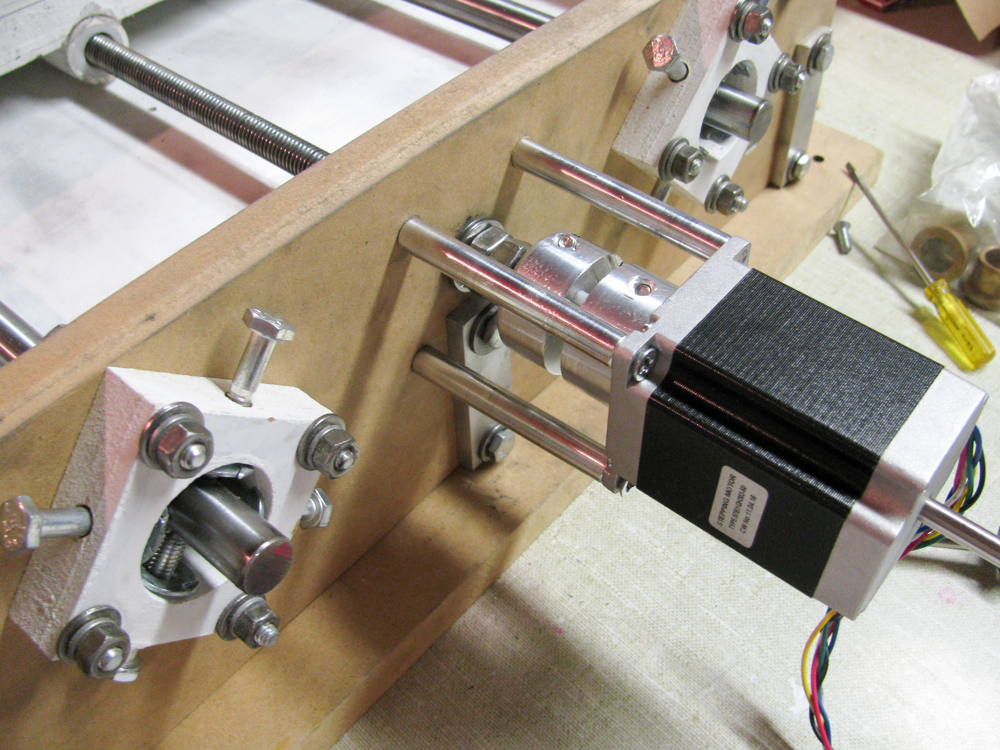](<cnc_x_motor.jpg>)Above: On the left, my personally designed rail alignment mounts. This allows precise adjustment of the rail's parallelism to each other and to the drive shaft. This overcomes the difficulty in aligning pieces of wood and accurately drilling holes. In the center, stepper motor and coupler, mounted with 3/8″ tapped aluminium spacers and a homemade bearing mount, comprising of 4 nuts and 2 bearings torqued against the MDF.

 

[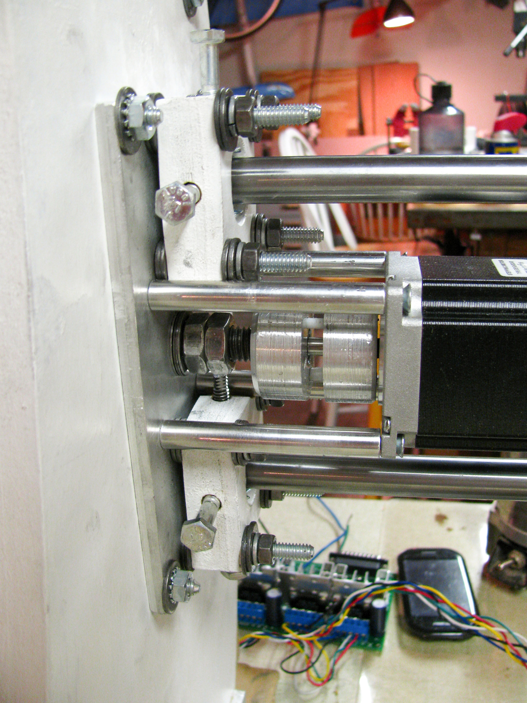](<cnc_y_motor.jpg>)Above: Y-axis stepper motor and rail mounts on a 1/4″ aluminium plate

 

[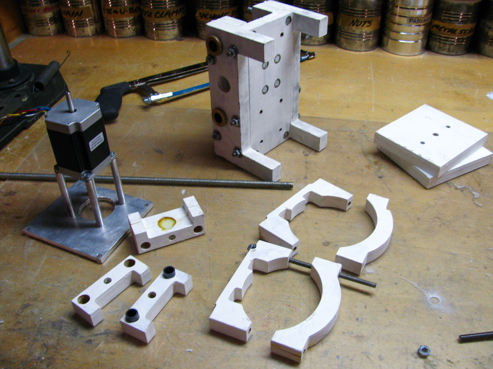](<cnc_z_gantry.jpg>)Above: The z-axis and router mount

[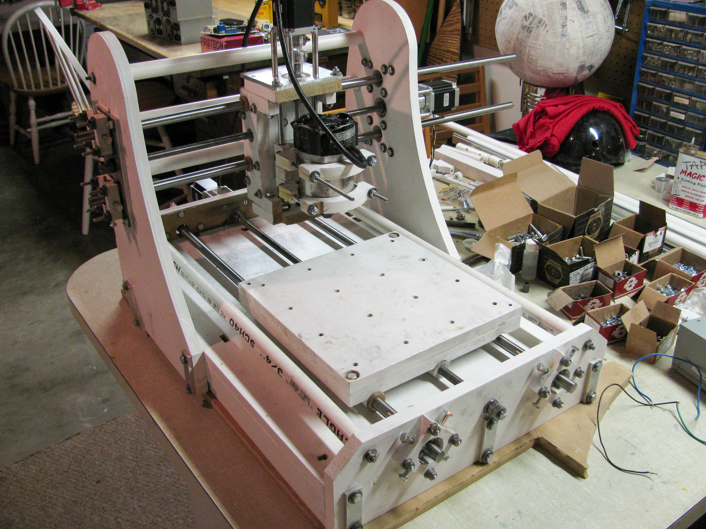](<cnc_overall_1.jpg>)Above: Mostly complete. Z-axis is assembled and the router is mounted, but still missing limit switches and motor connections.

 

[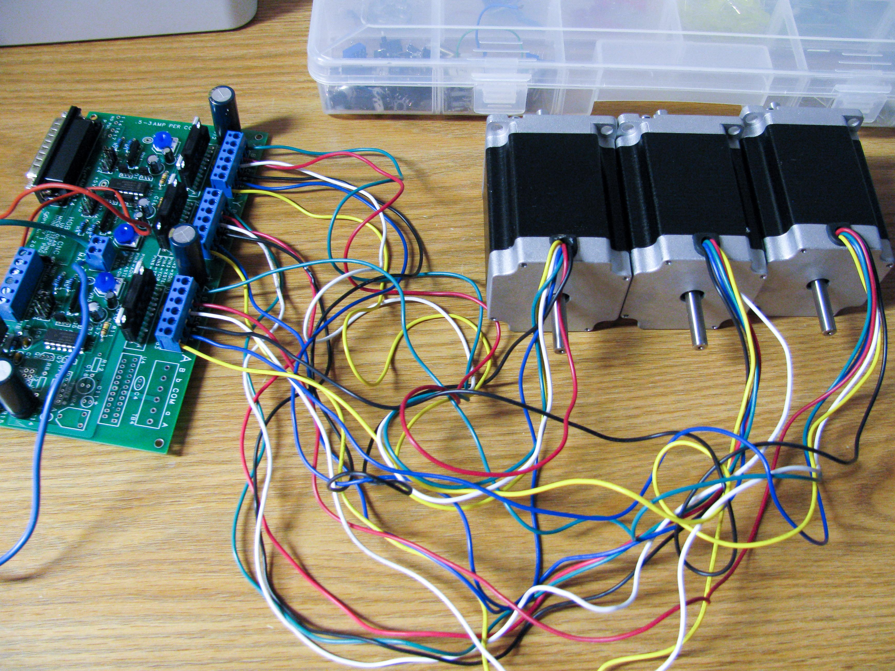](<cnc_driver.jpg>)Above: 3 x 220 oz-in stepper motors and a 3-axis HobbyPro driver board

 

 

Currently, this CNC machine is at my college radio station, cutting out speaker molds and engraving parts. This project was easily one of the biggest projects I have undertaken through high school. What I learned about design, planning, the mechanics of big machinery, metalworking, woodworking, control systems, and routing have proved invaluable.

 

