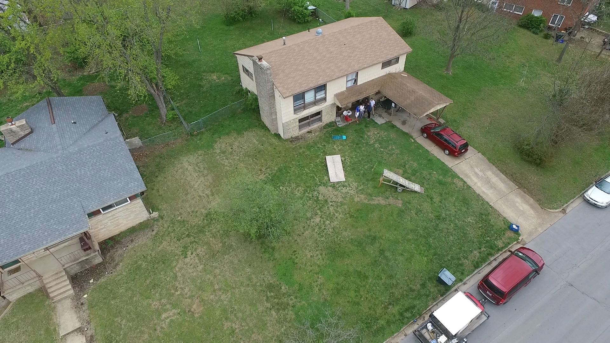
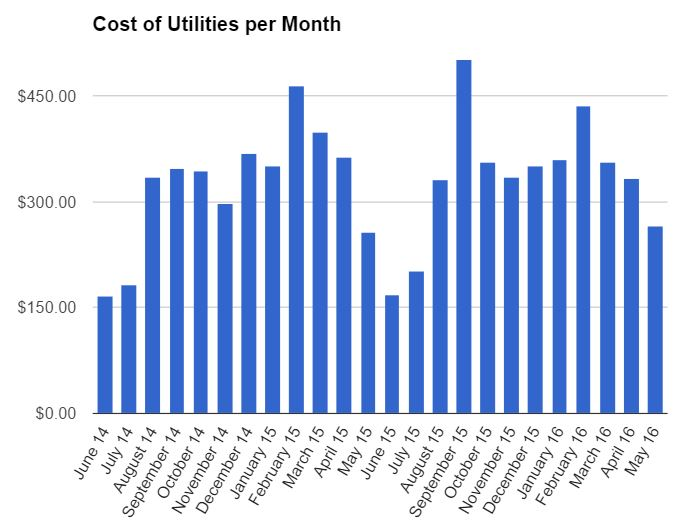

I spent 3 years in a 5 bedroom house in Rolla Missouri. I kept careful track of finances for the first 2 years.

## Bank Account

I setup a new bank account for the house. When I say 'house', I really mean the 5 of us roommates and our house, but I say house because our house is pretty special to us. It's _the house_.

Every month, we write checks or use paypal to get our monthly rent into the house bank account. All bills are written through the same bank account. As we graduate and new students replace our spots in the house, we add their names on the bank account, transferring the ownership.

It's much cleaner and easier than using a personal bank account. It'd get confusing quick.

## Family Dinner Night

5 roommates and 5 school nights a week makes it perfect for preparing dinner for all. Even if you had only 3 roommates, you could still do family dinner 3 nights a week.

When you cook dinner, you take the debit card attached to the house bank account to go shopping. This also made it easy to have food that "belonged" to the house. Example: butter, oil, spices, jelly, condiments. It'd be redundant to have 5 bottles of ketchup. So the house owned a bottle and everyone used it.

This saves money. We can buy the bulk sizes of everything. We can buy the biggest bag of frozen vegetables, which may get used for 3-4 nights of dinner. We can make an enormous croc-pot of chili for 2 nights.

Lasagna was a good example. Every semester, we made ~100 pounds of homemade lasagna. For 4 hours, it'd be a big assembly line. Someone was spent the entire time browning ground beef and sausage while someone else spent the entire time mixing cheese and boiling noodle. We froze all of the lasagnas and had one every week during the semester.

Overall, family dinner night saves time and money and is very much worth the effort.

## Slush Fund

The house bank account allows us to buy things we wouldn't normally buy. I set up a Slush Fund. It's a pool of money to be spent on things no indivdual would buy, but would benefit the house. Examples include tiki torch, lawn chairs, cooking equipment, speaker equipment, a cat, a bidet, a disco ball, a 2 foot tall bicycle ramp, a 4 foot tall bicycle ramp, family (housemates) group portraits, Christmas lights, beads for St. Patrick's Day, concrete for a firepit, LED lights, material for a parade float, 10 cheap airsoft pistols, 10,000 airsoft BBs, and a Roomba.

Initially, the math was complicated for determining Slush Fund balance. I simplified it: The housemates agree to buy something for the house. We limit the max spending per semester to $300.

## Utilities

All of our utilities went through the city except for gas, which was through Ameren.

Average Utility Cost per Month

| **All Year (including summer)** | **August-May (school term only)**  
---|---|---  
Elec | $162.11 | $180.82  
Water | $24.36 | $26.98  
Sewer | $25.98 | $30.03  
Gas | $38.02 | $41.56  
Trash & Misc | $37.30 | $38.02  
Internet | $30.00 | $30.00  
Renter's Insurance | $10.58 | $10.58  
**Total** | $328.36 | $357.99  
  
Electricity is $20/month + 8.9¢/kWh. During the school year, we averaged 1,800 kWh. This is double the national average according to the [EIA](<https://www.eia.gov/tools/faqs/faq.cfm?id=97&t=3>).

Our highest electricity bill was in September at $297. The house was built in 1955, has all single pane windows, and poor circulation. We have 2 full size fridges, 6 mini fridges, and a deep freezer. There are 2 desktop computers that almost never get turned off. The living room has a TV and computer that are on 24/7. Nobody can remember to close the doors, turn off lights, and close the fridge. Ho hum.

We have a gas heater, water heater, and stove. Our monthly cost of gas averages $50 in the winter months and $30 in the summer months. The house is unoccupied in the summer months.

## Rent

We pay $825/month to the realty company. [Zillow.com](<http://www.zillow.com>) and I both think we should be paying $600-$700 a month. $825 divided by 5 people is $165 per person per month. On the 3rd year, we moved a sixth roommate into the house, lowering rent to $137.50/person/month.

## Calculating Monthly Bills

This is the method I have used and recommend. It's quite simple.

Set up a house bank account. Everyone deposits $300. They'll get this money back when they move out. With 5 people. there is now $1500 in the bank account. Use this money to pay for food, utilities, and rent throughout the month.

At the end of the month, check the balance. Suppose $500 is remaining. That means you spent $1500-$500= $1000. $1000/5 people is $200 per person. Everyone writes a check (or Paypal or VenMo) for $200.

## Totals

| **Average Monthly** | **Average Monthly Per Person**  
---|---|---  
Rent | $825.00 | $165.00  
Utilities | $328.36 | $65.67  
Slush Fund | $65.66 | $13.13  
Food and Misc | $237.08 | $47.42  
**Total** | $1,456.10 | $291.22  
  
Add another $300/month for additional food, hygiene, beer, insurance, gas, and clothes. It is very possible to comfortably live off $600/month or $7,200/year!
