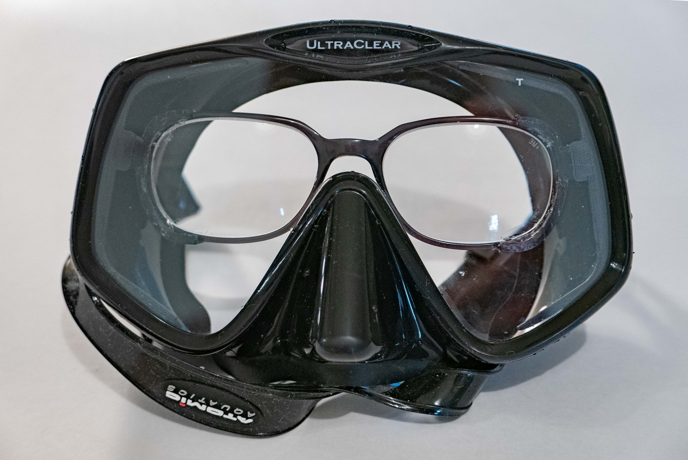
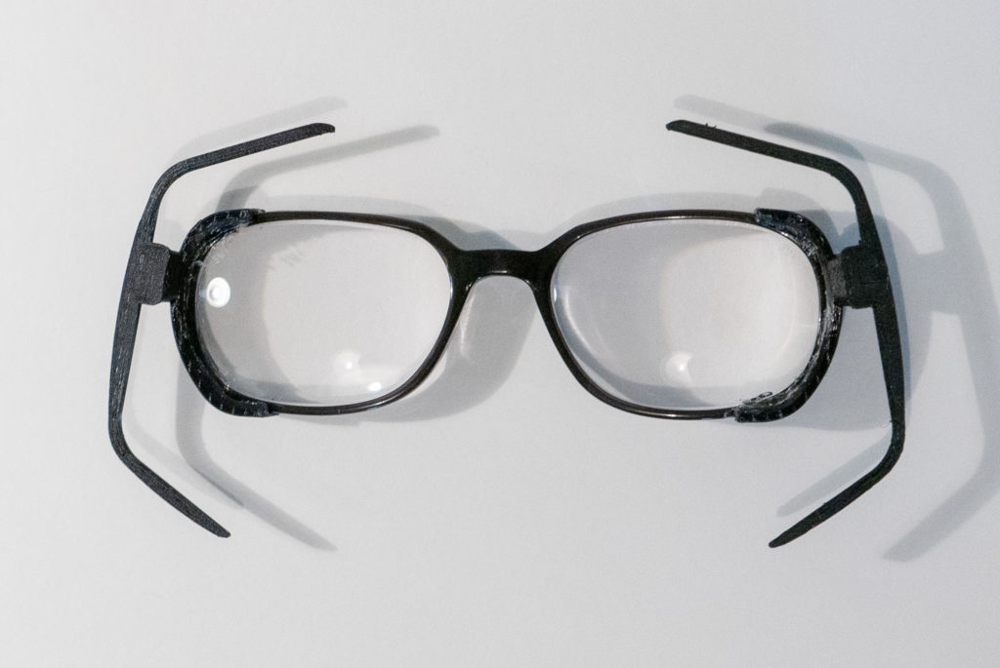
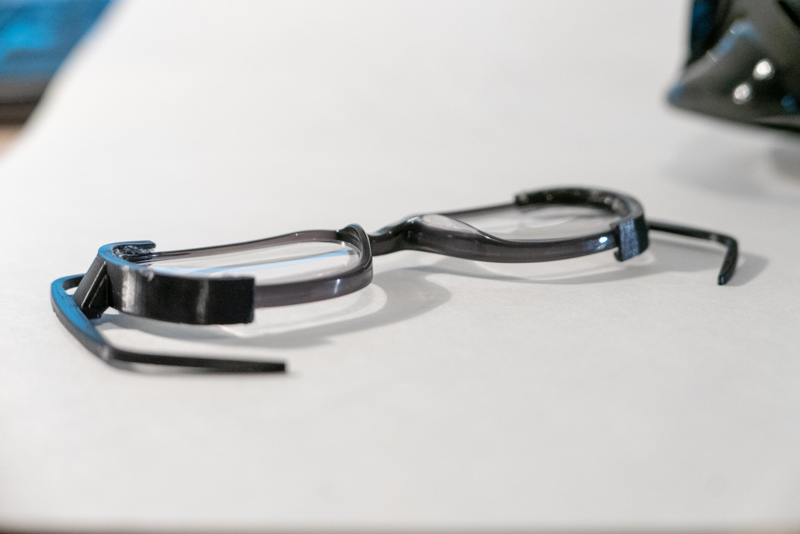
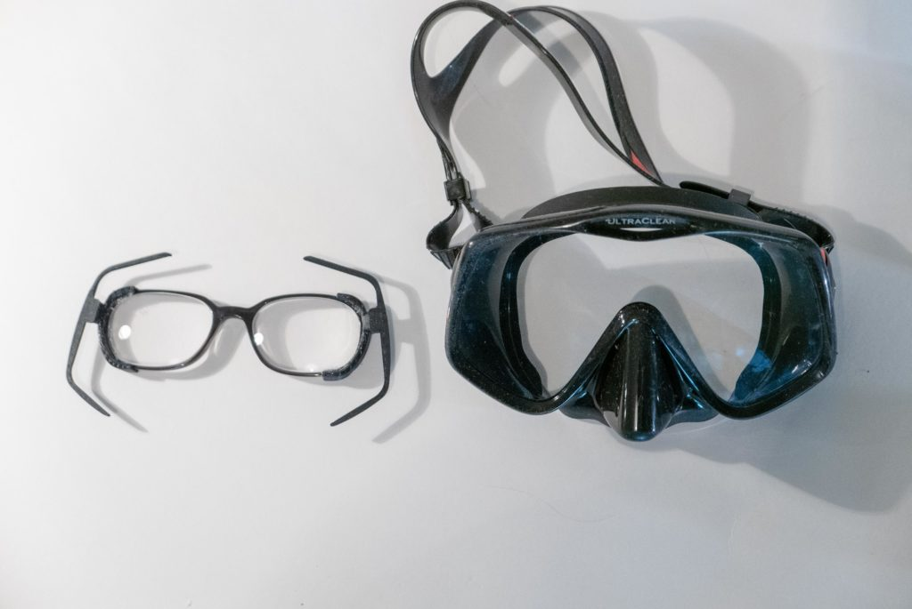

This is a custom bracket for holding a pair of prescription lenses inside a scuba dive mask.

The goggles here are the [Atomic Frameless 2](<https://www.atomicaquatics.com/masks_frameless2.html>). These goggles are great quality, have a wide field-of view, and have enough clearance to fit a pair of glasses inside.

I designed the bracket in Autodesk Inventor and printed it on a 3D printer. You can find my design files on Thingiverse [here](<https://www.thingiverse.com/thing:3196365>). If you want to customize this bracket to fit your specific glasses and mask, you can get a free copy of Autodesk Fusion 360 [here](<https://www.autodesk.com/products/fusion-360/overview>).

[Aquaseal](<https://www.gearaid.com/collections/aquaseal>) is a great choice for gluing the bracket to the glasses. You can also use hot glue - it has good adhesion to PLA plastic and is non-destructive.

I am very farsighted (+5) and these are the cheapest lenses available (N=1), so they are quite thick. They still fit, but there is not much clearance between my face, the lenses, and the mask. If you have a bad prescription like me, I'd recommend using high index lenses.

This is a particularly cheap and effective way to get prescription goggles, but it requires a bit of design and 3D printing knowledge. Removing the glasses from the mask for cleaning is quick. Additionally, there are no modifications to the mask.
