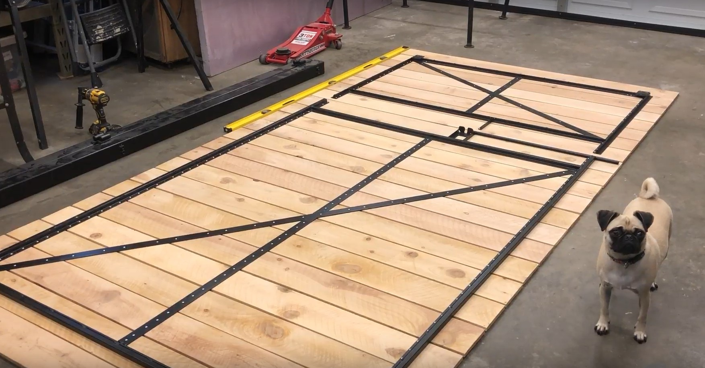
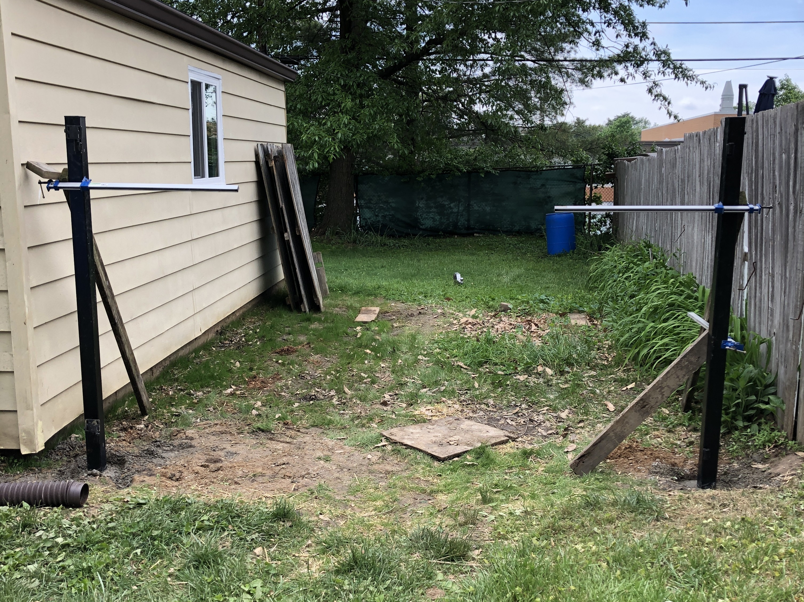

This gate has no exterior visible from the front and opens large enough for a vehicle and trailer to drive through.

## Design



You can download this as a PDF [here](frameless-gate-1.pdf).



## Frame

The frame is made of 3/4″ angle iron at 1/8″ thick as the frame. I ended up double up on the angle iron (welding them back-to-back). I wish I would have used a thinner-walled square tube instead. It would have been much stronger for the same weight and price.

## Posts

The posts are 3″ square tube at 1/8″ thick and 10′ long. I dug a 5′ deep hole. For this, I used my homemade auger. You can see it in the video below. It’s driven with a 1/2″ socket and uses 1/2″ socket extensions to get to depth.

I used weld-on hinges to attach the gate. I made an adjustable bracket, which allows me to get a perfectly aligned gate. If the gate sags in the future, I can compensate with the adjustable brackets.

## Video



## End Result

The gate turned out really great. It is easy to open and sturdy. I can easily drive a vehicle through the gate.


