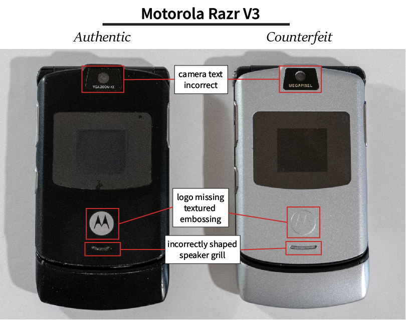
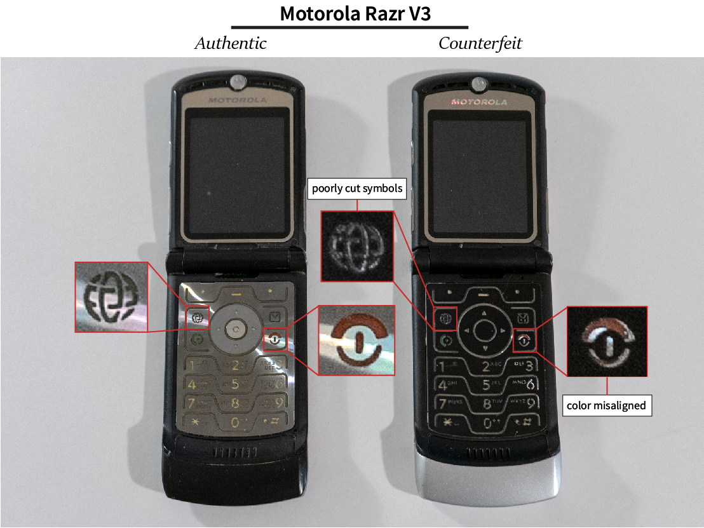

_**Note** - There are many versions of the Motorola Razr, each with subtle differences. Even similar version have differences between countries. Not all of the differences of this counterfeit/refurbished Razr will apply to your Razr!_

This applies specifically to the Motorola Razr V3, but you can find similar discrepancies on a Razr V2 or V3i.

If you have a feeling the phone is fake, that's a good indicator that it is. 

First notice the camera text. The authentic phone says "VGA ZOOM 4X" whereas the counterfeit phone says "MEGAPIXEL". To quip, the cameras are 0.3 megapixels.

Second, the Motorola "M" logo. On the authentic phone, it has a textured, shiny embossing. It's a different finish that the rest of the plastic, regardless of the phone's color. On the counterfeit phone, the logo has no embossing. 

Third, the speaker grill. On this counterfeit phone, it isn't shaped quite right.

Opening the phones, you should first notice the difference in keyboard color. It should be a reflective silver, not a matte black. This is the quickest indicator for a counterfeit phone. It doesn't matter if the outside of the Razr is silver, pink, black, or anything else - the keyboard on a Razr V3 is always reflective silver.

Second, you should notice a distinctive difference in the quality of pressing keys. On an authentic Razr, pressing a key gives a firm and satisfying click. On the fake phone, pressing a key doesn't feel firm and it's easy to accidentally press a few keys at once.

Third, notice the quality of the letters and symbols. They are clean and precisely cut on an authentic phone. 

Finally, the coloring for the "call" and "hang up" keys are poorly aligned on the fake phone.

Have you found other indicators that a Razr V3 is fake? Let me know in the comments below.

Want a more in-depth teardown? See my teardown [here](</blog/motorola-razr-v3-real-vs-counterfeit-teardown/>).
