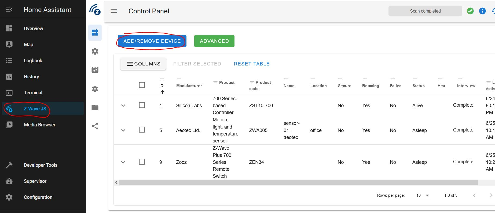
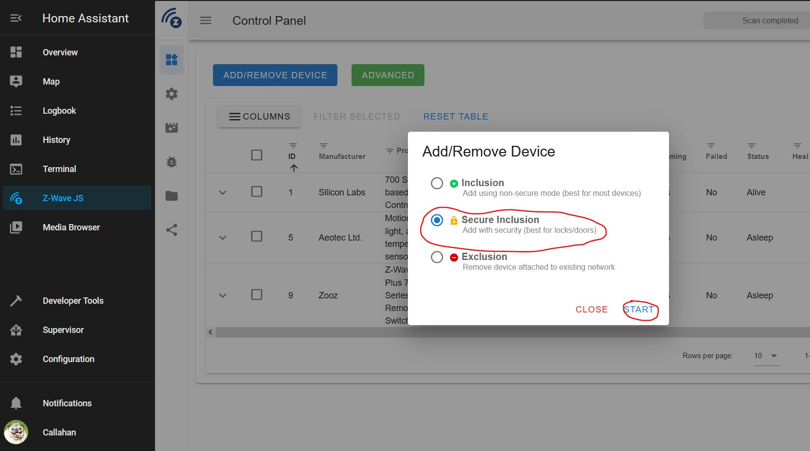
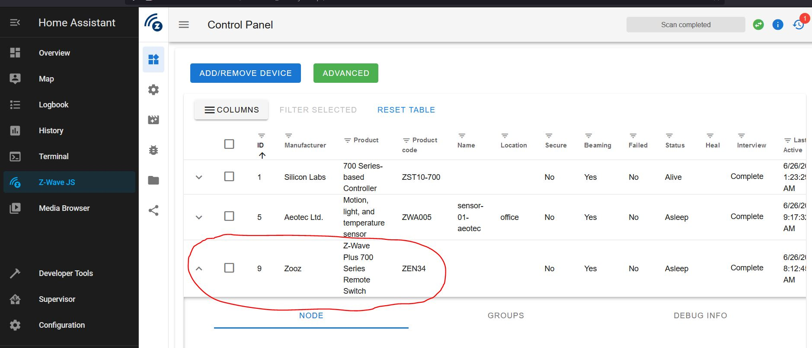
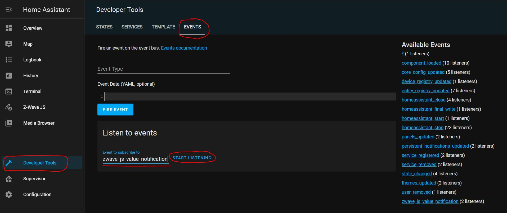
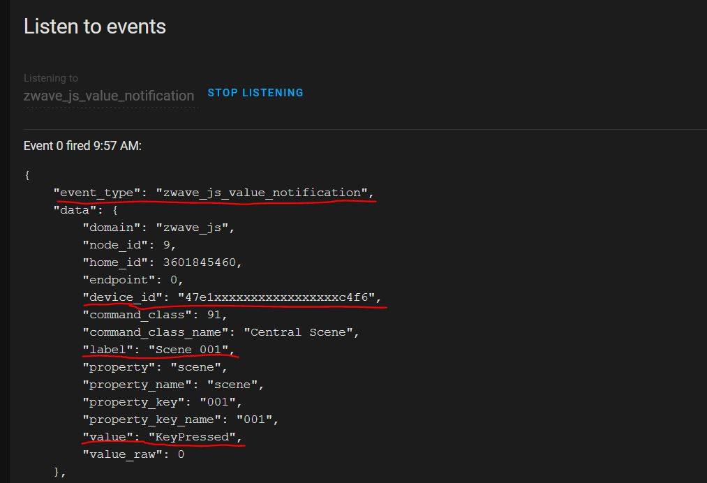
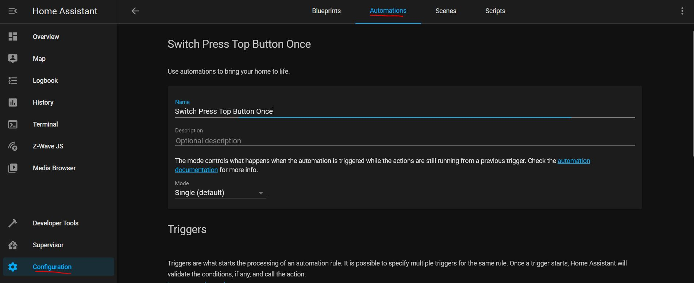
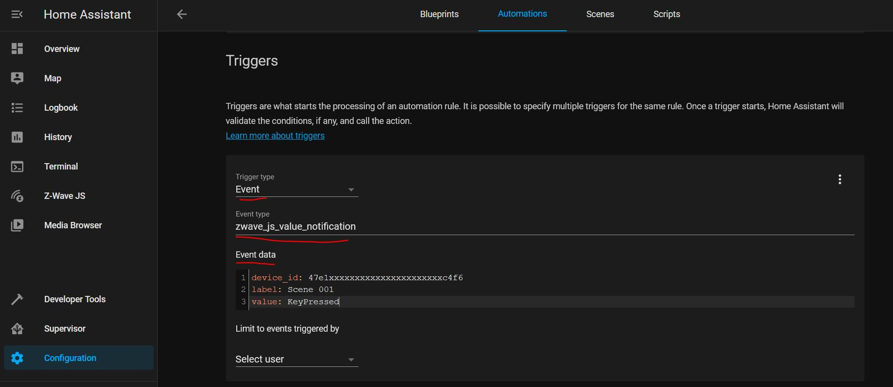

This overviews adding a Zooz ZEN34 smart switch to Home Assistant and using it to trigger automations.

This guide was written for HA 2021.6.6.

## Prerequisites

  1. [Home Assistant](<https://www.home-assistant.io/>)
  2. Z-Wave USB Hub  
I recommend either the [Aeotec Z-Stick 7](<https://aeotec.com/z-wave-usb-stick/z-stick-7.html>) or [Z-Stick 5](<https://aeotec.com/z-wave-usb-stick/>).
  3. Z-Wave JS integration on Home Assistant  
See setup instructions [here](<https://help.aeotec.com/support/solutions/articles/6000246295-setup-home-assistant-with-z-stick-7>).
  4. [Zooz ZEN34 Smart Wireless Z-Wave Switch](<https://www.amazon.com/gp/product/B08TMWLY74>)

## Add ZEN34 to Z-WaveJS

  1. Remove paper battery tabs from switch to power on switch
  2. Login to Home Assistant
  3. Go to Z-Wave JS and press "Add/Remove Device"  
  

  4. Select "Secure Inclusion" and press "Start"  
  

  5. The switch should show up on the Z-Wave JS Control Panel.  
If the fields are fully filled in (they shown "unknown" or "dead"), wait 5 minutes.  
If the fields still haven't shown up, press the upper paddle 7 times to force the switch to wake up and send/receive configuration data.  
  

## Listen for Switch Presses

The switch should show up as a device under Configuration->Devices. Unintuitively, the switch will not have any entities for the two buttons, but just entities for battery status.

When the switch is pressed, a `zwave_js_value_notification` event is generated. The event contains data about which button was pressed and how many times it was pressed. To use the switch for an automation, we will use this event as the trigger.

  1. Go to Developer Tools->Events
  2. Under "Listen to events", enter `zwave_js_value_notification` and press "Start Listening"  
Note - you can also enter "*" to listen to all events.  
  

  3. Press a button on the switch. You should see the event appear.  
The important data are `event_type`, `device_id`, `label`, and `value`.  
- `device_id` - identifies the switch  
- `label` - "Scene 001" = upper button, "Scene 002" = lower button  
- `value` - how many times the button has been pressed  
  

We can now use this data to trigger an automation.

## Trigger an Automation

  1. Go to Configuration->Automation->Add Automation  
  

  2. Under Triggers:  
- Trigger Type: `Event`  
- Event Type: `zwave_js_value_notification`  
- Event Data (from the "Listen for Events" step) :   
`device_id: <your_device_id>  
label: <your_label>  
value: <your_value>`  
  

  3. Add the rest of your automation's conditions and actions.  
  

#### List of Event Data

The ZEN34 switch supports multiple presses (up to 5 presses) and long holds.

The table below shows the `label `and `value `data to use in your automation trigger's event data.

Button| Action| Label| Value  
---|---|---|---  
Upper Button| 1 Press| Scene 001| KeyPressed  
Upper Button| 2 Presses| Scene 001| KeyPressed2x  
Upper Button| 3 Presses| Scene 001| KeyPressed3x  
Upper Button| 4 Presses| Scene 001| KeyPressed4x  
Upper Button| 5 Presses| Scene 001| KeyPressed5x  
Upper Button| Key Held Down (long press)| Scene 001| KeyHeldDown  
Upper Button| Key Released (long press)| Scene 001| KeyReleased  
Lower Button| 1 Press| Scene 002| KeyPressed  
Lower Button| 2 Presses| Scene 002| KeyPressed2x  
Lower Button| 3 Presses| Scene 002| KeyPressed3x  
Lower Button| 4 Presses| Scene 002| KeyPressed4x  
Lower Button| 5 Presses| Scene 002| KeyPressed5x  
Lower Button| Key Held Down (long press)| Scene 002| KeyHeldDown  
Lower Button| Key Released (long press)| Scene 002| KeyReleased
