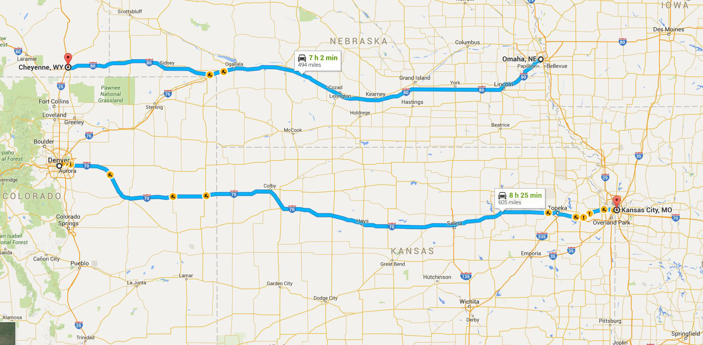
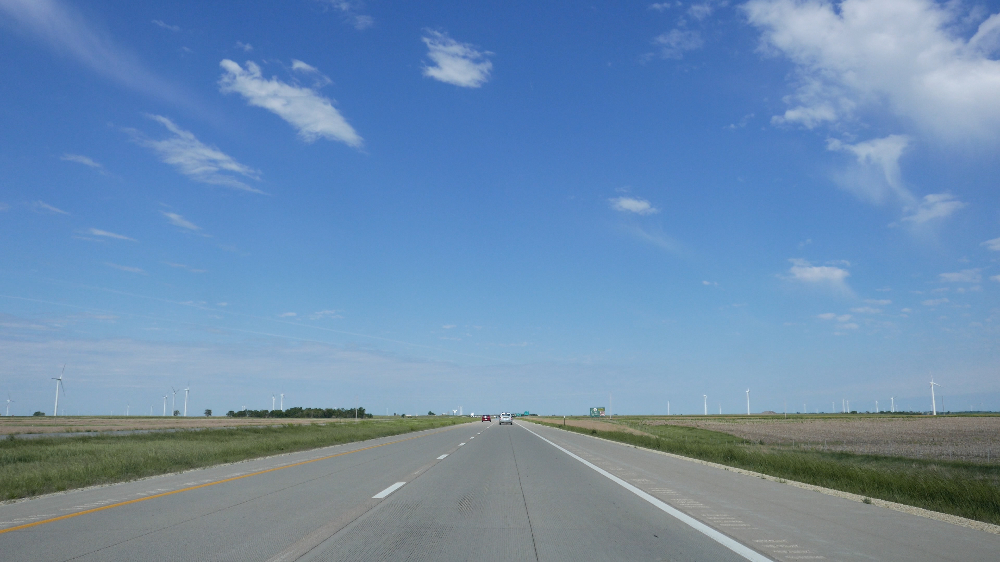

Trying to decide which one to take? I've driven both, so you don't have to.

I-80 through Nebraska runs on slow, gradual hills. Driving to from Kansas City to Denver is deceiving, because after the 5 hours through Kansas, you still have 3 hours in Colorado that looks remarkably similar to Kansas.

There isn't much along the highway either. Few towns, trees, signs, or radio stations.

_Highway I-70 through Kansas_

The open space is beautiful in it's own right, but I-70 Kansas gets such a bad rep because of its neighboring states. A few hours East for the endless forests of Missouri. A few hours West for the snowy mountains of Colorado.

I-80 through Nebraska doesn't look like I-70, although Google Maps makes both look equally treacherous. Compared to Kansas, this section of Nebraska has many more rolling hills, trees, towns, signs, and radio stations. Still, it is one of the more open and sceneless drives in America.

_Highway I-80 through Nebraska_

Everyone should drive through I-70. It belongs on the list next to Disneyworld, LA, and Yellowstone.

Just once, if you can help it.
