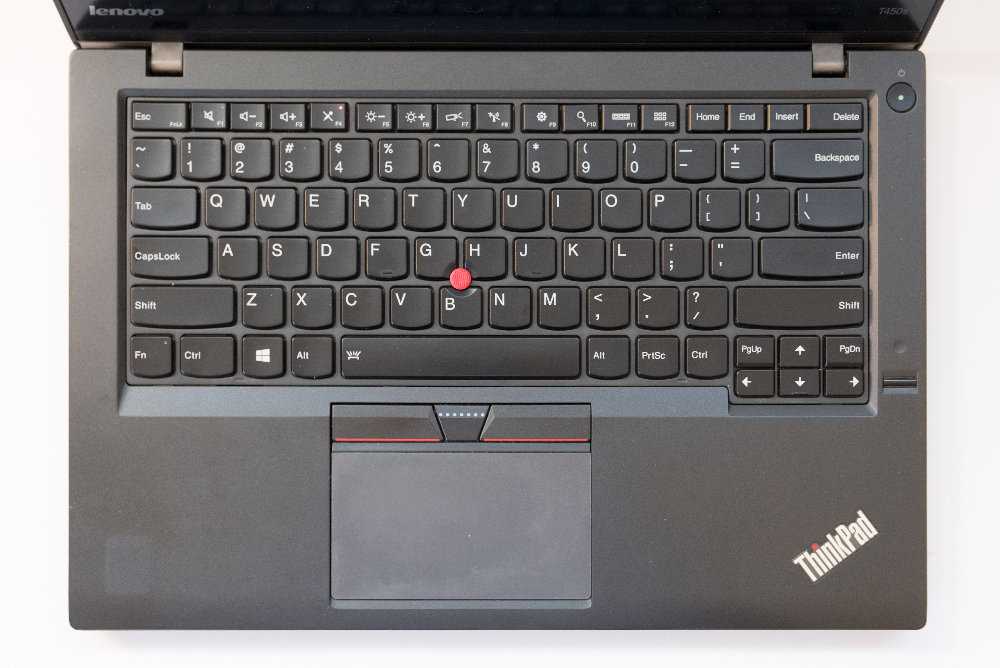
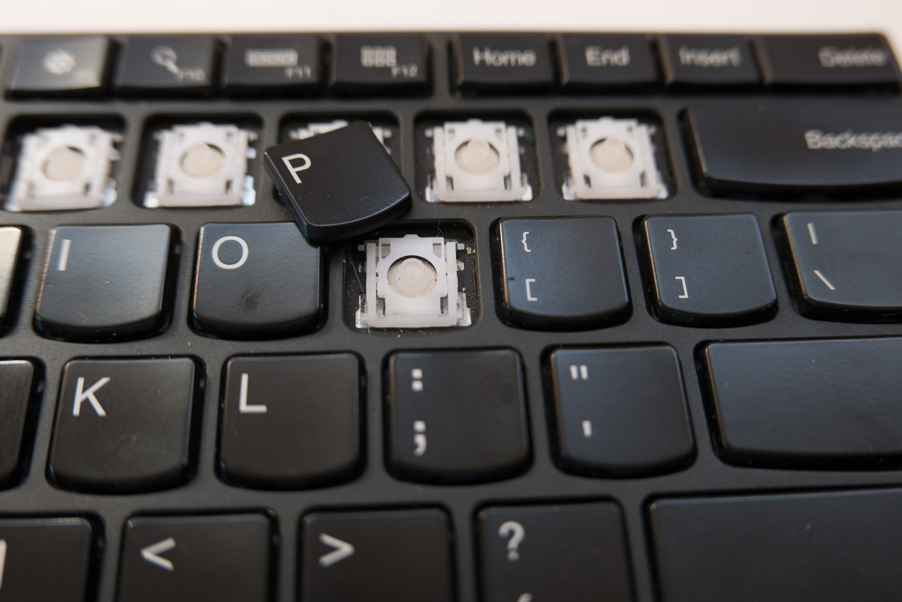
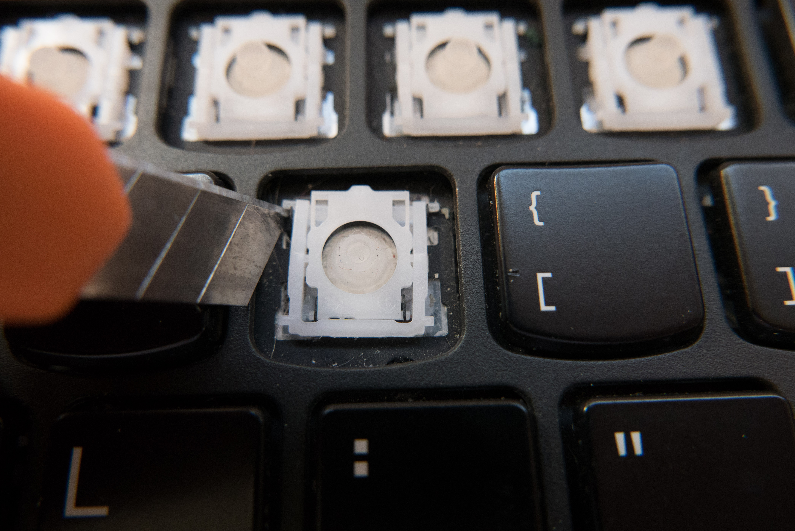
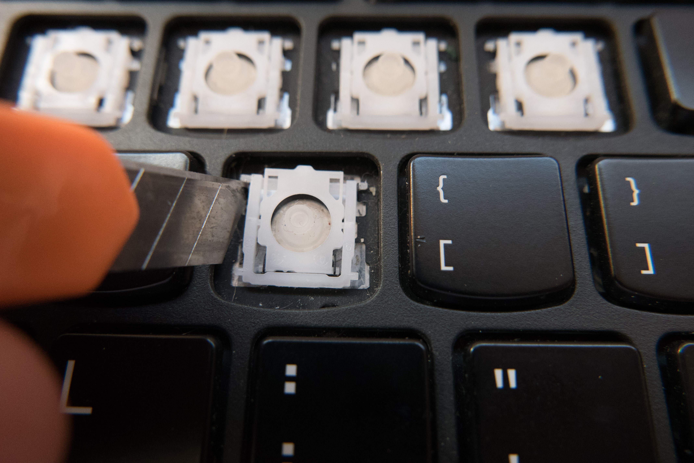
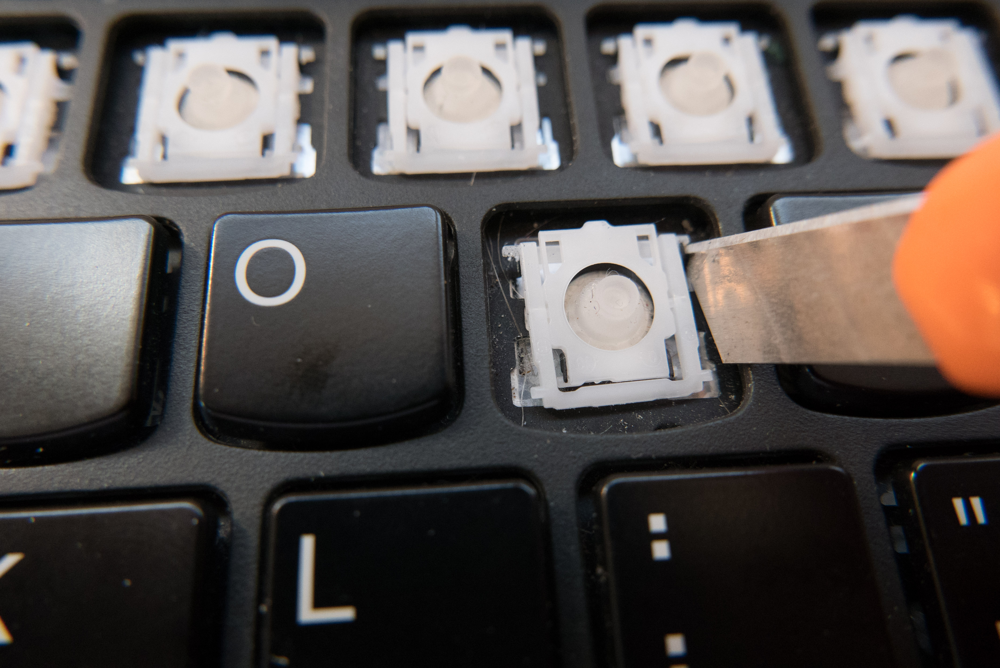
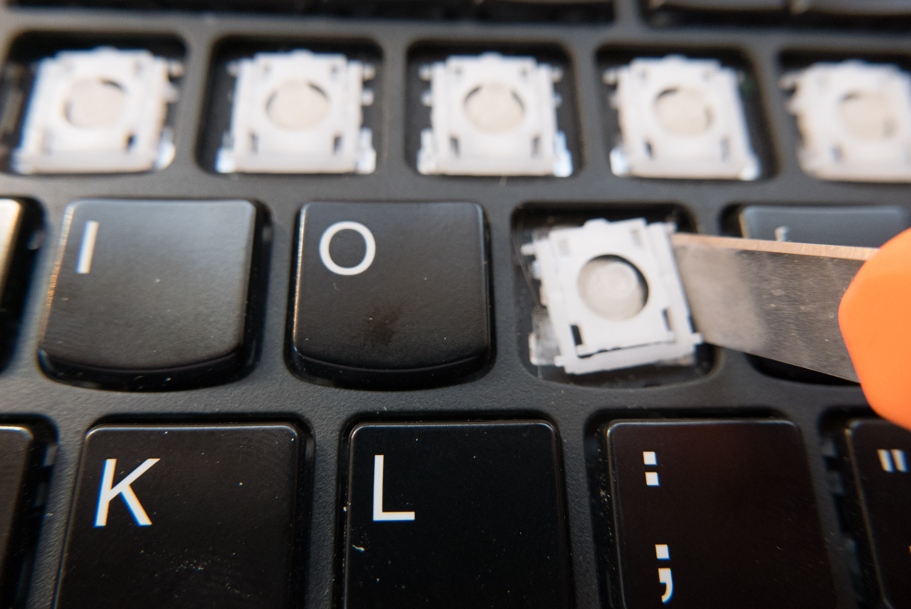
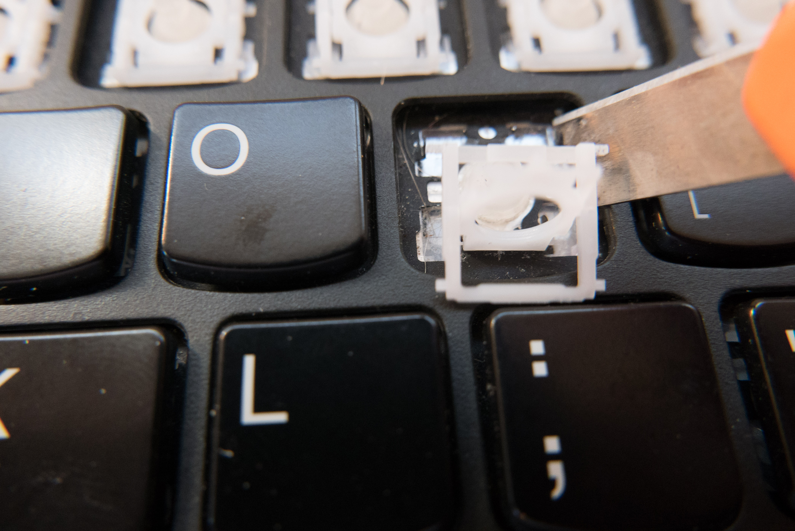
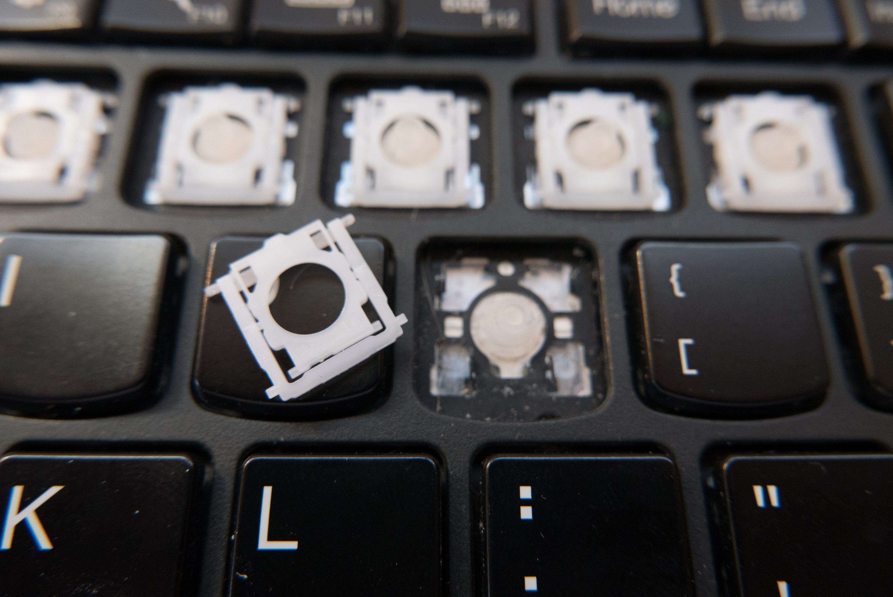
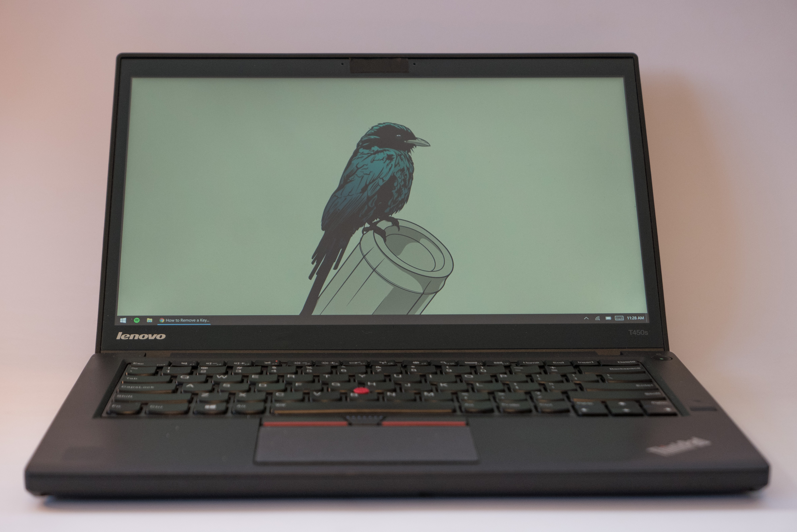

This guide is for removing keys off a Lenovo ThinkPad T450s and should also work for the T430, T440, T450, and T460.

There are fragile retaining clips on the underside of each key. Repetitive removal will surely break them. Once the clip breaks, it must be replaced.

 

## Key Removal

Wedge your finger underneath the upper left and pull directly up until you hear a single click.

 

 

Now wedge your finger underneath the upper right and pull directly up until you hear another single click.

 

 

The key should now be free to be removed.

If you're just replacing the key or removing debris underneath the key, then you are done. If the plastic bracket is broken, follow the steps below to remove the bracket.

 

## Plastic Bracket Removal

 

Using a small flathead screwdriver or razor blade, gently push forwards on the little arm. Once you have pushed forwards enough, you can then push upwards, freeing the arm from its retaining hinge.

 

 

The arm has been pushed upwards. You can see it is now free.

 

 

We'll repeat the same procedure on the other side. The second side always requires less force.

 

 

And it is free. The lower part of the bracket slips out on its own.

 

 

Continue to use your screwdriver or screwdriver to wiggle the bracket free.

 

 

And the bracket has been freed!

Reassembly follows the same steps in reverse.

 

 

