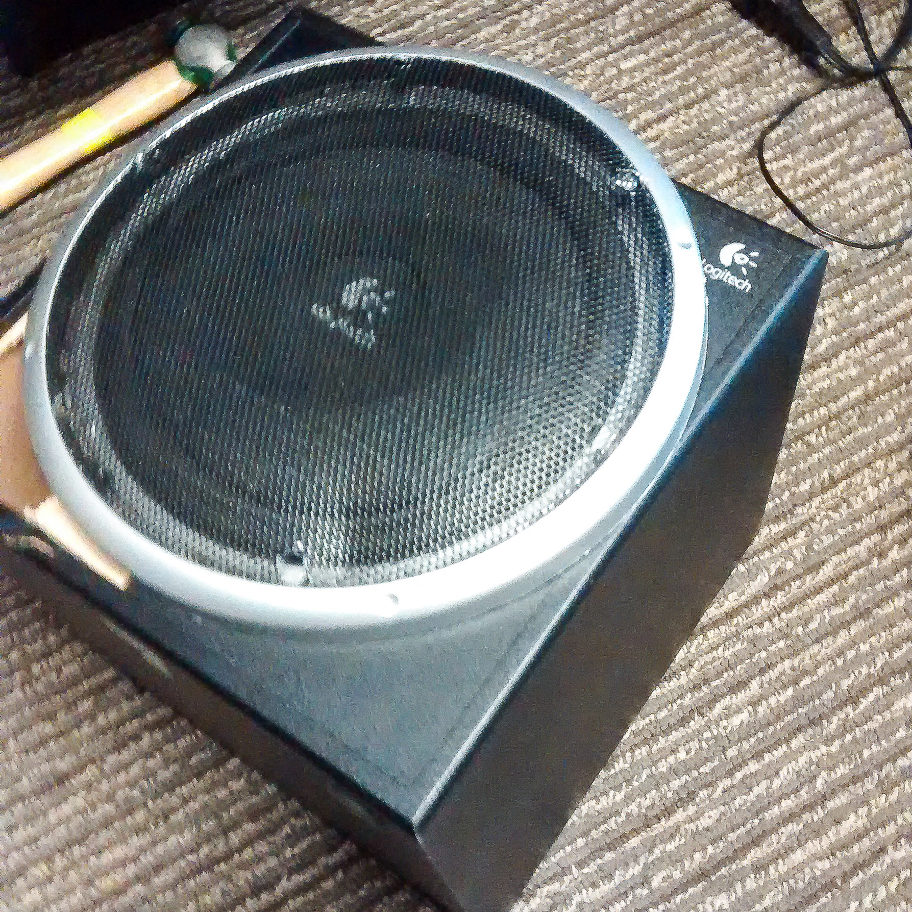
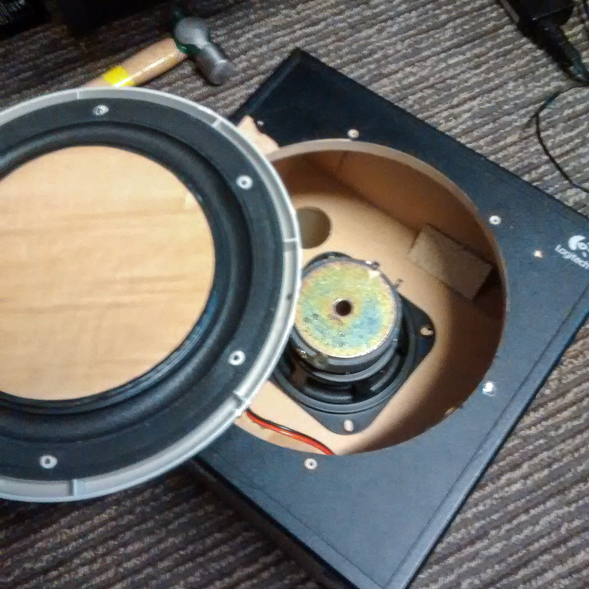
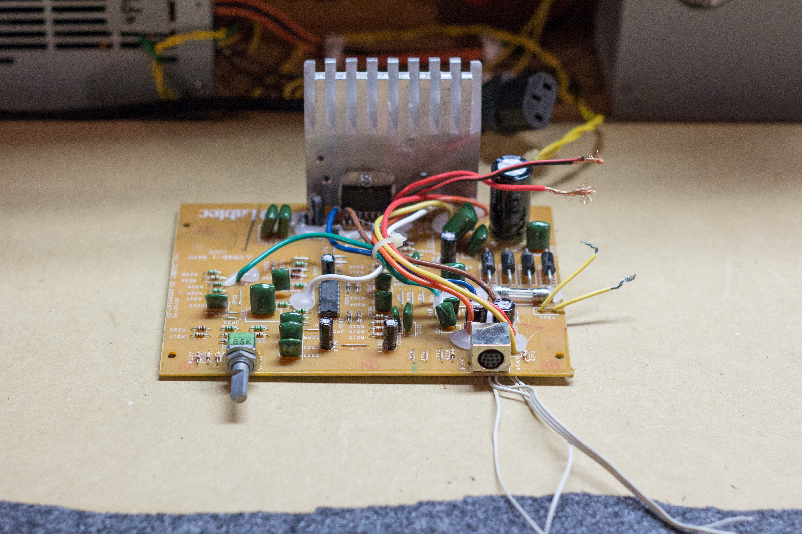
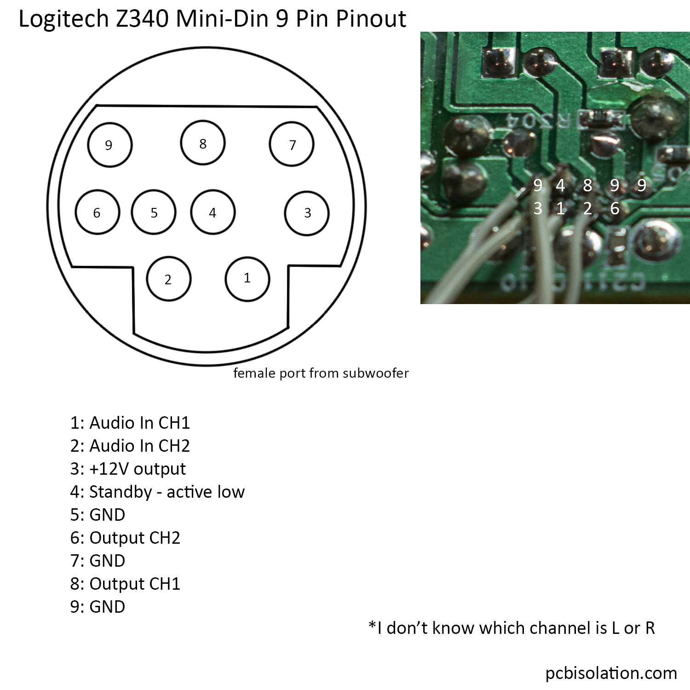
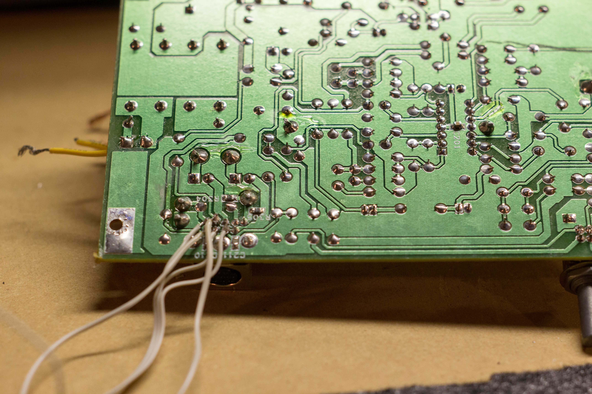
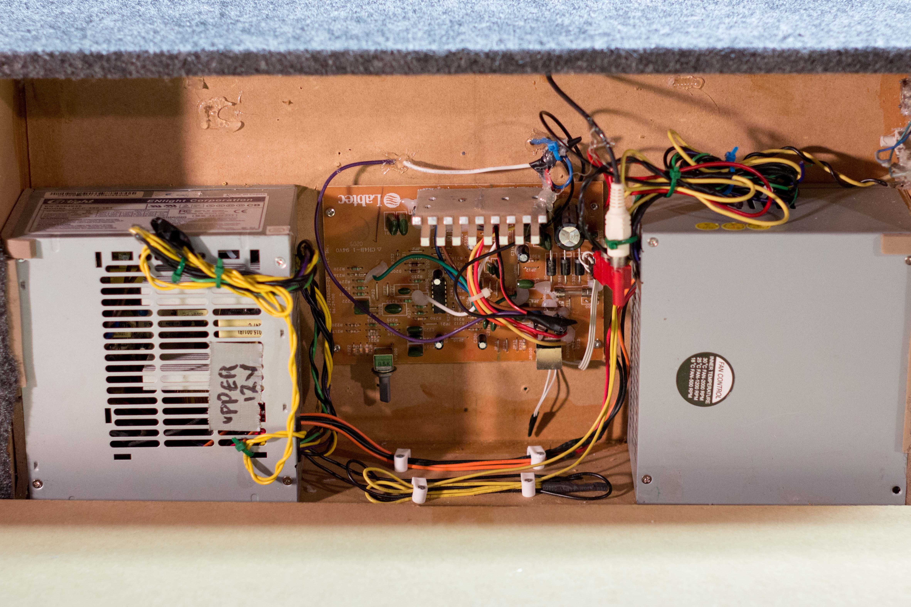
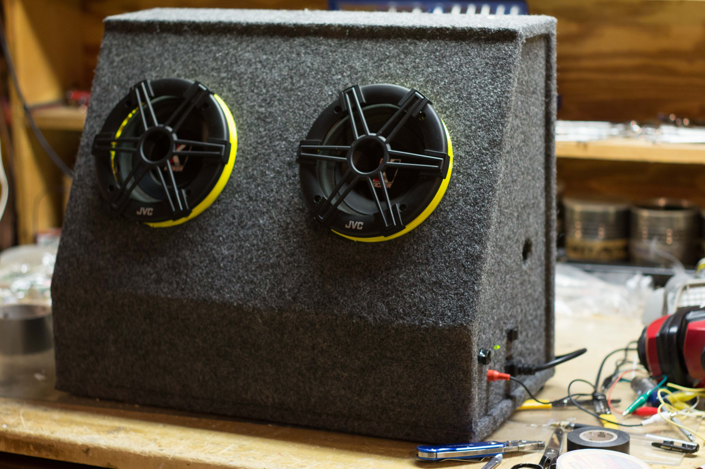

Logitech has a large presence in 2.1 systems, where price and appearance dominate. This sub is designed to trick you, there's more to it than what meets the eye.

I picked up a used Logitech Z340 2.1, sans the 2. I got a woofer with no satellites or volume control.

notice in the corner - Mr. Happy Hammer 🙂

8″ subwoofer (4″ speaker + cardboard)

 

Since I don't have the satellites, this is of no value to me. And the speaker isn't of much value either, so I want the amplifier out of this.

 

 

This sub requires a lot of hammering and unscrewing to free the amp. If you had long needlenose pliers, you could get to the amp without destroying the box. Otherwise, you will have to rip off the front Revolutionary Subwoofer Panel and smash open the screw-free, super glued box.

 

 

Fortunately, everything here is simple. The picture of the PCB is where the mini-din connector attaches to the PCB.

 

 

 

You can see where I attached wires to control the subwoofer. I shorted the standby signal to the 12V out, so it is always on.

The amp will be replacing the Sure amp that broke from my [Kicker Sub Build](<http://pcbisolation.wordpress.com/2013/02/17/powered-subwoofer-box-build/> "Powered Subwoofer Box Build").

 

 

 

Here it is, powered from the 12V rail of an ATX PSU. Since the Sure amp is gone, the 2nd PSU isn't used anymore.

 

 

 

And there you have it, a Logitech Z340 that would have surely gone to the dump, repurposed and reused.

 

 
