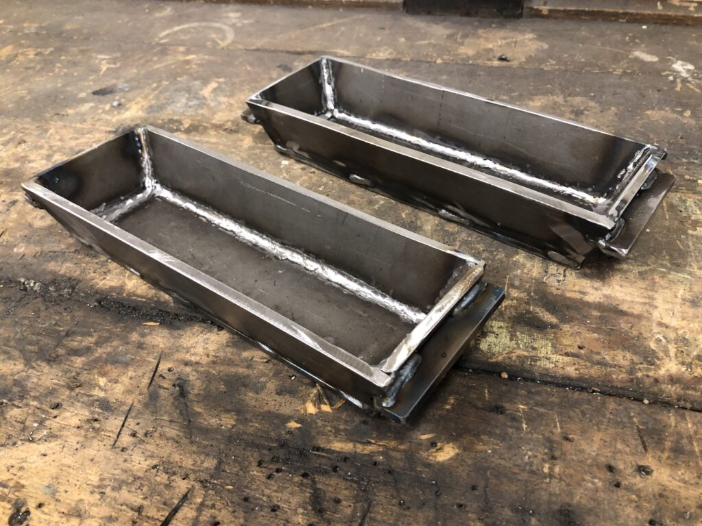
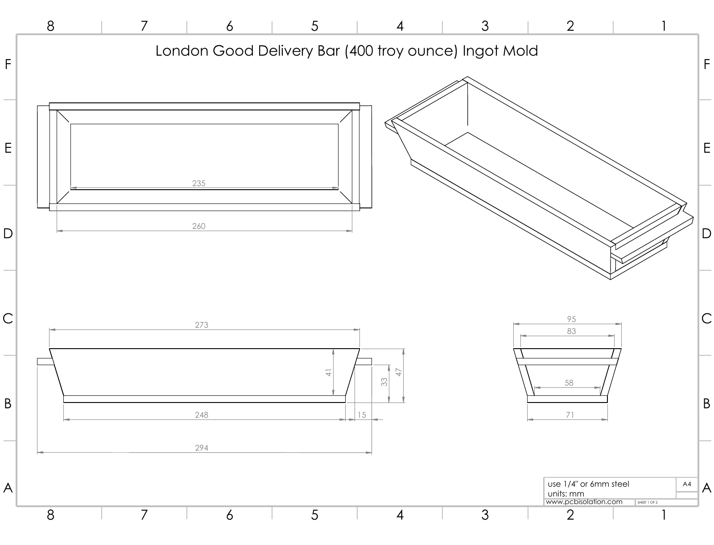
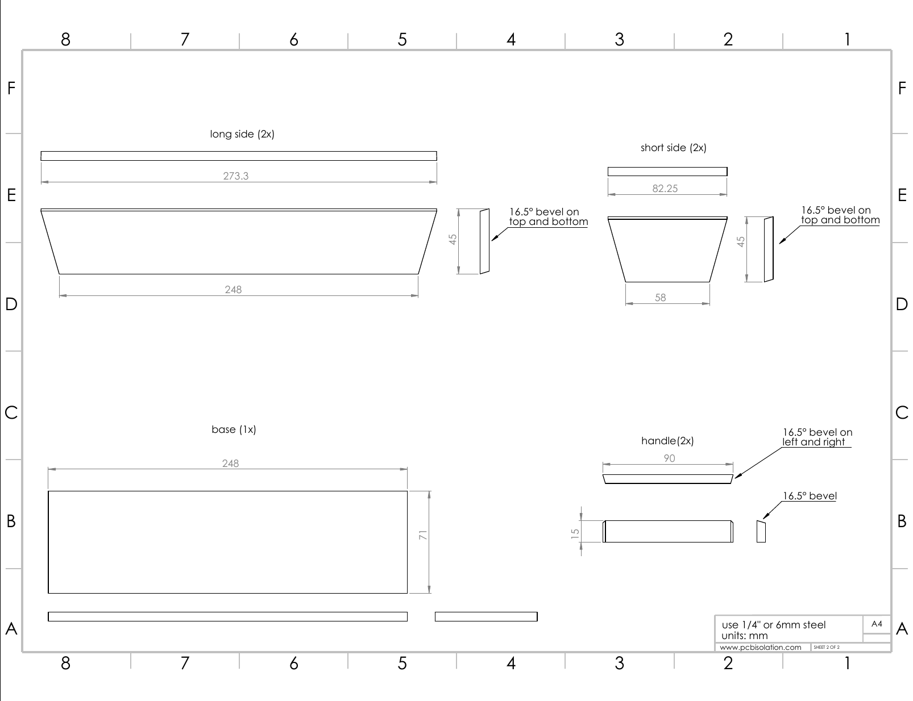

[London Good Delivery Bars](<https://en.wikipedia.org/wiki/Good_Delivery>) define [standards](<https://www.lbma.org.uk/publications/good-delivery-rules/technical-specifications>) for gold and silver ingots. These are usually the ingots you see in movies. This post contains drawings I created for molds made from 1/4″ (6mm) mild steel.

Below you'll find a pdf and jpegs with the dimensions.

[london-good-delivery-bar-ingot-mold](<london-good-delivery-bar-ingot-mold.pdf>)[Download](<london-good-delivery-bar-ingot-mold.pdf>)

 

See the creation of the molds below:


