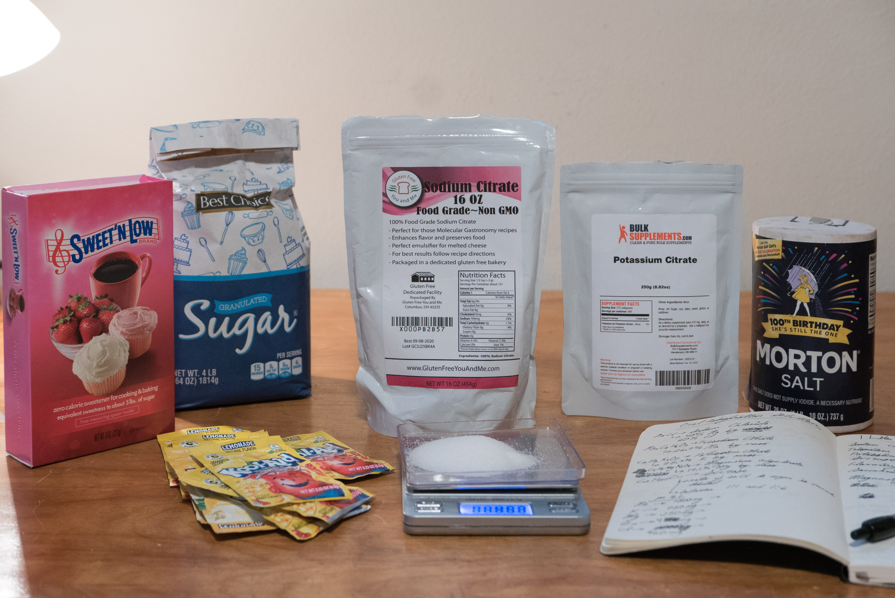
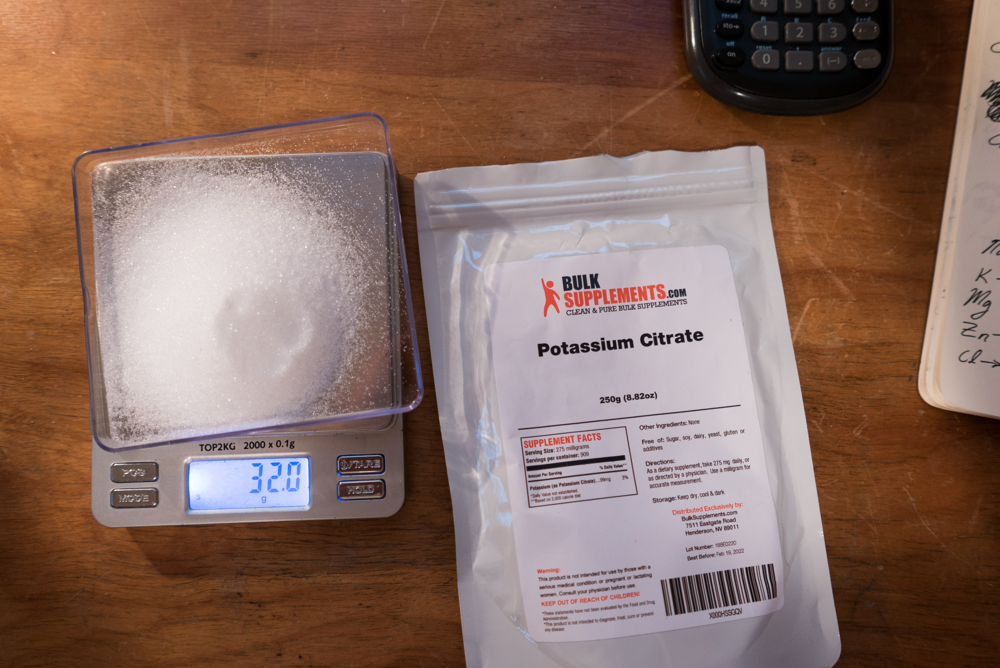
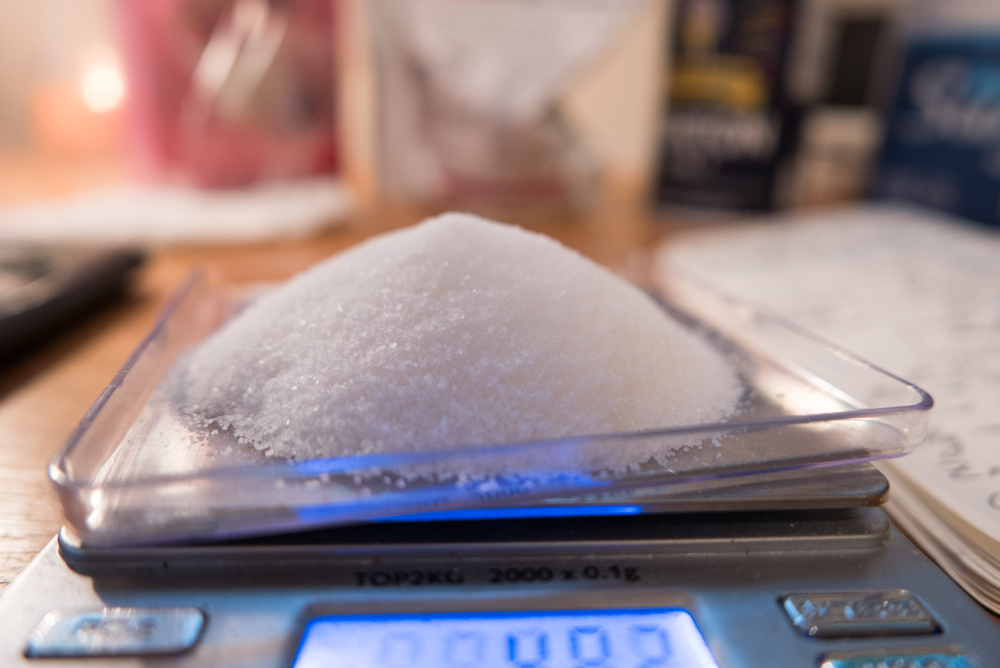

This ORS (oral rehydration solution) is 10 times cheaper than Pedialyte and contains a wider array of electrolytes. Gatorade, in comparison, is a [low electrolyte, high sugar mix](<https://paleoleap.com/all-about-electrolytes/>) and has nothing on this ORS besides marketing.

I wanted something to mute hangovers or to drink after a long day of sweating. But I don't want to spend $4 on Pedialyte or drink a gallon of sugary Gatorade. This ORS closely follows the nutritional profile of Pedialyte. The ingredients are similar too, excluding Pedialyte's additives to improve solubility and shelf life. As a powder, it is more convenient. Compared to a $4 bottle of Pedialyte, 1 liter of this ORS costs about 41 cents!

I'm not a doctor and don't know much about anything. So be careful. Nonetheless, all these ingredients are commonly used in food and safe to ingest, so I feel comfortable with these mixes.

### There Are More Electrolytes Than Sodium

Almost every recipe for an ORS starts with "you need to replenish your [electrolytes](<https://en.wikipedia.org/wiki/Electrolyte#Physiological_importance>)." Then, they follow the same recipe - salt, sugar, and water. Example recipes [here](<https://www.mamanatural.com/natural-pedialyte-recipe/>), [here](<https://www.100daysofrealfood.com/homemade-pedialyte/>), and [here](<http://jenniraincloud.com/diy-pedialyte/>).

Yet there are more electrolytes than Sodium and Chloride. Some important electrolytes:

  * [Sodium](<http://www.merckmanuals.com/home/hormonal-and-metabolic-disorders/electrolyte-balance/overview-of-sodium-s-role-in-the-body>) ([more info](<https://en.wikipedia.org/wiki/Sodium_in_biology#Humans>))
  * [Chloride](<https://traceminerals.com/chloride-the-forgotten-essential-mineral/>)
  * [Potassium](<http://www.merckmanuals.com/home/hormonal-and-metabolic-disorders/electrolyte-balance/overview-of-potassium-s-role-in-the-body>) ([more info](<http://www.umm.edu/health/medical/altmed/supplement/potassium>))
  * [Magnesium](<http://www.merckmanuals.com/home/hormonal-and-metabolic-disorders/electrolyte-balance/overview-of-magnesium-s-role-in-the-body>)
  * [Calcium](<http://www.merckmanuals.com/home/hormonal-and-metabolic-disorders/electrolyte-balance/overview-of-calcium-s-role-in-the-body>)
  * [Phosphate/Phosphorus](<http://www.merckmanuals.com/home/hormonal-and-metabolic-disorders/electrolyte-balance/overview-of-phosphate-s-role-in-the-body>)
  * [Bicarbonate](<http://www.mgwater.com/bicarb.shtml>)

In my recipe, I included Sodium, Chloride, Potassium, Magnesium, and Zinc. Pedialyte includes zinc. Zinc is [lost in sweat](<https://www.ncbi.nlm.nih.gov/pubmed/8220392>) and a [deficiency is found in alcoholics](<https://www.ncbi.nlm.nih.gov/pubmed/6342450>). Exercise and hangover recovery are my main uses of this ORS so adding zinc makes sense. You can skip this and instead occasionally take a multivitamin.

(Side note - some recipes use baking soda to include sodium and bicarbonate - two important electrolytes. [Bicarbonate](<http://www.mgwater.com/bicarb.shtml>) is secreted by the stomach but additional bicarbonate can regulate water and calcium absorption. This is often used as a replacement [[page 350](<http://apps.who.int/medicinedocs/documents/s16879e/s16879e.pdf>)] when Sodium Citrate is not available)

### Electrolytes By Mass Per Compound

Powder| Compound| Mass of Powder| Electrolyte| Percent by mass| Mass of Electrolyte| [Recommended Daily Allowance / AI](<https://en.wikipedia.org/wiki/Dietary_Reference_Intake>)| Contents of 1L Pedialyte| Ref  
---|---|---|---|---|---|---|---|---  
Sodium Chloride| NaCl| 1.6g| Na| 0.4| 640mg (total of 1010mg)| 1500mg| 1035mg| [[ref]](<http://www.webqc.org/molecular-weight-of-NaCl.html>)  
Sodium Chloride| NaCl| 1.6g| Cl| 0.6| 960mg| 2300mg| 1225mg| [[ref]](<http://www.webqc.org/molecular-weight-of-NaCl.html>)  
Trisodium Citrate| Na3C6H5O7| 1.38g| Na| 0.267| 370mg (total of 1010mg)| 1500mg| 1035mg| [[ref]](<http://www.webqc.org/molecular-weight-of-Na3C6H5O7.html>)  
Potassium Citrate| C6H5K3O7| 2g| K| 0.383| 750mg| 4700mg| 780mg| [[ref]](<http://www.webqc.org/molecular-weight-of-C6H5K3O7.html>)  
Magnesium Glycinate| C4H8MgN2O4| 1.77g| Mg| 0.141| 250mg| 420mg| NA| [[ref]](<http://www.webqc.org/molecular-weight-of-C4H8MgN2O4.html>)  
Zinc Gluconate| C12H22O14Zn| 55mg| Zn| 0.143| 7.8mg| 11mg| 7.8mg| [[ref]](<http://www.webqc.org/molecular-weight-of-C12H22O14Zn.html>)  
  
This table contains the electrolytes for our ORS. These electrolytes and minerals come in many forms. For example, you can buy 9 different types of magnesium supplements. I tried to mimic Pedialyte's list of ingredients as closely as possible (using Sodium Chloride, Sodium Citrate, Potassium Citrate, and Zinc Gluconate).

 

### The Recipe

Ingredient| Quantity| Link| Cost per L  
---|---|---|---  
Sodium Chloride (Table Salt)| 1.6g| | $0.004  
Trisodium Citrate| 1.4g| [[buy]](<https://www.amazon.com/Non-GMO-Citrate-Excellent-Creating-Spherification/dp/B00D393SVS>)| $0.033  
Potassium Citrate| 2g| [[buy]](<https://www.amazon.com/BulkSupplements-Potassium-Citrate-Powder-grams/dp/B00ENSA942>)| $0.112  
Sucrose (White Sugar)| 10g| | $0.010  
Flavoring (Lemonade Kool-Aid Powder)| 3g (half packet)| [[buy]](<https://www.amazon.com/Kool-Aid-Soft-Drink-Mix-Unsweetened/dp/B00IIWPM5K>)| $0.160  
Magnesium Glycinate| 1.8g| [[buy]](<https://www.amazon.com/BulkSupplements-Magnesium-Glycinate-Powder-grams/dp/B00F7OZJQE>)| $0.092  
Zinc Gluconate| 55mg| [[buy]](<https://www.amazon.com/BulkSupplements-Pure-Gluconate-Powder-grams/dp/B00GW1C4H8>)| $0.003  
| Total - 20g| | Total - $0.41  
  
 

 

### Breakdown

Sodium Chloride - Cheap source of both Sodium and Chloride. Used in both Gatorade and Pedialyte.

[Trisodium Citrate](<https://en.wikipedia.org/wiki/Trisodium_citrate#Foods>) - Source of Sodium that enhances the flavor. Found in Gatorade and Pedialyte.

[Potassium Citrate](<https://en.wikipedia.org/wiki/Potassium_citrate>) - Source of Potassium found in Pedialyte. Gatorade uses [Monopotassium Phosphate](<https://en.wikipedia.org/wiki/Monopotassium_phosphate>) which provides the electrolyte Phosphorus.

Sucrose - Table sugar. Glucose helps with [Sodium and water absorption](<https://www.ncbi.nlm.nih.gov/pubmed/11193601>) across the intestines [[ref]](<http://www.pnas.org/content/93/23/13367.full.pdf>) [[ref]](<https://www.unicef.org/sowc96/joral.htm>). You can find many differing opinions on the ratio of glucose to Sodium. The WHO ORS [[page 350](<http://apps.who.int/medicinedocs/documents/s16879e/s16879e.pdf>)] has a ratio of 7.5:1. Rehydrate.org recommends an [8:1 mass ratio](<http://rehydrate.org/ors/ort-how-it-works.htm>) (derived from 1:1 molar ratio). [Pedialyte](<https://pedialyte.com/products/liters#grape>) uses dextrose (D-glucose) and has a ratio of 24:1. I use 10g of table sugar (sucrose) which contains 5g of glucose. Thus my ORS's ratio is 5:1. Substitute sucrose for glucose to eliminate unnecessary fructose.

Flavoring - I used Kool-Aid lemonade packets for flavoring. One packet is enough for 2 liters of ORS. If you're venturing enough, buy [powered lemon juice](<https://www.amazon.com/Lemon-Juice-Powder-Unsweetened-Reconstitute/dp/B0072IMORU>).

[Magnesium Glycinate](<https://en.wikipedia.org/wiki/Magnesium_glycinate>) - A popular and easily obtainable salt of Magnesium.

[Zinc Gluconate](<https://en.wikipedia.org/wiki/Zinc_gluconate>) - A popular and easily obtainable salt of Zinc.

 

### Results

This ORS has a similar taste, nutritional profile, and ingredient list to Pedialyte. It provides Sodium, Chloride, Potassium, Magnesium, and Zinc. It is powdered instead of prebottled. It is 10x cheaper too.

Good luck and leave any thoughts or corrections in the comments below!
