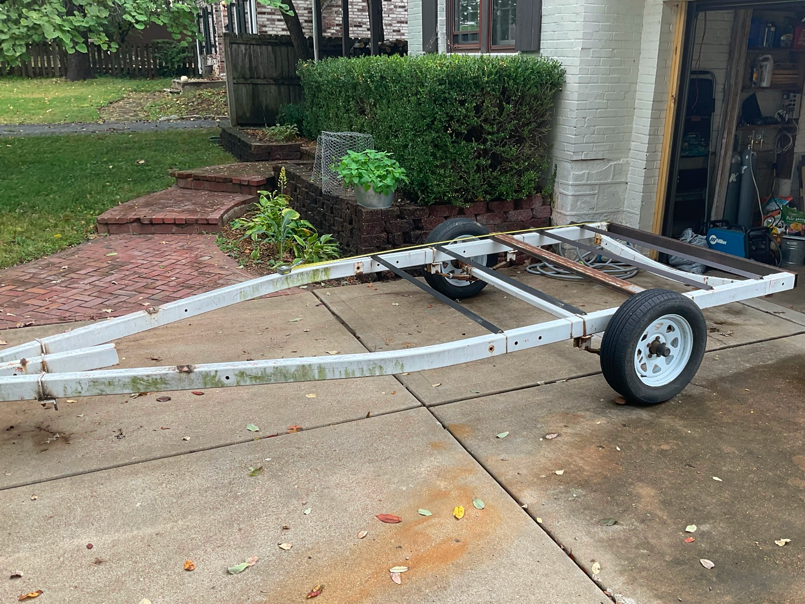

I bought an old boat trailer and converted it into a dual jet ski trailer.

## Boat trailer

Originally, someone stripped this boat trailer in preparation for making a utility trailer. They gave up on the project and I bought it for $250.

## Design



In Solidworks, I added the rails for the jet skis to sit on and adjustable winching mechanisms.

## Coupler



I cleaned the coupler using electrolysis with excellent results. A few months later, I bought a new coupler because the original was simply worn out and very challenging to get mounted.

## Winch



I bought two [hand winches](<https://www.amazon.com/gp/product/B08KFX2GGN>) and two [rubber bow rollers](<https://www.amazon.com/attwood-11205-1-Trailer-Rubber-Roller/dp/B000MRPN1W>). I used square u-bolts and 1/4″ plates to make an adjustable design. To fit different-sized jet skis, they can be moved up/ down and forwards/backwards. This can also be used to adjust the tongue weight.

## Other details

I added a trailer wiring kit from [www.etrailer.com](<https://www.etrailer.com/Home>). Compared to Amazon, they have good quality, waterproof kits that don’t dry rot after a few years.

Finally, I added a spare tire with Attwood’s [tire carrier](<https://www.amazon.com/gp/product/B002IV8I80>).

## End result



This trailer turned out really well. In total, I spent about $700. It’s certainly longer and heavier than most jet ski trailers but it’s been reliable and sturdy.
