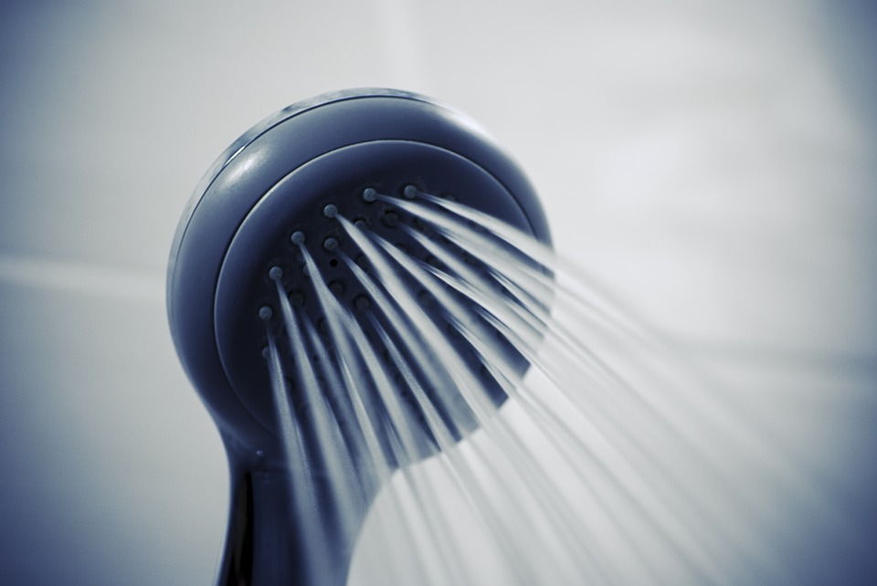

 

Cold showers are like meditating - there should be more of it in your life, but it's difficult to habitualize. I enjoy hot showers, so cold showers are difficult for me. And most of the advice on the subject hinders rather than helps. Below are the techniques and mindset that has helped me habitualize cold morning showers.

 

**Use less water pressure.** My shower's water pressure rivals a fire hydrant, which isn't very pleasant. I've found partially turning on the shower, so less water comes out, improves the experience.

 

**Don 't slowly lower the temperature.** The most common advice is to take a shower at your regular temperature, then slowly lower the temperature during the shower.

This is a good way to never form the habit of cold showers. It requires you to slowly make yourself more and more uncomfortable with no set time limit or minimum temperature. Maybe you try this for three days, then decide to skip on the fourth day, because you had a long day at work. Habit gone. Broken. Good luck doing this everyday for a year.

 

**Don 't do cold showers in the evening.** This may apply more to those who normally shower in the evening, like me. Before I shower, I am relaxed and within an hour of bedtime. But a cold shower is an exciting and awakening experience. So when I shower, I don't want to have a cold shower. And how do you form a habit of something you  _really_ don't want to do?

Separate the purposes of each shower. The evening shower is 5-15 minutes with the purpose of cleaning your body. The morning shower is 2-5 minutes with the purpose of feeling terrific. Don't combine or confuse these.

 

**Stay in the shower for at least 90 seconds.** The first 30 seconds is the hardest. This is contrary to the common advice of "start small and work your way up."

 

**Don 't think about the cold so much.** Close your eyes and focus on breathing slowly. Try some [Wim Hof breathing](<http://www.icemanwimhof.com/wim-hof-exercises>). The less you think about how cold the water is, the less it matters. In fact, that lesson applies in many other scenarios, from thinking about wanting material goods to sensational news.
