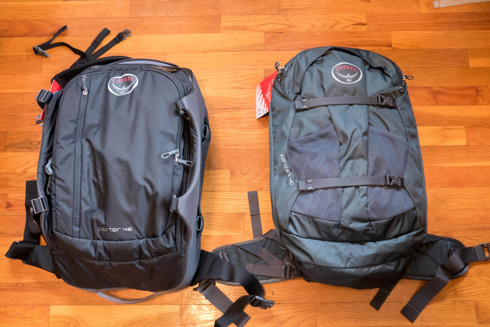

The [Osprey Porter 46](<https://www.ospreypacks.com/us/en/product/porter-46-PORTER46.html>) and [Osprey Farpoint 40](<https://www.ospreypacks.com/us/en/product/farpoint-40-FARPNT40.html>) backpacks are both excellent choices for travel backpacks. I was looking for an ideal backpack for long-term travel and was considering these two. Both backpacks seem quite similar online but are very different in real life. Each is suited to different styles of travel.

The Porter 46 is luggage styled like a backpack. The Farpoint 40 is a backpack styled like luggage.

This is a set of side-by-side comparison photos of the two backpacks along with some of my thoughts about them.

In all the photos, the Osprey Porter 46 is on the left and the Farpoint 40 is on the right.

There is no affiliate or referral links here. It is all my unbiased opinion.

## Comparison

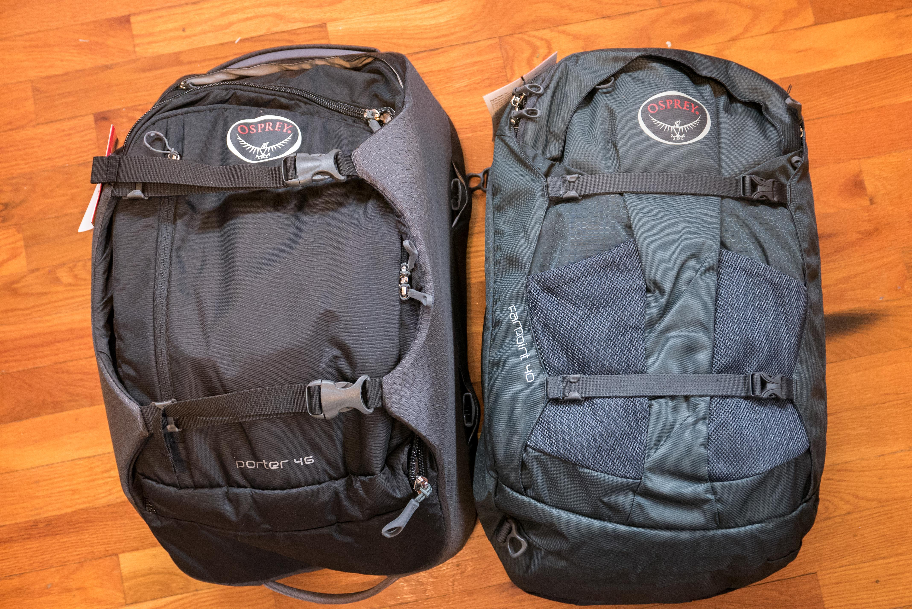

Both have two compression straps. Both have a cover over the main zippers to prevent rain from coming in. All other zippers have waterproof seams on both backpacks. The zippers can be locked with a padlock.

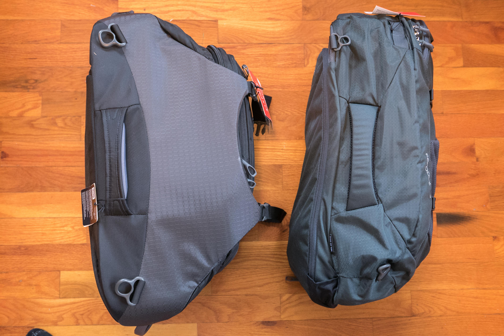

According to Osprey, the Porter 46 is only 6 liters larger than the Farpoint 40. It seems like a greater difference in these photos. In defense of the Farpoint 40, I didn't fully stuff it.

Compared to other backpacks, I think the Porter 46 is more like 50 liters. It is not carry-on on a plane (unless it was partially empty). The Farpoint 40 seems to be accurate at 40 liters.

The side carry handles are large and very comfortable on both.

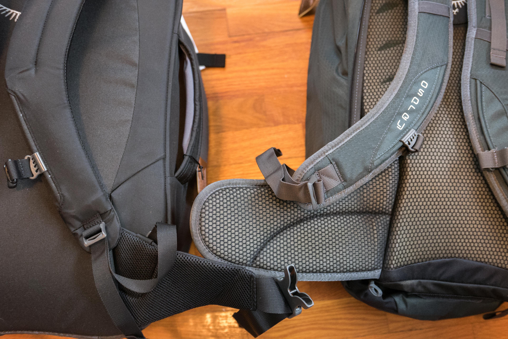

Both backpacks have shoulder straps, hip straps, sternum straps, and load lifter straps.

However the Farpoint 40 is significantly more comfortable. It has a mesh back and a wide soft hip belt. A fully loaded Porter 46 would cause some discomfort after an hour or so. The Farpoint 40 takes a few hours before it begins to cause any discomfort.

Unlike true hiking backpacks, neither or these backpacks allow you to adjust the distance between the shoulder and hip belt. I find slightly-too-small distance between the shoulder and hip belt of the Farpoint 40 a bit uncomfortable for multi-day hikes (I am 5′ 11″ (180 cm)). 

This is a minor point. It's likely one of the most comfortable 40L backpacks that is airplane carry-on friendly.

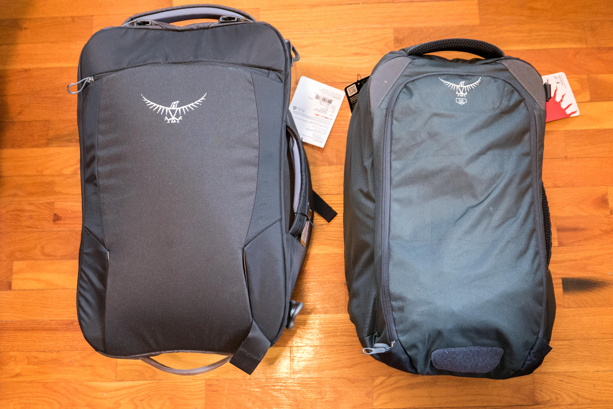

Both backpacks have stowable straps when checked on an airplane. They take the same amount of time to store or pull out (30-60 seconds).

The top carry handles are both large and very comfortable.

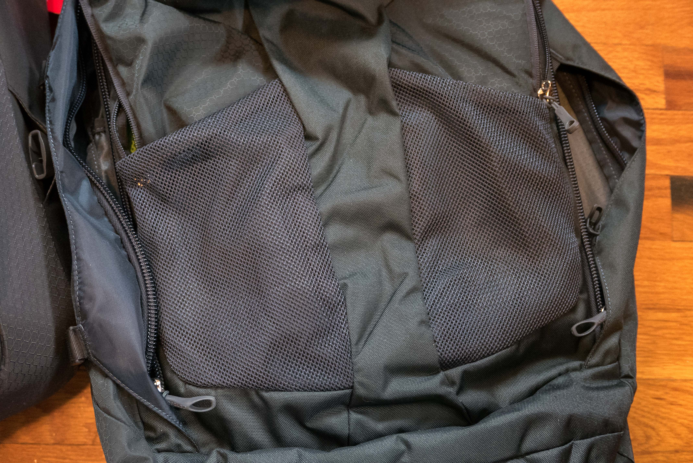

The Farpoint 40 has two water bottle mesh holders. I find this a very convenient feature, however they aren't very elastic and it is difficult to holder more than one small water bottle in each pocket.

If you have a 32 oz (1 L) waterbottle and your bag is full, you really have to force the bottle into the pocket.

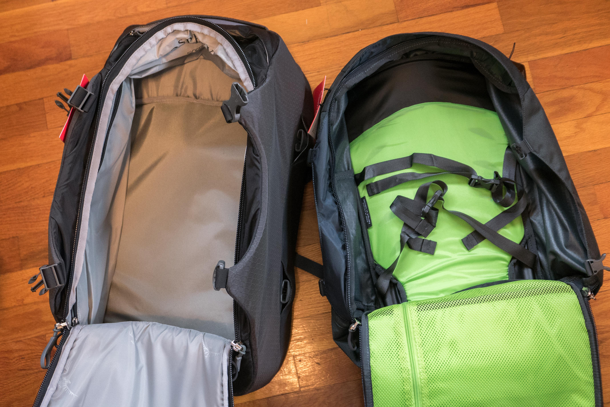

Both backpacks unzip fully. Amazing!

The Porter 46 has significant padding on every side - at least a 1/2″ of thick strong padding. It retains its shape very well without clothes. Much more like a piece of luggage than a backpack.

The Farpoint 40 is much thinner. The sides are a single layer of canvas. Your luggage is much more vulnerable. When empty, it wilts over, like a school backpack would. Additionally, the Farpoint 40 has two interior straps to hold down luggage.

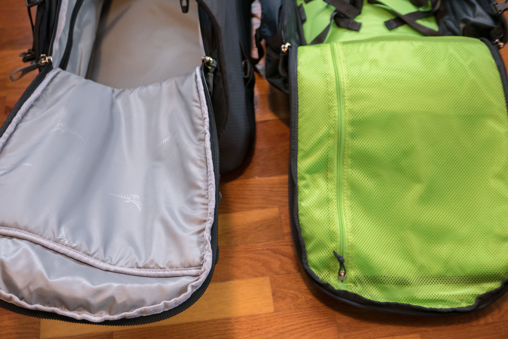

Both have a big pouch. The Farpoint 40 is mesh and has a zipper.

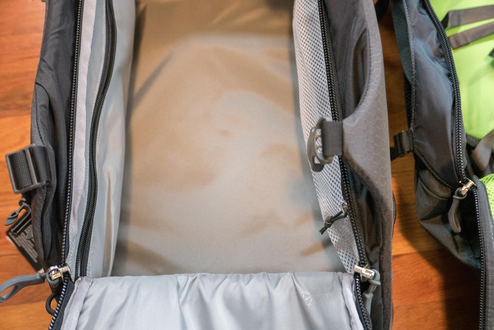

There are two side pouches in the Porter 46. On the left, a solid pouch and on the right, a mesh pouch.

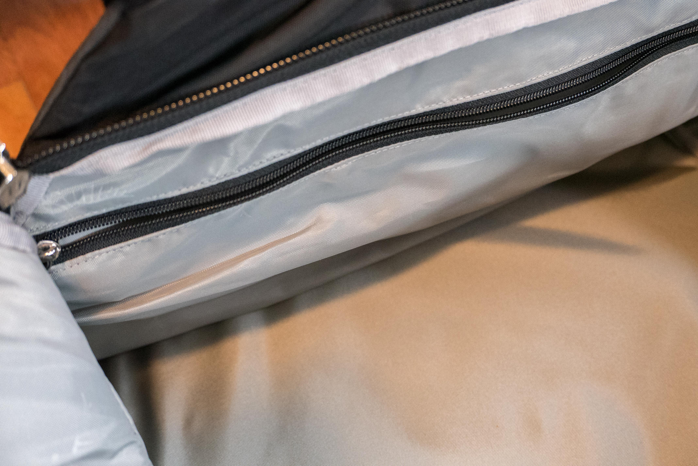

Close up of the Porter 46 side pouch.

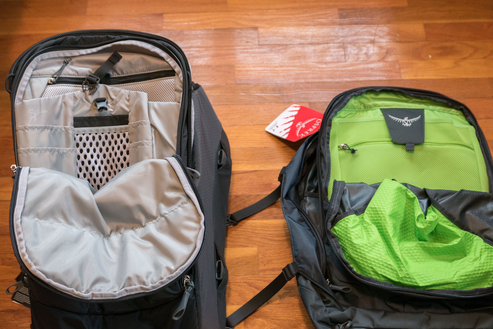

Both backpacks have a section of little pockets. 

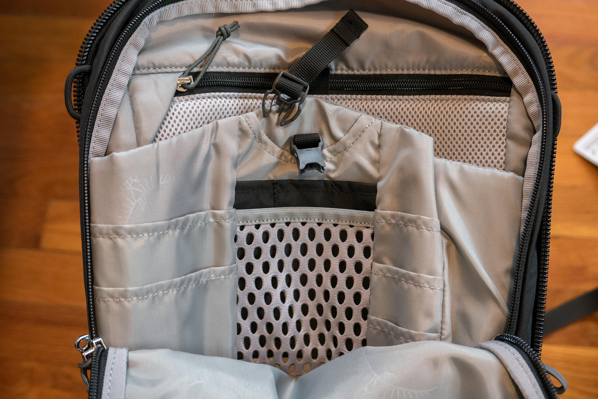

The Porter 46 has a lot of weird little pockets. A big mesh pocket will hold a tablet or small laptop (13″ max). Notice how the zipper has a little cover in the upper left to tuck under. It's so you can put a big laptop in front of it without scratching the laptop.

The Porter 46 is secure and firm, so I would be confident that my laptop won't be getting smashed or bent when traveling.

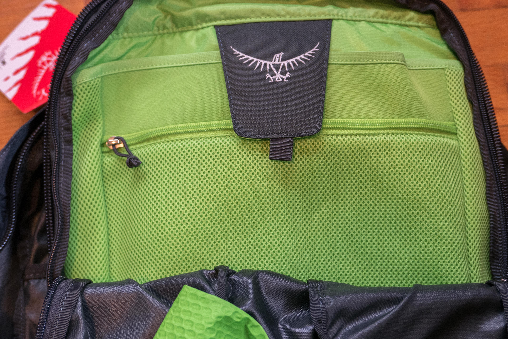

The Farpoint 40 has two pockets. A big one with a velcro strap and a smaller zippered mesh one. A 13″ laptop would fit in either pocket.

I'm not sure if the velcro (black patch with bird logo) does much.

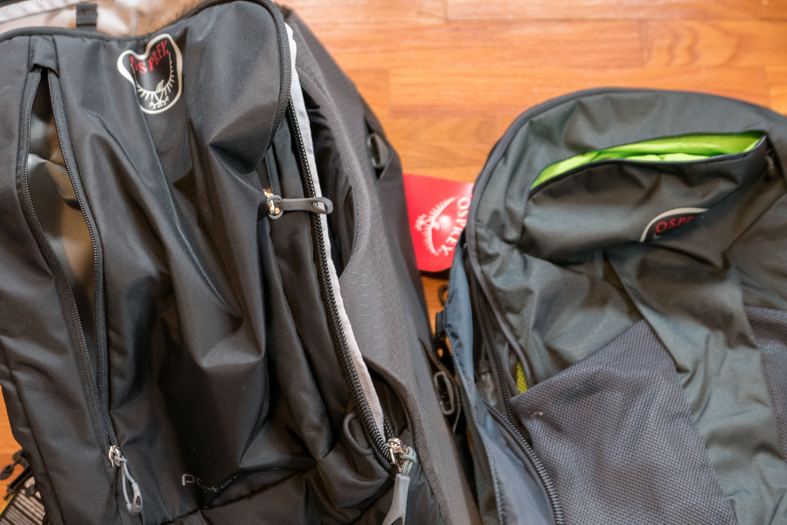

And finally, an easy access pouch.

The Porter 46 has a long vertical zipper running down the front. The Farpoint 40 has a horizontal zipper near the top (you can see the green inside of the pocket).

## Conclusion

### Buy the Porter 46 if:

you normally carry suitcase luggage or duffel bags, but want something more backpack styled.

### Buy the Farpoint 40:

if you normally carry backpacks, but want something more luggage styled.

### Scenario 1:

You travel with a laptop, check your luggage occasionally, and don't walk more than a mile or two at a time. You don't want to haul a rolling suitcase or two duffel bags.

Buy the [Porter 46](<https://www.amazon.com/Osprey-Porter-Travel-Backpack-46-Liter/dp/B00IMXQ8Z8/ref=sr_1_1?ie=UTF8&qid=1487434797&sr=8-1>). It has ample storage, will protect your luggage, and when the straps are hidden, looks professional.

### Scenario 2:

You travel light and sometimes walk many miles a day, possibly all day. You may or may not have a laptop or tablet that you bring along. Perhaps you are vagabonding or enjoy long term travel.

Buy the [Farpoint 40](<https://www.amazon.com/Osprey-Farpoint-Travel-Backpack-Volcanic/dp/B014EBM3KA/ref=sr_1_2?ie=UTF8&qid=1487434797&sr=8-2>). It's comfortable, small, and simple. It is small enough for carry-on on most flights, and yet the straps still can be stowed when the backpack is checked as luggage.

**Update**

I traveled with the Farpoint 40 through Asia for 8 months and the backpack looks like new. I love the pack. It's perfect for backpackers, but you have to pack light. I often get the comment, "is that all you brought?" If 40L isn't enough, get the Farpoint 60, it's bigger brother, very similar in design and a terrific backpack.

I've been using this backpack almost everyday for a year to bicycle to work. It's holding up great!
