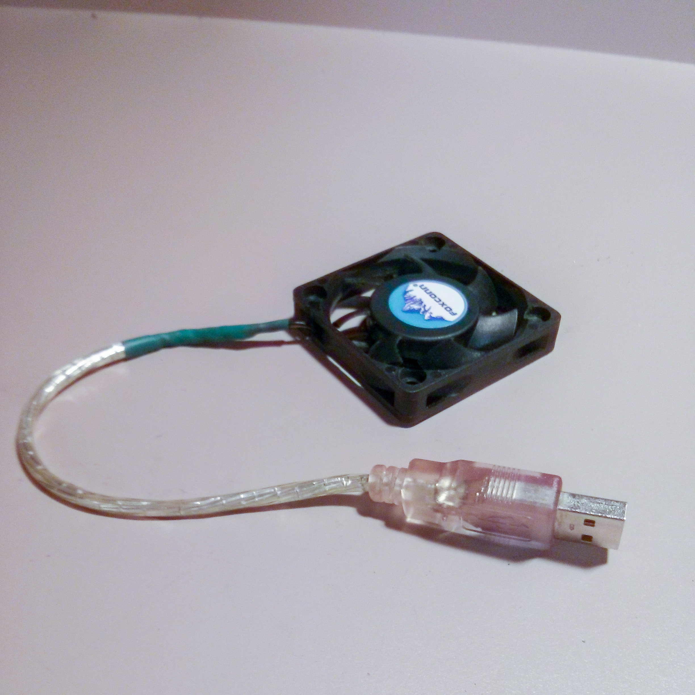
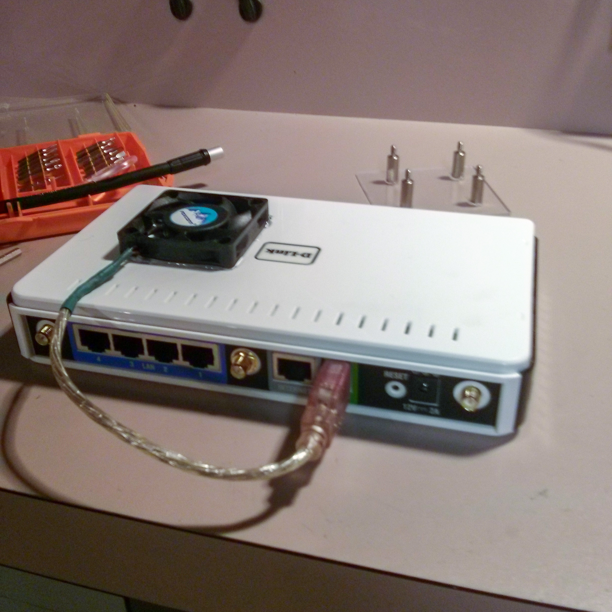
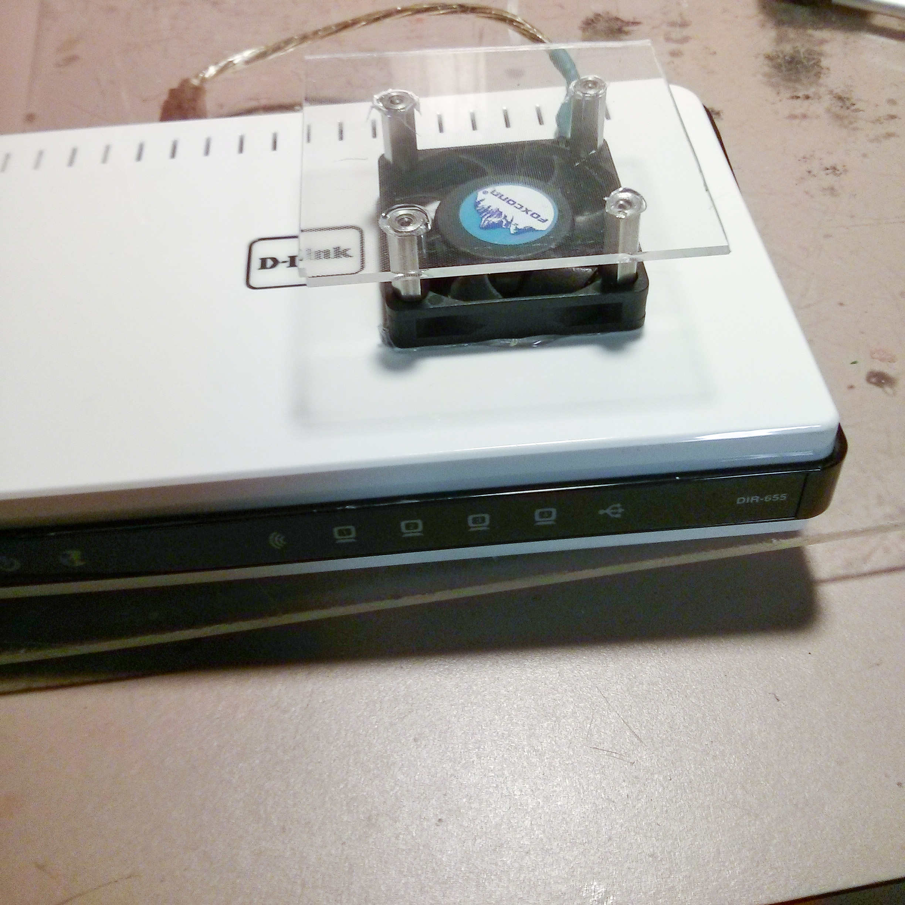

The DLink DIR-655 is an excellent router. It supports Dynamic DNS, Port Forwarding, Virtual Servers, DMZ and much more. Problem is, in the awful heat and humidity of the midwest, it overheats during periods of high traffic, like large file downloads.

Three quick fixes, A) move it to a basement or cooler spot of your house, B) drill holes in the case, or C) add a fan.

 

  
The DIR655 has a usb output on the back designed for printers and network storage. I pulled power from that port. I wired a small computer fan to a USB male plug (5V and gnd). Many 12V computer fans will spin off 5V. To disassemble, I took two screws under the feet at the bottom and popped the top off.

 

 

I dremeled a hole, glued the fan in, and put a protector on top. The protector's purpose is to keep dust or anything that could damage the router from falling in.  
The fan blows inward and pushes air out the small holes in the top and bottom. It has solved my stability issues.
