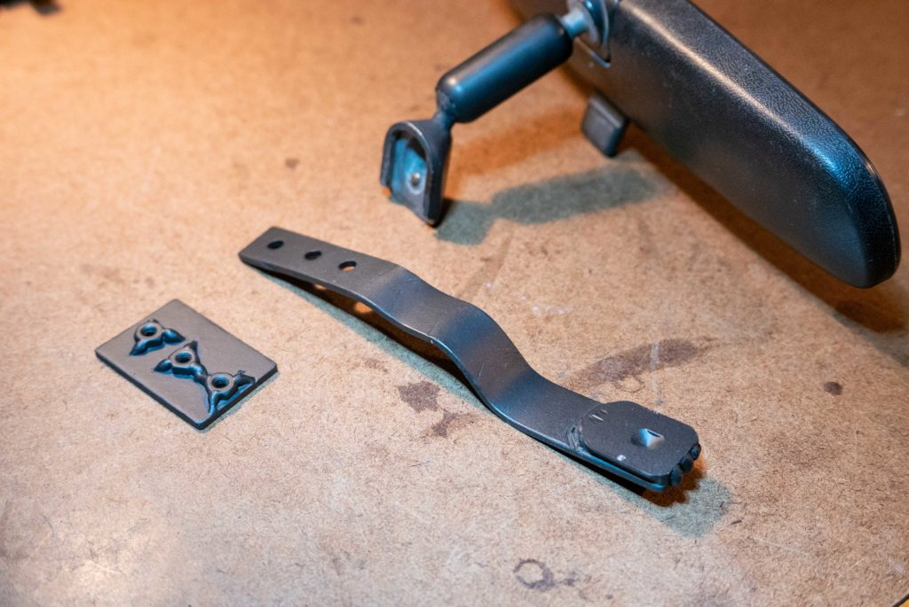
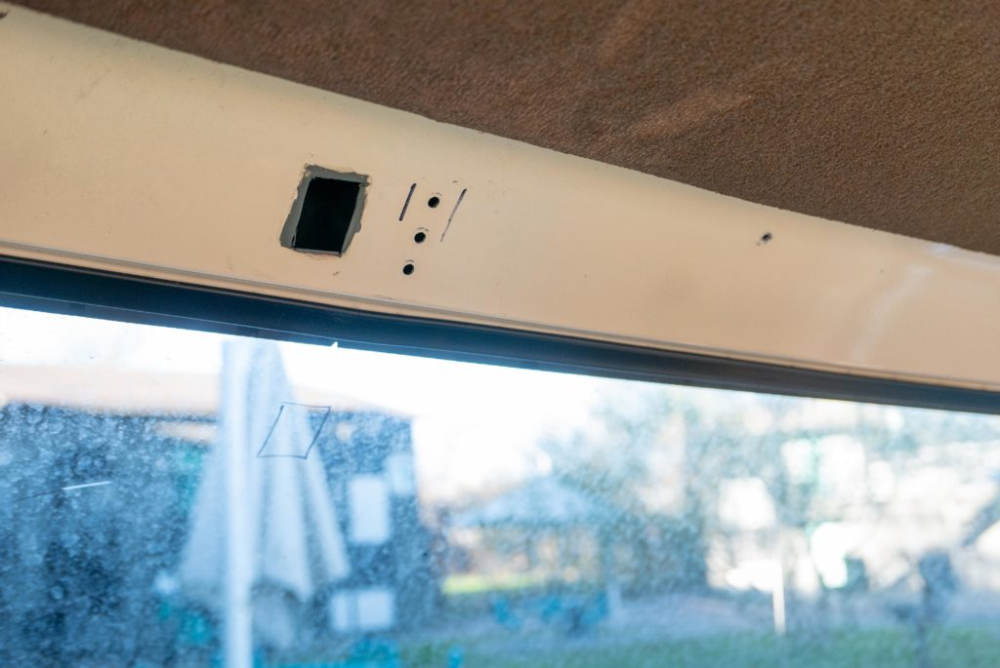
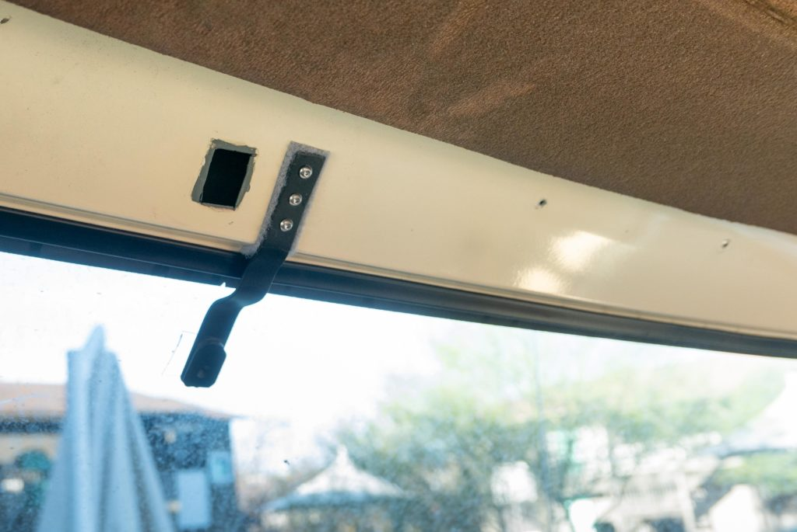
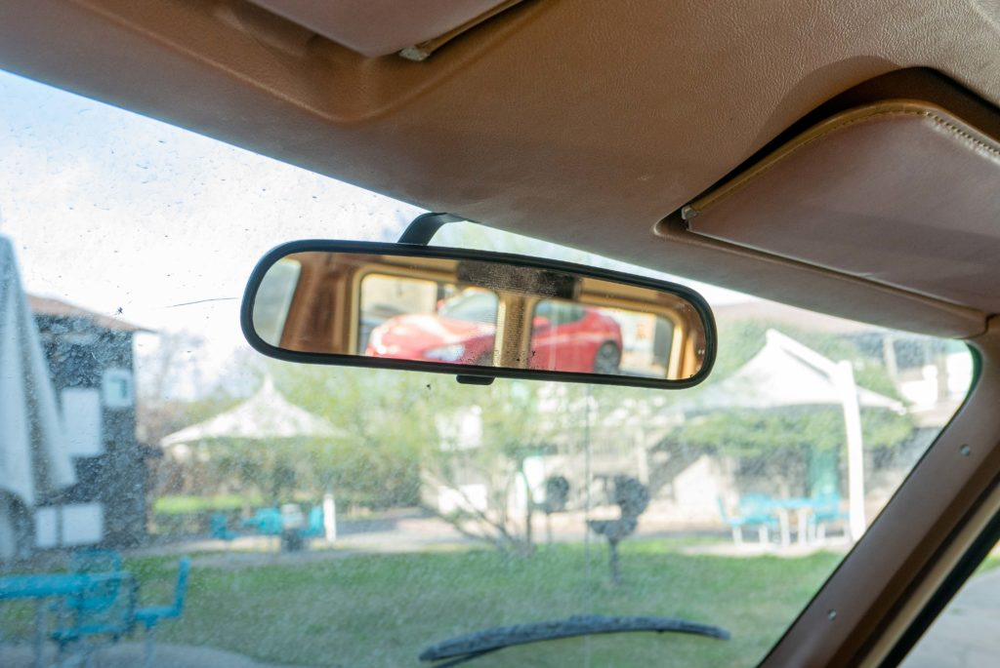

This post details a more permanent mounting for a rearview mirror.

I bought an old vehicle with a rearview mirror that was laying on the ground next to an empty bottle of rearview mirror glue. I bought a new bottle of 3M rearview mirror glue kit and reattached the mirror by devoutly following the instructions in a good weather. Still, the mirror fell off a few weeks later after I adjusted it too aggressively.

I'm sure I did something wrong when gluing, but I know enough folks with 30+ year old vehicles who also can't get their mirrors to stay attached.

After being fooled twice, I made a more permanent mirror attachment.

On the far left is a metal mounting plate with 3x #10 nuts welded on.

In the middle is a metal bar with 3 holes on one end and the original mirror mount welded on the other end.

The way the mirror attaches hasn't changed - it's slides onto the original mirror mount and is secured with a screw.

I drilled 3 holes and dremeled an access hole in frame to slide in the metal mounting plate. There are a few other large cutouts in this part of the frame (not pictured), so I don't feel guilty adding another cutout.

I coated the hole with primer and paint to prevent rust.

Next, I slid the metal mounting plate inside the frame and bolted in the metal bar.

There is a piece of soft velcro sandwiched between the frame and metal bar. This prevents metal-to-metal contact and give some vibration dampening.

When fully assembled, it looks quite nice. I hope it doesn't fall off again!
