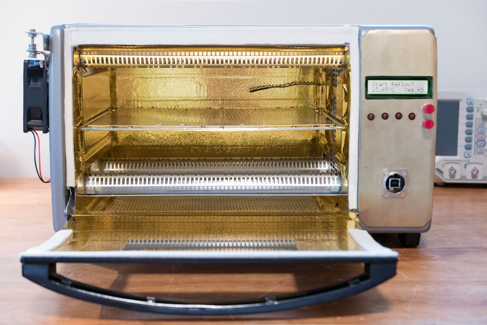
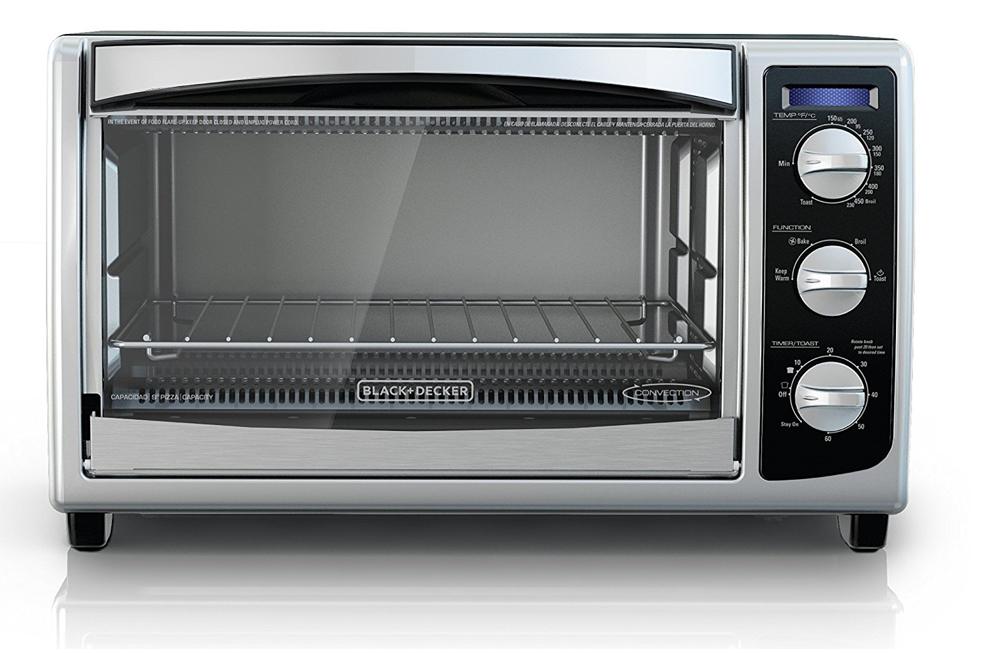
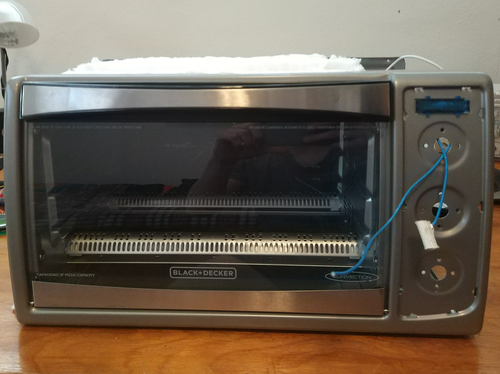
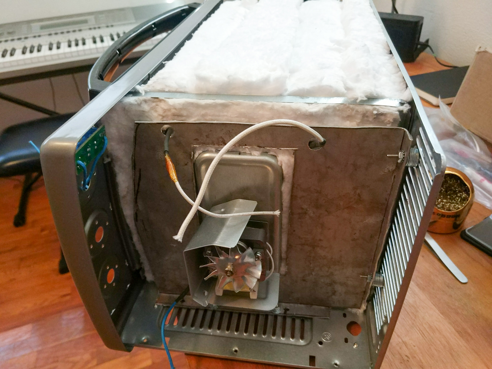
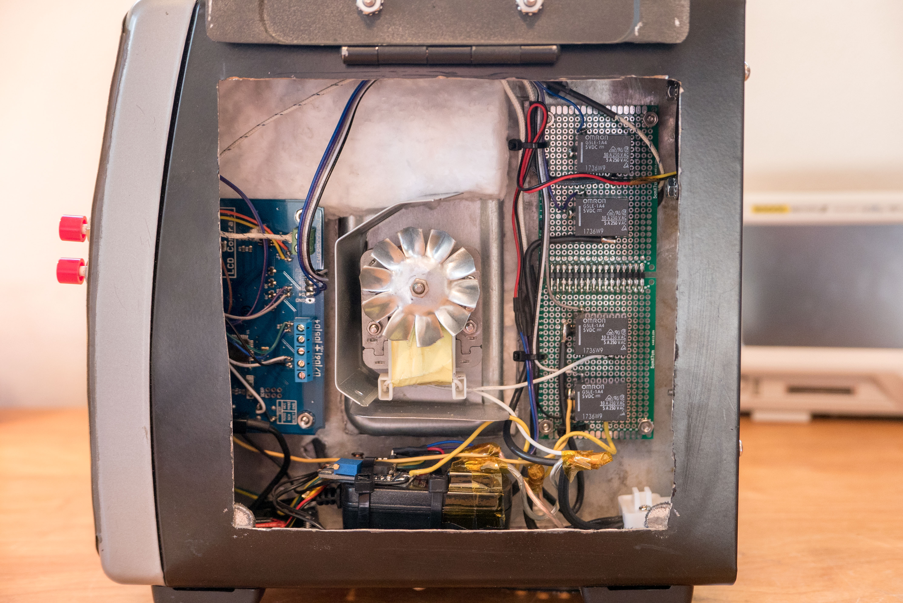
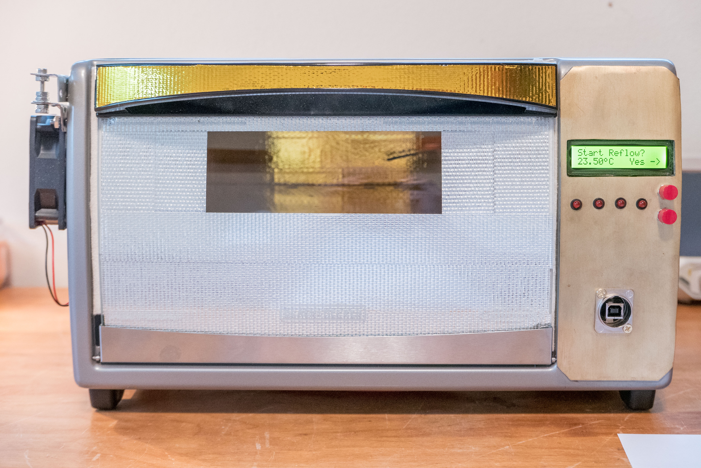
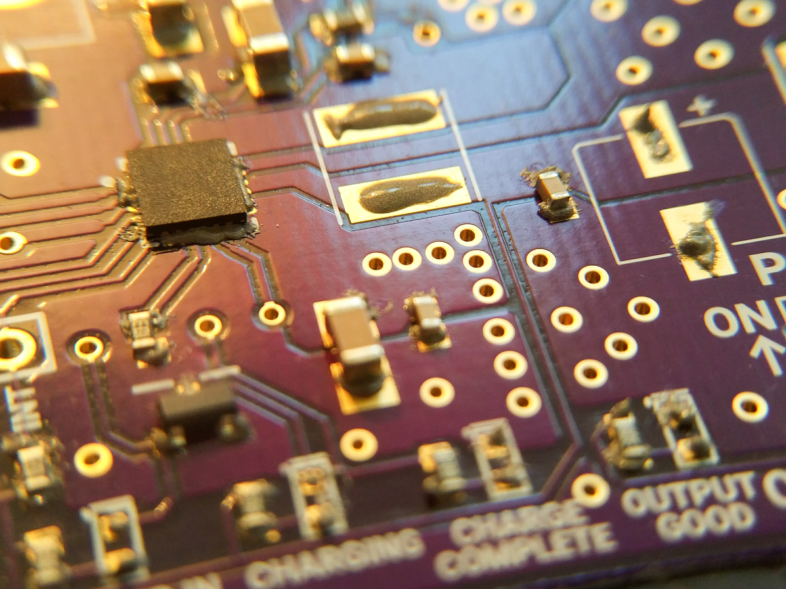
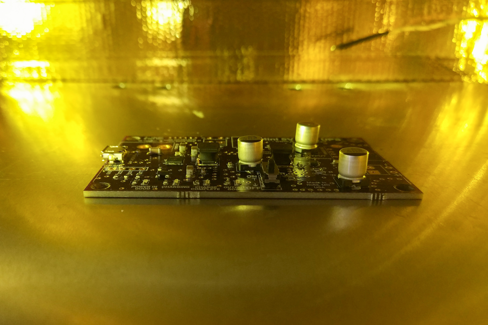
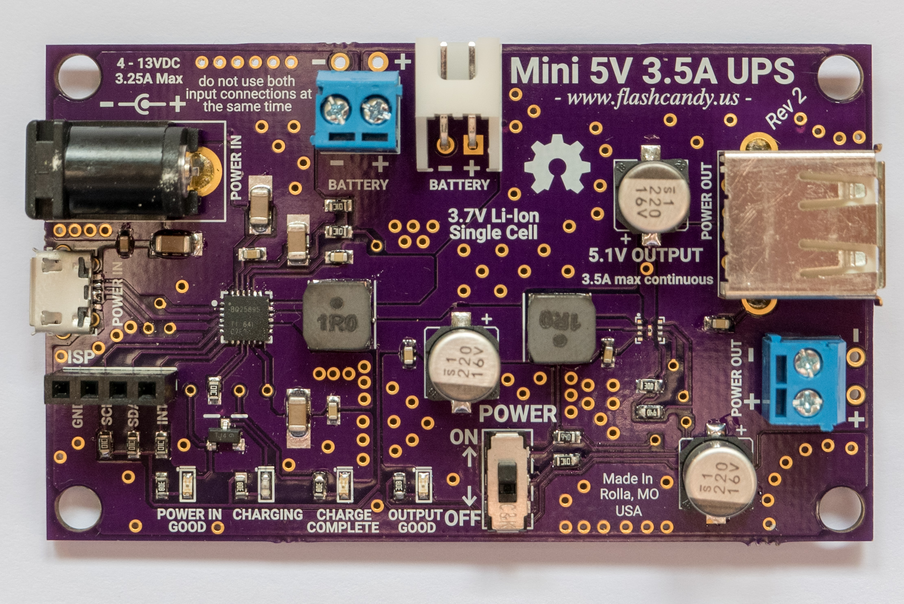

This is a conversion of a convection toaster oven into a SMD reflow oven.  I took a standard toaster oven then added insulation, ControlLeo2 controller, temperature sensor, cooling fan, and a front panel.  It has excellent thermal properties and follows a reflow profile well.

I bought the [ControlLeo2 ](<http://www.whizoo.com/>)for the reflow controller.  It features PID control and is overall good.  Still has shortcomings.  I had to heavily modify it to make it fit in the front panel.  A different LCD (8×2 or 8×4) and a new PCB layout would make this board slim enough to fit.  Additionally, I had some issues with LCD corruption and had to modify the software.  I am also disappointed with the lack of PID control for the cooling fan.

The ControlLeo2 can be bought standalone for $70.  For $205, you can buy it and all the convection oven parts.  I don't recommend this as you can save money by buying parts individually.  Also, this kit still doesn't have quite enough Reflect-A-Gold tape, includes low quality SSRs, and an unnecessary servo kit.

 

### You Don't Need Solid State Relays and A Fancy Servo Door Opener

The included solid state relays certainly underrated compared to their advertised ampacity.  Whizoo has probably not sourced quality Fotek SSRs, because genuine 25A SSRs are expensive.  Check out [this disassembly of Fotek SSRs](<http://www.instructables.com/id/The-inner-workings-of-Counterfeit-FOTEK-SSRs/>).  These relays will still work for your oven, but I'd much rather use a good quality mechanical relay.  I bought 4 [Omron relays](<https://www.digikey.com/product-detail/en/omron-electronics-inc-emc-div/G5LE-1A4-DC5/Z3116-ND/369019>) for $1.41/each from Digikey.

The automatic door opener is a gimmick.  First, my oven has too much thermal mass to cool from a slight opening.  Second, I don't want to fuss with a servo.  There's enough electronics liable to malfunction already.  Third, why do you need this feature?  Your regular oven for cooking food doesn't have or need a door opener; the timer goes off, you open the door and remove your food.  Are you going to spend an hour carefully placing components, set it in the oven, then leave your house within 5 minutes?  No!  I guarantee you'll be close enough to open the door with your own hand.

Save yourself the time and frustration by skipping the servo door opener.

 

### The Build

I started with this $40 [Black and Decker Convection Oven](<https://www.amazon.com/BLACK-DECKER-TO1675B-Convection-Countertop/dp/B0060VQFQ6>) from Amazon.

 

 

 

I removed all the electronics and control panel.

 

 

I added [ceramic blanket insulation](<https://www.amazon.com/gp/product/B00NDKU14Y>) and an aluminium mounting plate to hold the electronics.

 

 

This is a side view of the completed oven.  I added a door for quick access to the electronics.  On the far left is the ControlLeo2 board.  I soldered wires out for the LEDs, buttons, and LCD.

There are two cooling fans for the electronics - one in the bottom left and the other in the upper right.

Four relays control the upper heaters, lower heaters, convection fan, and cooling fan.  It turns out a relay for the convection fan wasn't needed - it never turns off.

At the bottom, a 5VDC power adapter is used for the ControlLeo2 and the relays.  A 5V-12V boost converter powers the 12VDC fans (you can find MT3608 based converters on eBay for less than $5).

 

The front panel is 1/32″ brass sheet.  I used JB Weld to attach it.  JB Weld can withstand 260C continuously and 316C for 10 minutes, which makes it the perfect adhesive to use in a reflow oven.

Every side of the oven has [ceramic blanket insulation](<https://www.amazon.com/gp/product/B00NDKU14Y>), except for the bottom.  I added extra sheet metal on the backside to hold additional insulation.  The entire inside is covered in [Reflect-A-Gold](<https://www.designengineering.com/category/catalog/design-engineering-inc/heat-sound-barrier/reflect-gold>) tape.  This [30'x1.5″ roll](<https://www.amazon.com/gp/product/B0039Z1UWA>) from Amazon for $40 was the perfect amount of tape for this oven.

The bottom is covered in [Boom Mat](<https://www.designengineering.com//category/catalog/boom-mat-acoustical-products/floor-tunnel-shield-ii-heat-sound-insulation>).  I found an eBay seller who sold a [10″x10″ cut](<http://www.ebay.com/itm/162236361546>) for $17.

I used high temperature BBQ/Smoker gasket to improve the door seal (the gap was unacceptable).  For $14, you can buy [Nomex gasket](<https://www.amazon.com/gp/product/B00J47KQJU>) from Amazon.

The tray is 1/32″ Aluminum plate.  I found a [9″x12″ sheet](<http://www.ebay.com/itm/322342217718>) on eBay for $10.  I put four 1/2″ holes in the front and the back of the tray to improve air circulation.

A K-type thermocouple measures in the back of the oven.

 

 

On the far left, a computer fan can swing inwards to cool the oven during the cooling stage.  Because there is no PID control for this fan, I manual point the fan inwards to keep the cooling rate between 2C and 6C/second.

I added a USB port from [Parts Express](<https://www.parts-express.com/neutrik-nausb-w-feed-thru-reversible-usb-a-b-adapter-d-panel-mount-nickel--092-278>) ([Neutrik NAUSB-W](<http://www.neutrik.com/en/multimedia/usb/nausb-w>)) on the front for easy access to serial debugging and temperature output.

 

 

### Results

On this board, I hand placed components with [solder paste](<https://en.wikipedia.org/wiki/Solder_paste>).

 

 

Board reflowing in the oven.

 

 

Board after reflow.  Looks great!

 

 

And finally, a 5x speed up of the reflow process in my oven.


