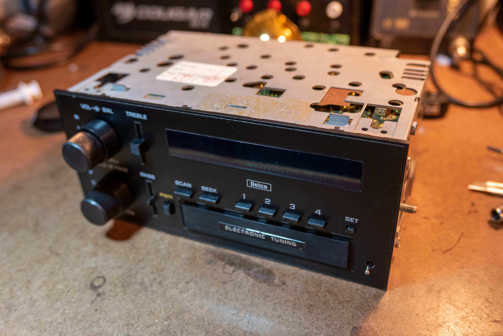
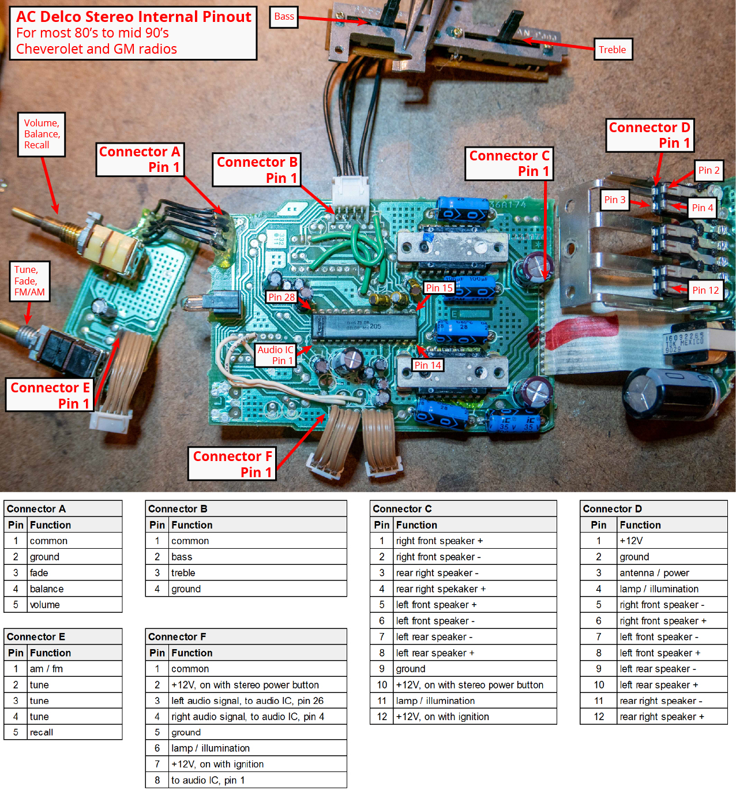
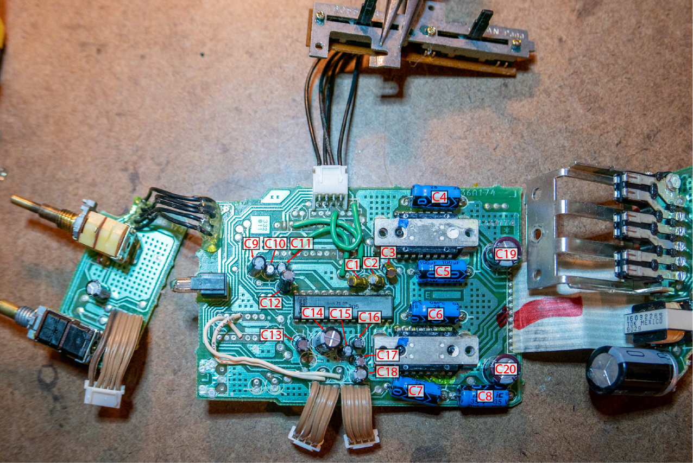
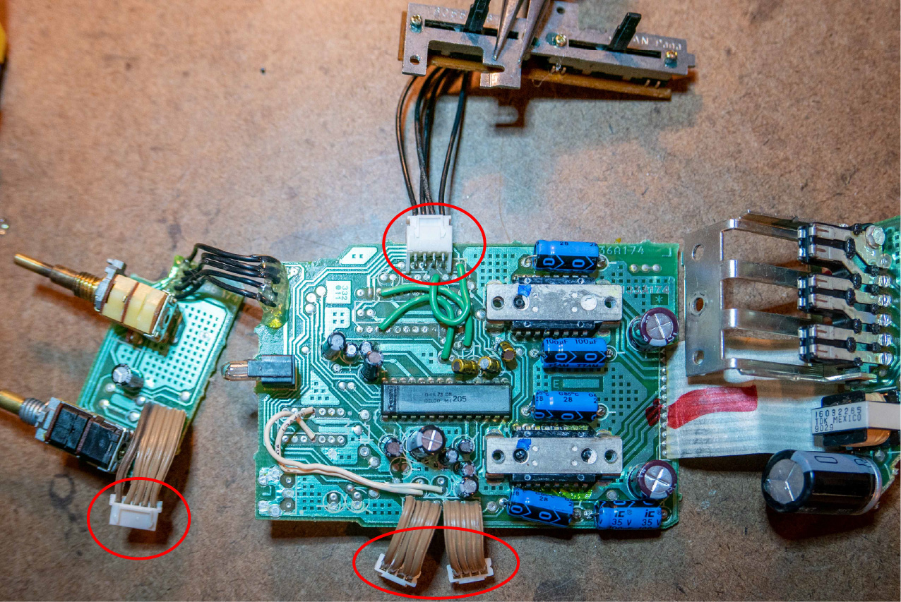
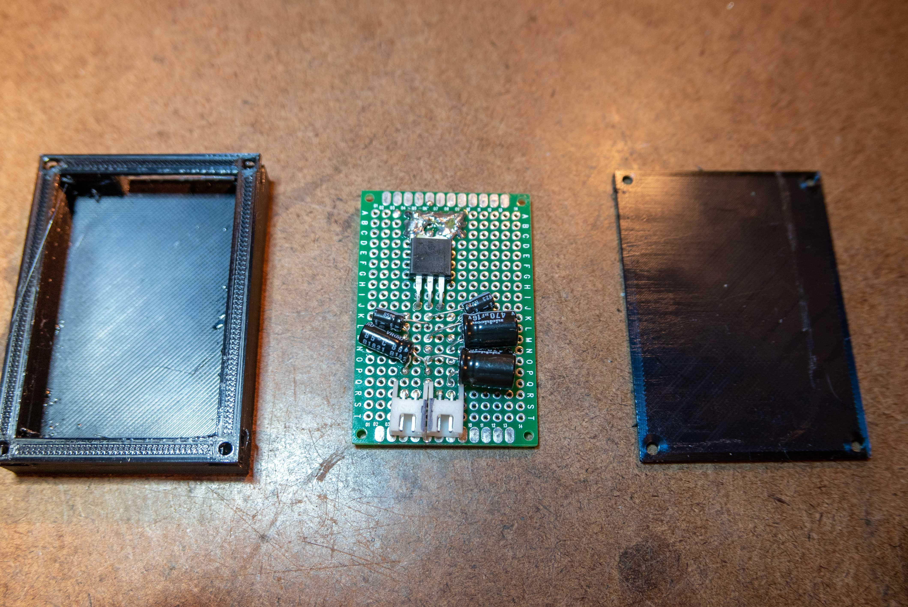
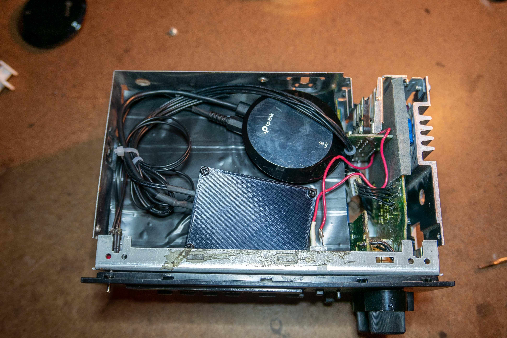

_AC Delco Model 16131355_

This post details the repair of a early 1991 AC Delco stereo. AC Delco made many variants of this stereo for both Chevrolet and GM cars, trucks, and vans from the early 80's to the mid-90's. While many of the stereos have more or less features (cassette players, radio presets, etc), the amplifier section of the radio is fairly standard and unchanged.

## Internal Pinout and Schematic

There isn't much material online about these stereos, so I had to reverse-engineer the boards to determine these pinouts.

### Capacitor Replacements



There were three issues with my stereo:

  * No left channel output
  * Crackling when changing volume or FM/AM tuning
  * Fade/balance don't work correctly

[This page](<http://www.howtoalmanac.com/Scott/HowTo/02-12-DelcoGMDM165AudioAmpRepair.htm>) has an excellent write up on diagnosing and repairing AC Delco stereos. However, it claims that if you don't have audio output in a channel, it is likely due to an amplifier IC failure. 

For me, it was a capacitor failure. The caps on this board are very close to the amplifier ICs and get hot, accelerating failure rates. Because the caps are much easier to source and replace, I'd recommend replacing them before bothering with the IC's.

The image above lists the capacitors that I replaced. C1, C2, C3, C4, C5, C6, C7, C8, and C9 are the most likely to fail and cause an issue, but I recommend replacing all of the caps.

The table below lists suitable replacement caps.

Component  
(all capacitors are aluminum electrolytic)| Digikey Number| Mfn. Number| Quantity| Reference| Notes  
---|---|---|---|---|---  
1µF 20% 50V Radial| [493-16046-ND](<https://www.digikey.com/product-detail/en/nichicon/USW1H010MDD/493-16046-ND/2539315>)| USW1H010MDD| 3| C1, C2, C3| Must be audio grade capacitors  
100µF 20% 25V Axial| [1572-1048-ND](<https://www.digikey.com/product-detail/en/illinois-capacitor/107TTA025M/1572-1048-ND/5343978>)|  107TTA025M | 5| C4, C5, C6, C7, C8| Must have co-axial leads  
4.7µF 20% 50V Radial| [493-6100-1-ND](<https://www.digikey.com/product-detail/en/nichicon/UVR1H4R7MDD1TA/493-6100-1-ND/3438489>)| UVR1H4R7MDD1TA| 3| C9, C12, C13|   
1µF 20% 50V Radial| [493-6031-ND](<https://www.digikey.com/product-detail/en/nichicon/USR1H010MDD/493-6031-ND/2539217>)| USR1H010MDD| 5| C10, C11, C15, C16, C17|   
470µF 20% 16V Radial| [493-1043-ND](<https://www.digikey.com/product-detail/en/nichicon/UVR1C471MPD/493-1043-ND/588784>)| UVR1C471MPD| 1| C14|   
22µF 20% 50V Radial| 4[493-12572-1-ND](<https://www.digikey.com/product-detail/en/nichicon/UVK1H220MDD1TD/493-12572-1-ND/4328653>)| UVK1H220MDD1TD| 1| C18|   
270µF 20% 16V Radial| [493-5020-1-ND](<https://www.digikey.com/product-detail/en/nichicon/UPJ1C271MPD6TD/493-5020-1-ND/3129357>)| UPJ1C271MPD6TD| 2| C19, C20|   
  
### Board-to-Board Connections

_Added JST-XH connectors  
(I later re-did these connections on the backs of the PCBs)_

These stereos are a real bastard to assemble and disassemble. The PCBs are part of the structure of radio. All the parts have to come together at once when assembling, which is challenging.

All the boards are hard-wired to each other, which makes it impossible to lay them all flat on a table. Additionally, the connecting wires are short, stiff, and lack stress relief, which puts a lot of stress on the solder joints. A few of the joints broke while I was reassembling the stereo, requiring me to resolder every connection wire.

I added JST-XH connectors and a few extra inches of wire to all the board-to-board connections. This made debugging and determining pinouts much easier. It also allows me to easily inject a bluetooth audio signal into the radio.

## Adding Bluetooth



I wanted to add bluetooth to this stereo without losing any functionality of the stereo and without adding a completely second amplifier.

I bought this [TP Link bluetooth audio receiver](<https://www.amazon.com/gp/product/B00YPATOEE>). I like this adapter for automotive applications because it doesn't require you to press reset/pairing buttons, so it can be hidden and never be seen by the user. Also, it doesn't have any bright LEDs on it.

_12V to 5V converter_

To power the bluetooth receiver, I made a simple 12V to 5V adapter with a LM7805 that outputs to a micro USB connector. This lives in a little 3D printed box to keep it from shorting out.

The bluetooth outputs line-level audio into the audio IC's input on the amplifier board. This is where the AM/FM audio signal is normally received. I had to add a DPDT switch to switch between AM/FM and bluetooth.

This chain of bluetooth components sneaks in between the main stereo board and the amplifier board, at connector F.

This stereo lacks a cassette player, so there is a cavity of open space. The bluetooth parts sit comfortably here. It makes it's easy to install the stereo, since all the components are self-contained.

I couldn't think of an easy solution that wouldn't require a switch on the front of the stereo to switch between AM/FM and bluetooth. I tried to make this switch as discrete as possible. You can see it in the image above, in the bottom right corner.

## Conclusion

This was an enjoyable and successful project. Most of the work was reverse-engineering and adding JST-XH connectors. It's fun to work on older equipment, because the failures are easy to troubleshoot and the components are spread out.

The stereo works great - it has the look and sound of an old stereo, the convenience of bluetooth, and no loss of functionality.
