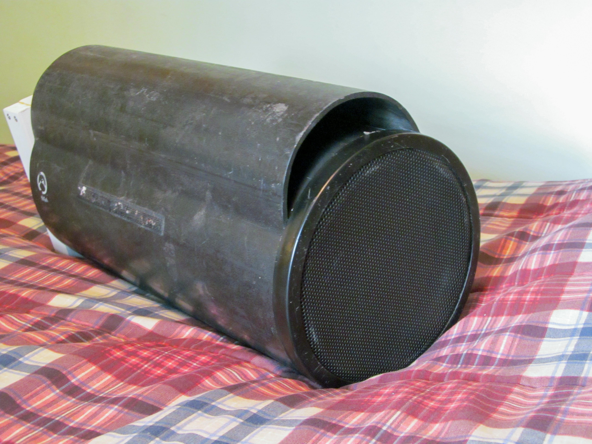
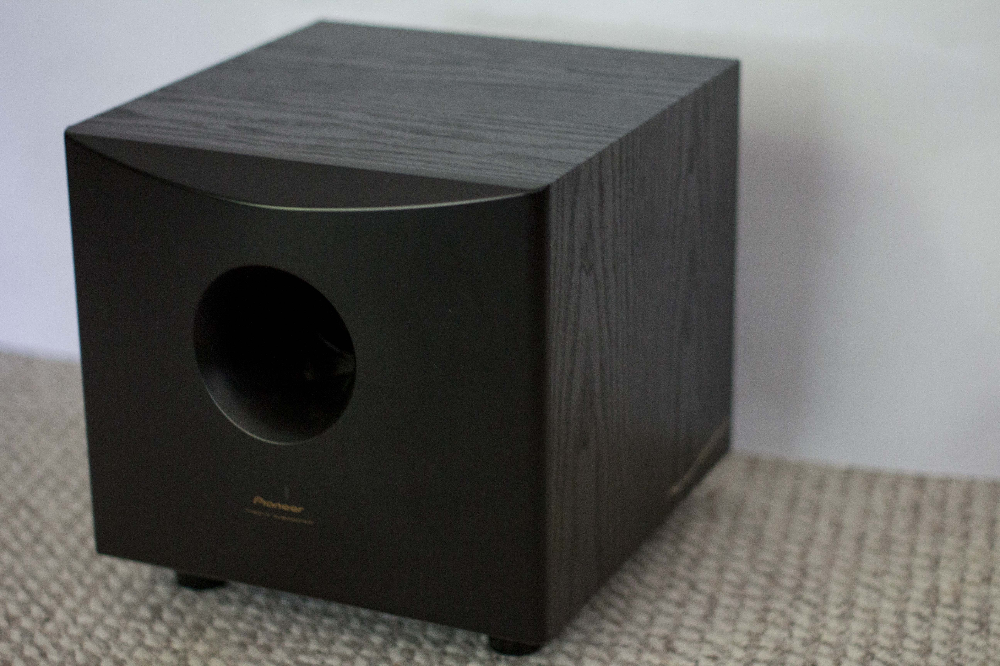
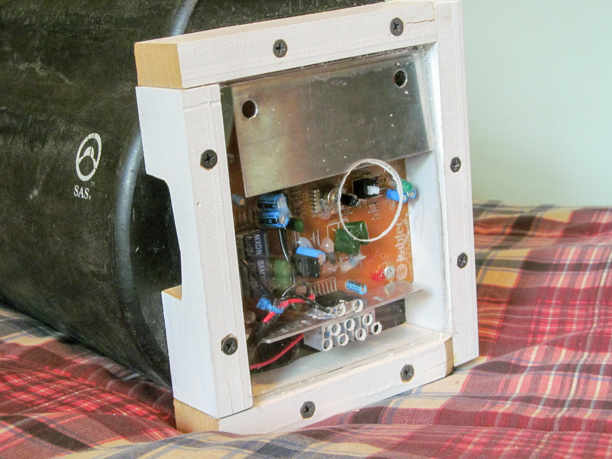

I have a thing for subwoofers, convenience, and low cost. Arguing over DVCs in $300 subs isn't my thing.

This 8-inch tube subwoofer was $1 a garage sale.

Tube subs are popular for their size and portability, you can set it in a car trunk or behind a truck seat with no thought or effort. The enclosure is plastic so they are lightweight. To reclaim trunk space, pull it out.

 

 

I picked up a 45W RMS powered sub from Goodwill for $5. The amplifier inside runs off 12-18V. This means it can be powered from 2 very common sources:

  * an old laptop charger
  * a car

 

 

 

I removed the amp out of the powered sub, screwed it into the back of the tube, surrounded it with wood, and covered it in plexiglass.

I use this subwoofer all the time, normally it is in my car. Since there are [only two cables leading to it](</blog/mazda2-subwoofer/>), I can pull it out quickly.

This is the most convenient and versatile subwoofer I have ever used (certainly not the loudest!). First, it's lightweight; I can carry it with one hand. Second, it's durable; I've dropped it a few times, played it outside, in cold weather, and in the snow. Third, I don't feel bad mistreating a sub that costs $6. And most importantly, it makes a nice seat.
