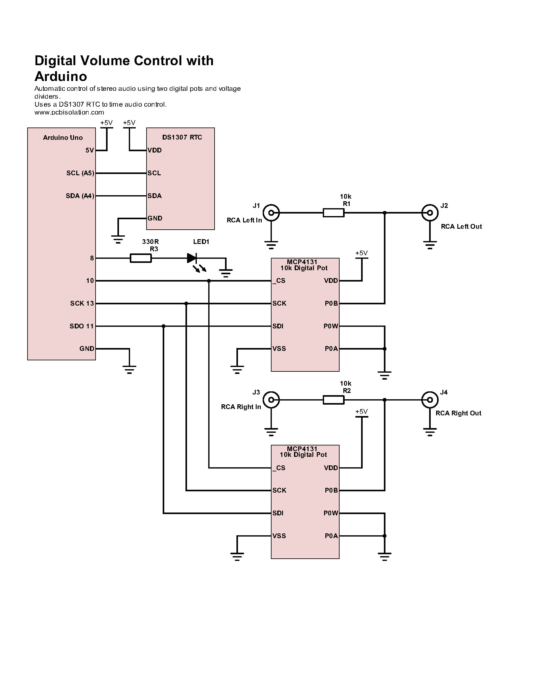
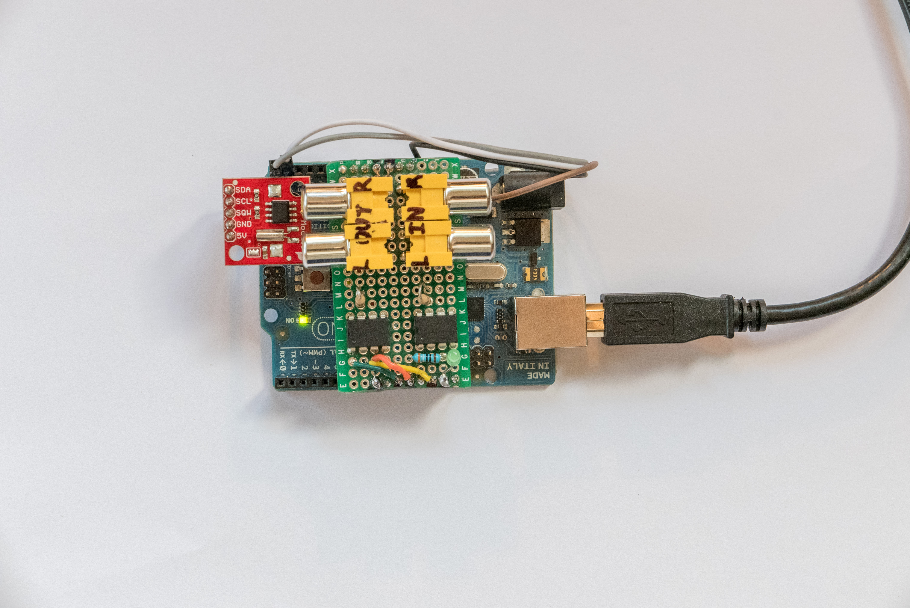
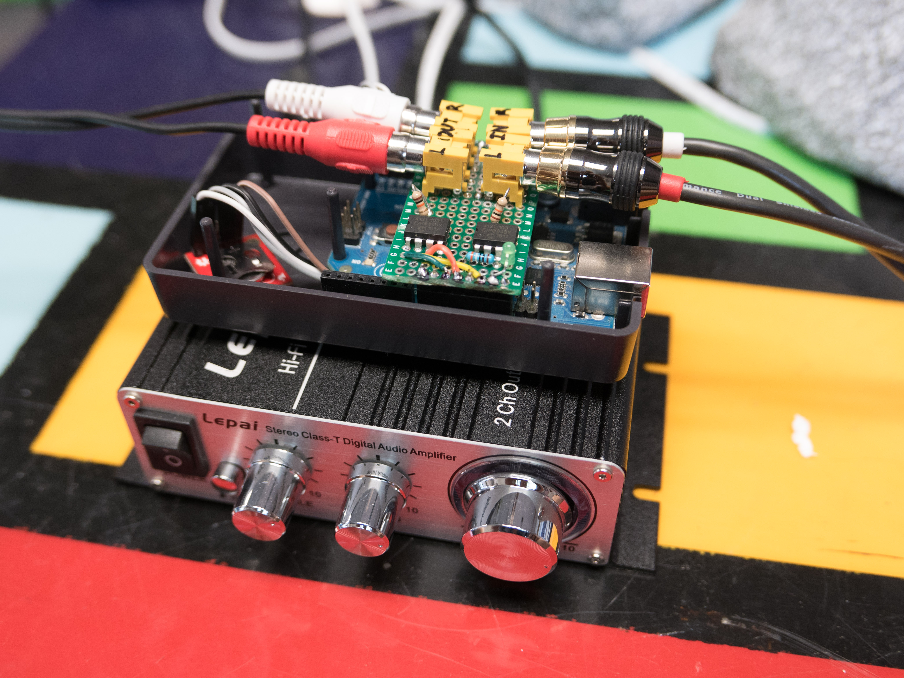

This was for a pair of outdoor speakers in front of KMNR, my college radio station. KMNR was receiving complaints for having the music too loud at night.

An Arduino checks clock and adjusts volume using digital potentiometers This post is a walkthrough of the design and implementation.

## Design

I interfaced an Arduino with a RTC (real time clock) to get the time. The RTC is Maxim's DS1307 and it should last 17 years on it's backup battery. It communicates over I2C and you can find already written code [here](<https://www.sparkfun.com/products/12708>).

To control the volume, I use a resistor and potentiometer to form a voltage divider. Both are 10k, so the audio output can be anywhere between 0% and 50% of the original input.

The potentiometers are Microchip's [MCP4131](<http://ww1.microchip.com/downloads/en/DeviceDoc/22060b.pdf>), which are adjusted digitally over SPI. It has 128 discrete values of resistance. The MCP4131 multiplexes SDI and SDO, but you shouldn't ever have to read data out of the pot, you can ignore SDO. I had no problem controlling both pots via SPI at the same time.

I also added a status LED to indicate when the audio was being attenuated.

 

## Implementation

_Bottom Board - Arduino Uno, Red Board - RTC, Green Board - Audio Control Circuit_

 

_Board mounted on a Lepai amp_

 

 

## Code

Ok, here's where it gets ugly. The RTC doesn't keep track of daylight savings, because it varies based on your location and government.

### Sound Control
    
    
    /*
    * @name: SoundControl
    * @auth: John Kovacs
    * @date: 9 September 2016
    *
    * This program is used to control the outdoor speakers of KMNR.
    * From 10a to 8p, we run the speakers at full volume.
    *
    * Past 8p, we attenuate the signal using a voltage divider. One of the
    * resistors is a digital potentiometer controlled via SPI.
    *
    * We use the ds1307 RTC to get time and date. Battery should last at least 17 years.
    * The ds1307 communicates over I2C.
    *
    * The Status LED indicates when the device is running at full volume.
    *
    */
    
    #include
    #include
    
    byte clockAddress = 0x68; // I2C address for RTC
    byte potAddress = 0x00; // SPI address for pots
    
    byte CS = 10; // chip select, active low
    byte STATUS_LED = 8;
    
    byte HIGH_OUT = 100; // high resistance value (10k ohms / 128 )
    byte LOW_OUT = 10; // low resistance value
    
    byte second, minute, hour, dayOfWeek, dayOfMonth, month, year;
    
    ////////////////////////////////////////////////////////////////////
    // @name: bcdToDec()
    // @desc: Convert binary coded decimal to normal decimal numbers
    ////////////////////////////////////////////////////////////////////
    byte bcdToDec(byte val)
    {
    return ( (val/16*10) + (val%16) );
    }
    
    ////////////////////////////////////////////////////////////////////
    // @name: getDateDs1307()
    // @desc: Gets the date and time from the ds1307 and stores it
    // to global variables
    ////////////////////////////////////////////////////////////////////
    void getDateDs1307() {
    // Reset the register pointer
    Wire.beginTransmission(clockAddress);
    Wire.write(byte(0x00));
    Wire.endTransmission();
    
    Wire.requestFrom(int(clockAddress), 7);
    
    // A few of these need masks because certain bits are control bits
    second = bcdToDec(Wire.read() &amp; 0x7f);
    minute = bcdToDec(Wire.read());
    
    // Need to change this if 12 hour am/pm
    hour = bcdToDec(Wire.read() &amp; 0x3f);
    dayOfWeek = bcdToDec(Wire.read());
    dayOfMonth = bcdToDec(Wire.read());
    month = bcdToDec(Wire.read());
    year = bcdToDec(Wire.read());
    
    }
    
    ////////////////////////////////////////////////////////////////////
    // @name: digitalPotWrite()
    // @desc: sends a byte value to the 10kohm pots
    // 0 = 0 ohms, 128 = 10k ohms
    ////////////////////////////////////////////////////////////////////
    int digitalPotWrite(byte value)
    {
    digitalWrite(CS, LOW);
    SPI.transfer(potAddress);
    SPI.transfer(value);
    digitalWrite(CS, HIGH);
    }
    
    ////////////////////////////////////////////////////////////////////
    // @name: setup()
    // @desc: runs once at startup
    ////////////////////////////////////////////////////////////////////
    void setup() {
    pinMode(STATUS_LED, OUTPUT);
    pinMode(CS, OUTPUT);
    Wire.begin();
    SPI.begin();
    }
    
    ////////////////////////////////////////////////////////////////////
    // @name: loop()
    // @desc: runs continously
    ////////////////////////////////////////////////////////////////////
    void loop() {
    
    getDateDs1307();
    
    // if time is past the start time and before the end time
    if( hour &gt;= 10 &amp; hour &lt; 20 ) {
    digitalPotWrite(HIGH_OUT); // then turn up the volume!
    digitalWrite(STATUS_LED, HIGH);
    }
    else {
    digitalPotWrite(LOW_OUT); // else, turn down the volume
    digitalWrite(STATUS_LED, LOW);
    }
    
    delay(300000); // run every 5 minutes
    }
    
    

### Sound Control with Daylights Savings Time
    
    
    
    /*
    * @name: SoundControlDST
    * @auth: John Kovacs
    * @date: 9 September 2016
    *
    * This program is used to control the outdoor speakers of KMNR.
    * From 10a to 8p, we run the speakers at full volume.
    *
    * Past 8p, we attenuate the signal using a voltage divider. One of the
    * resistors is a digital potentiometer controlled via SPI.
    *
    * We use the ds1307 RTC to get time and date. Battery should last at least 17 years.
    * The ds1307 communicates over I2C.
    *
    * The Status LED indicates when the device is running at full volume.
    *
    *
    * DAYLIGHT SAVINGS
    * -------------------------------------
    * The RTC does not track daylight savings. Government and location affect this
    * too much, so it is too difficult to implement.
    *
    * In the spring, an hour is gained. It happens on the second sunday of march.
    * Thus the spring change will occur between 3/8 and 3/14, regardless of the year.
    *
    * In the fall, hour is lost. It happens on the first sunday on november.
    * And the fall change will occur between 11/1 and 11/7, regardless of the year.
    *
    * We set this up in September, so we are in daylight savings. Ho hum.
    *
    * When daylight savings end (winter months), we will subtract an hour from our time
    *
    * Because we don't want to turn on daylight savings to early or too late, Craig and I
    * devised an overly complicated set of rules to change the times of the sound control.
    *
    * Here's how it works:
    * Between the dates 11/7 and 3/8, we subtract an hour from the start time.
    * Between the dates 11/1 and 3/14, we subtract an hour from the end time.
    *
    * So it doesn't make sense. Sue me. We're pretty sure this is the most surefire way
    * to maximize the amount of time we blast KMNR.
    *
    * The speakers should turn on at 10am and off at 8p. Exception - during the transition
    * periods 11/1 to 11/7 and 3/8 to 3/14, that won't be true.
    *
    */
    
    #include
    #include
    
    byte clockAddress = 0x68; // I2C address for RTC
    byte potAddress = 0x00; // SPI address for pots
    
    byte CS = 10; // chip select, active low
    byte STATUS_LED = 8;
    
    byte HIGH_OUT = 100; // high resistance value (10k ohms / 128 )
    byte LOW_OUT = 10; // low resistance value
    
    byte second, minute, hour, dayOfWeek, dayOfMonth, month, year;
    
    ////////////////////////////////////////////////////////////////////
    // @name: bcdToDec()
    // @desc: Convert binary coded decimal to normal decimal numbers
    ////////////////////////////////////////////////////////////////////
    byte bcdToDec(byte val)
    {
    return ( (val/16*10) + (val%16) );
    }
    
    ////////////////////////////////////////////////////////////////////
    // @name: subtractBeg()
    // @desc: determines if we should subtract an hour from the
    // start of when the audio goes full volume
    // @retn: true, if an hour should be subtracted
    ////////////////////////////////////////////////////////////////////
    bool subtractBeg()
    {
    // if you are between 11/7 and 3/8
    if( (month == 11 &amp; dayOfMonth &gt;= 7 ) |
    (month == 12) |
    (month == 1) |
    (month == 2) |
    (month == 3 &amp; dayOfMonth &lt;=8 ) )
    {
    // then subtract an hour from the beginning of the day
    return true;
    }
    
    // else you are between 3/9 and 11/6, so do not subtract an hour
    return false;
    
    }
    
    ////////////////////////////////////////////////////////////////////
    // @name: subtractEnd()
    // @desc: determines if we should subtract an hour from the
    // end of when the audio goes full volume
    // @retn: true, if an hour should be subtracted
    ////////////////////////////////////////////////////////////////////
    bool subtractEnd()
    {
    // if you are between 11/1 and 3/14
    if( (month == 11) |
    (month == 12) |
    (month == 1) |
    (month == 2) |
    (month == 3 &amp; dayOfMonth &lt;=14 ) ) { // then subtract an hour from the end of the day return true; } // else you are between 3/15 and 10/31, so do not subtract an hour return false; } //////////////////////////////////////////////////////////////////// // @name: getDateDs1307() // @desc: Gets the date and time from the ds1307 and stores it // to global variables //////////////////////////////////////////////////////////////////// void getDateDs1307() { // Reset the register pointer Wire.beginTransmission(clockAddress); Wire.write(byte(0x00)); Wire.endTransmission(); Wire.requestFrom(int(clockAddress), 7); // A few of these need masks because certain bits are control bits second = bcdToDec(Wire.read() &amp; 0x7f); minute = bcdToDec(Wire.read()); // Need to change this if 12 hour am/pm hour = bcdToDec(Wire.read() &amp; 0x3f); dayOfWeek = bcdToDec(Wire.read()); dayOfMonth = bcdToDec(Wire.read()); month = bcdToDec(Wire.read()); year = bcdToDec(Wire.read()); } //////////////////////////////////////////////////////////////////// // @name: digitalPotWrite() // @desc: sends a byte value to the 10kohm pots // 0 = 0 ohms, 128 = 10k ohms //////////////////////////////////////////////////////////////////// int digitalPotWrite(byte value) { digitalWrite(CS, LOW); SPI.transfer(potAddress); SPI.transfer(value); digitalWrite(CS, HIGH); } //////////////////////////////////////////////////////////////////// // @name: setup() // @desc: runs once at startup //////////////////////////////////////////////////////////////////// void setup() { pinMode(STATUS_LED, OUTPUT); pinMode(CS, OUTPUT); Wire.begin(); SPI.begin(); } //////////////////////////////////////////////////////////////////// // @name: loop() // @desc: runs continously //////////////////////////////////////////////////////////////////// void loop() { getDateDs1307(); // if time is past the start time and before the end time if( hour &gt;= 10 - subtractBeg() &amp; hour &lt; 20 - subtractEnd() ) {
    digitalPotWrite(HIGH_OUT); // then turn up the volume!
    digitalWrite(STATUS_LED, HIGH);
    }
    else {
    digitalPotWrite(LOW_OUT); // else, turn down the volume
    digitalWrite(STATUS_LED, LOW);
    }
    
    delay(300000);
    }
    
