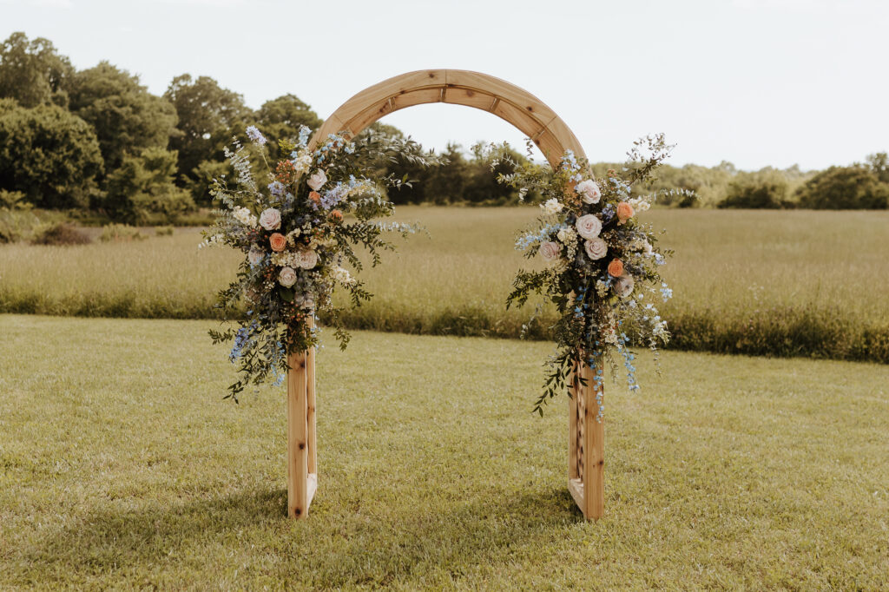
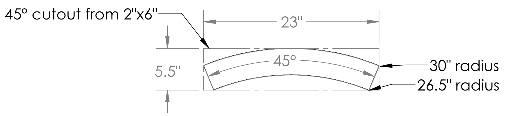
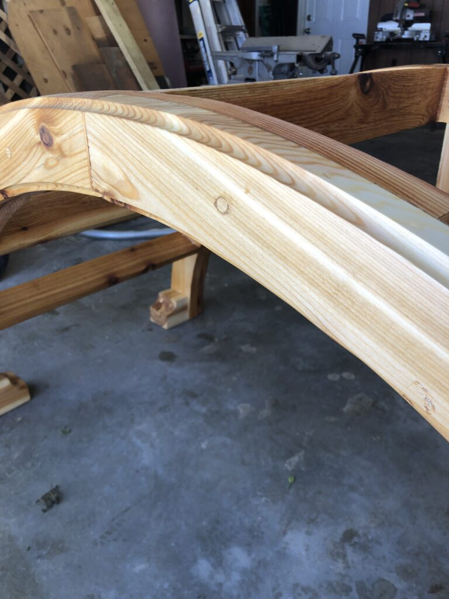
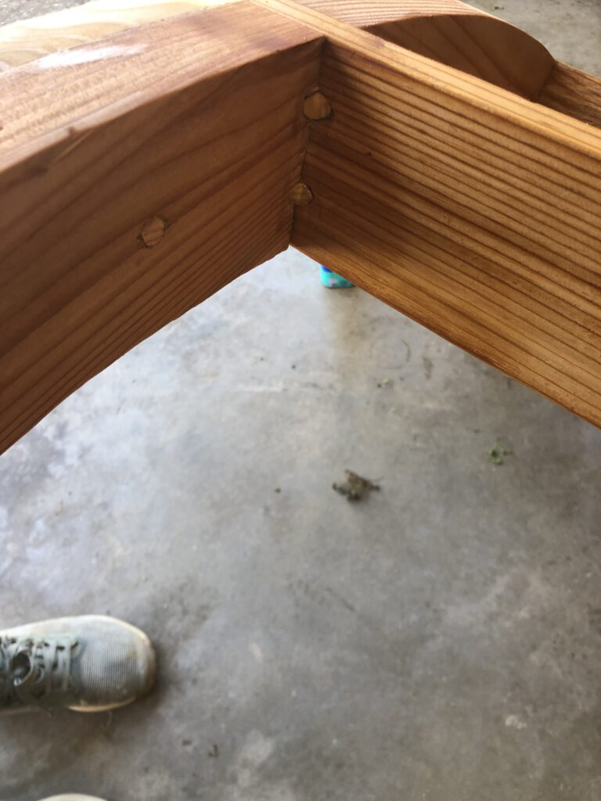
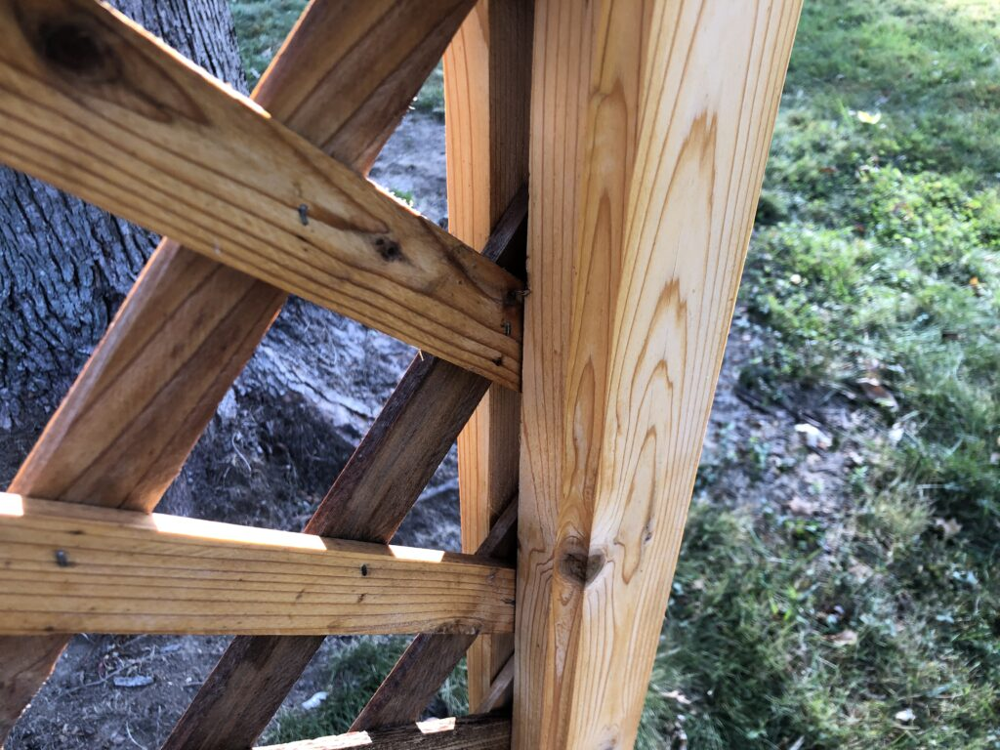
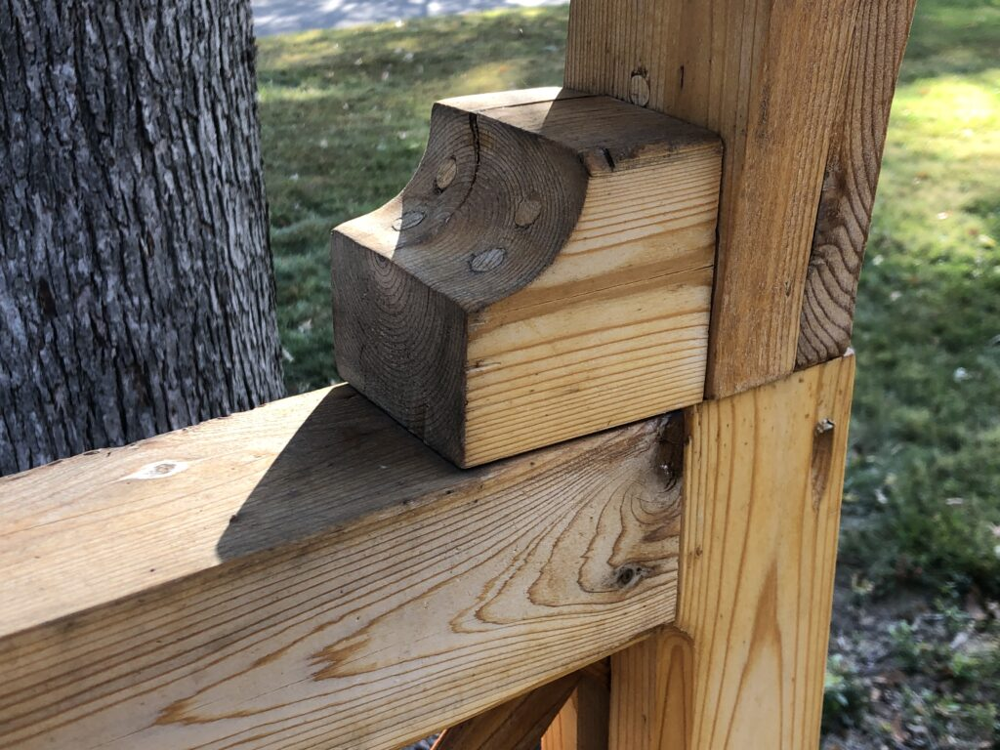
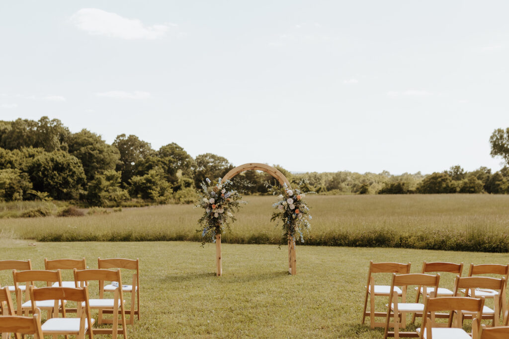
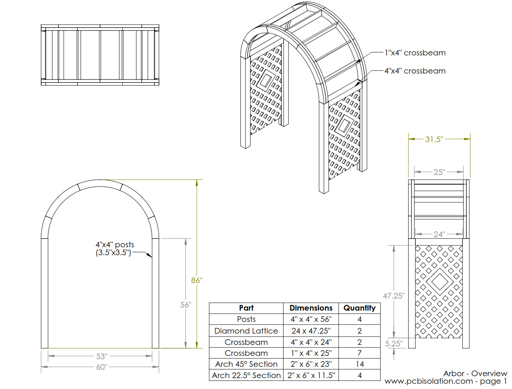
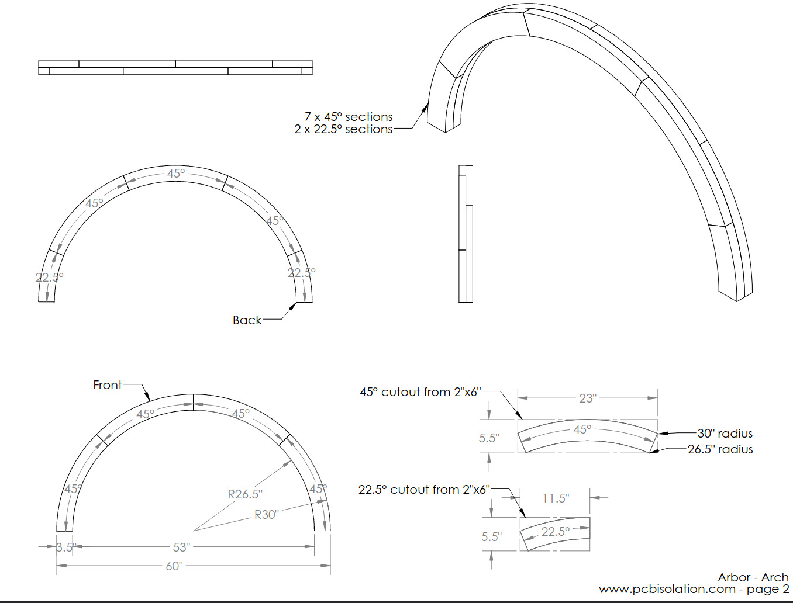

This post contains plans for a wooden arbor or archway for a garden or wedding.

I used cedar for this arbor. The total cost was about $200. You can find the plans at the bottom of this post. Otherwise, read on for some notes and details about the process.

## Building the arbor

The curved section is the most challenging part of the design. There are 3 approaches:

#### Option 1 - Steam forming/bending

This involves heating and steaming wood, then bending it into the right shape. I chose not to do this because of a lack of experience and equipment.

#### Option 2 - Cutting a single piece from plywood

This will give the best looking and strongest arch, because the arch will be from a single piece of engineered material. If you are going to paint your arbor, this could be a good option. 

#### Option 3 - Adding overlapping sections of small arcs

This process involves cutting out small sections of the arch from a straight piece of wood, then overlapping them to form the entire arch.

I think this is the best choice when using cedar, since it can be done affordably with 2×6's. It requires 30 linear feet of cutting. Since cedar is soft, you can cut it with a jigsaw (that's what I used). If you'll be using a hardwood like oak, a bandsaw would be needed.

I calculated using 2×8's, 2×10's, and 2×12's. These wider pieces of lumber can make longer sections of the arch (e.g. using a 2×8 will make a 60 degree section). However, the 2×6's end up being the most affordable size and waste the least amount of material.

I used a router with a cove bit add detail to the all the edges (see above).

To connect the 1×4's to the arch (see above), I cut out grooves in the arch and inserted the 1×4's. Then I secured them with decking screws and covered them with wood plugs.

Cedar diamond lattice can be purchased in 4'x8′ sheets at most hardware or landscaping stores. I routed out a 1″ deep groove to fit the lattice (see above). 

I used extra pieces of 4×4's as braces to secure the legs to the arch (see above).

To finish the arbor, I used boiled linseed oil.

## Plans

The plans below are available as a JPG, PDF, Solidworks drawings, or STL files:

[arbor-plans](<arbor-plans.pdf>)[Download](<arbor-plans.pdf>)

 

[Solidworks drawings - direct download (zip file)](<arbor-plans-solidworks.zip>)[Download](<arbor-plans-solidworks.zip>)

[Solidworks drawings - Google Drive link (zip file)](<https://drive.google.com/file/d/1IEzNxmPd5hLp9MpFFktD-5XdBTWabFxC/view?usp=sharing>)

[STL files - direct download (zip file)](<wedding-arbor-stl.zip>)[Download](<wedding-arbor-stl.zip>)

[STL files - Google Drive link (zip file)](<https://drive.google.com/file/d/1AZE1EUtyDdWoscQgax_S7PeWf1zMUy7U/view?usp=sharing>)
