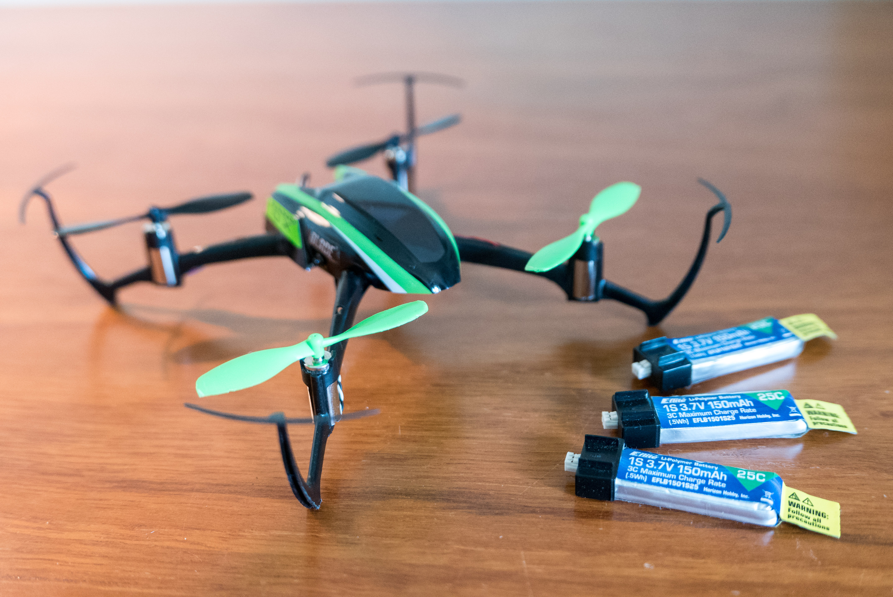
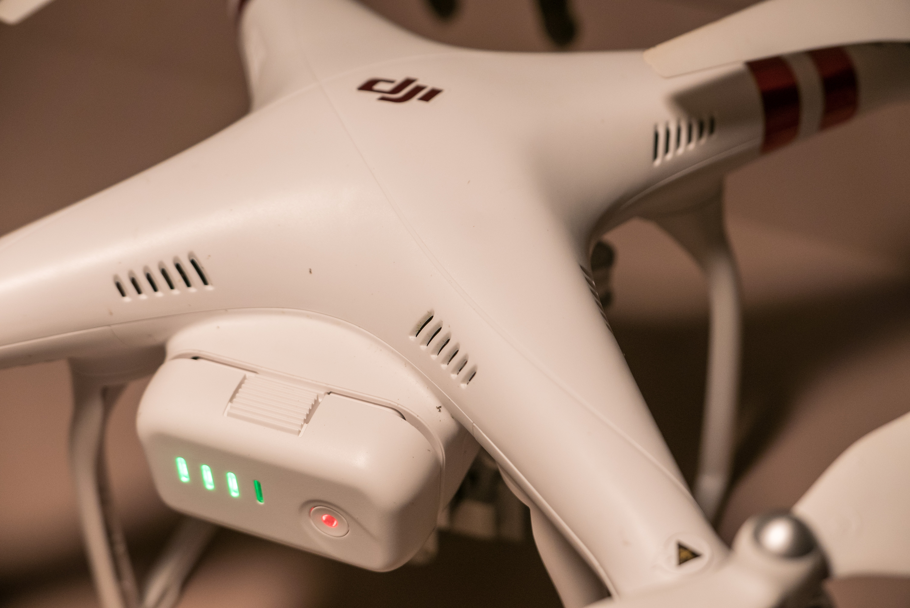

I could have gone from 1,000 crashes to 100 crashes with a few simple pointers.

There are two big reasons why you are crashing. This is for the pilots who moving from beginner and intermediate.

## Reason 1 - Your Brain

Imagine flying a microquad in a gymnasium. You can practice a banked turn and go wildly off target without crashing. Then you bring it back toward you and try again.

Now imagine flying in your living room. You try a banked turn, using half the room to gain speed. You aren't turning sharp enough. How do you avoid the wall? More thrust? Less elevator?  _BAM!_ You hit the freaking wall.

For any learned skill, people follow the same [path toward mastery](<http://www.davidmansaray.com/becoming-an-expert>). At first, 100% of your conscious effort goes towards turning the quad. As you practice, it becomes less and less of a conscious effort. The best quad fliers in the world can do banked turns without thinking.

You spend 100% of your mental effort on the banked turn and realize you are approaching the wall. It takes another 50% of mental effort to avoid the wall. Unless you are on some [amazing drugs](<http://www.imdb.com/title/tt1219289/>), you can't expend 150% of your mental power, so you crash. Worse, you don't learn much about banked turns.

Here's what I suggest. Find somewhere big to practice, so you don't have to think about obstacle avoidance. Microquads do well outdoors, provided there is no wind. In the midwest, dawn and dusk are often windless.

## Reason 2 - Speed

This is something I wish I would have known. I spent two months with a [Blade Nano QX](<https://www.amazon.com/BLADE-Nano-QX-RTF-Quadcopter/dp/B00SNEJA92/ref=sr_1_3?s=toys-and-games&ie=UTF8&qid=1469195993&sr=1-3>). I was getting progressively better then hit a figurative wall. I started crashing more and more.

I had a need for speed. I became overconfident and had the Blade running full speed the entire flight. Great pilots can do this, but I wasn't there.

Flying at 3/4 or even 1/2 speed gives you much more maneuverability. If you are turning at half speed and you are little wide, no problem. Add extra rudder and throttle, maybe more pitch, and you can tighten it to what you intended.

If you are turning at full speed and you are a little wide, well…tough luck. Your options are to slow down, lose momentum, or to crash into a wall.

Here's my second suggestion. If you are practicing turns and figure 8's, slow down.

 
