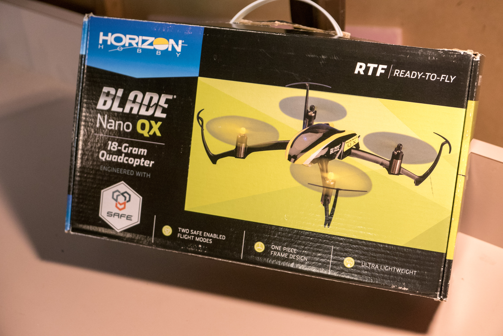
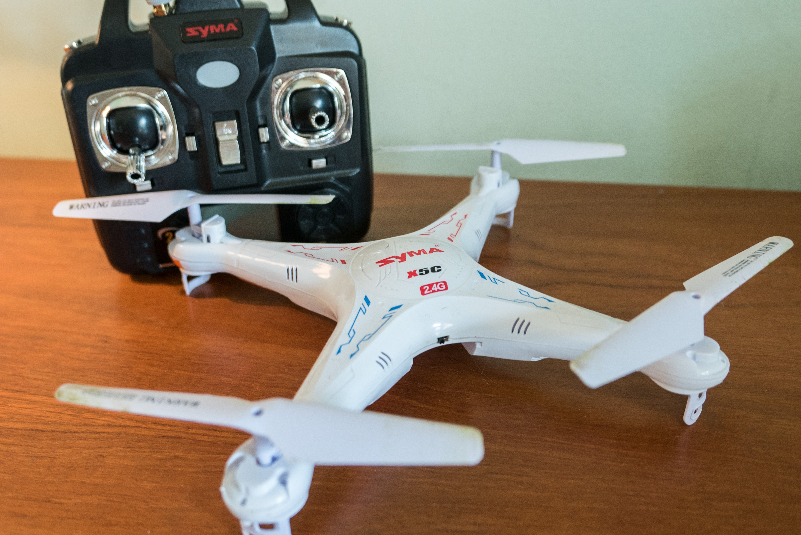

The same scene plays out everytime I see someone fly a quadcopter indoors… They lift it off the ground, hover for a few seconds, move back and forth, then a spectator roars.

"_Land it in my hands!_ "

This is not easy. First, it is a not simple to hold a microquad in one position for 5-10 seconds as you lower into someone's hand. Second, hands are small - much smaller than the floor. Third, you get some [Ground Effect](<http://www.rchelicopterfun.com/ground-effect.html>) and maybe [Vortex Ring State](<http://quadcopter101.blogspot.com/2014/10/vortex-ring-state-wobble-of-death.html>) from hitting your own [prop wash](<https://www.reddit.com/r/Multicopter/comments/1ud0be/can_you_school_me_on_prop_wash/>); all make holding a precise position that much harder. Fourth, if you bought a microquad, the motors heat up and slow down mid-flight - throwing off the trim you wasted an entire battery perfecting.

You struggle with the landing, whether it is a pair of hands or a coffee table. How discouraging. Why is landing so hard? Isn't takeoff and landing the first and the easiest things you should learn?

 

No. I argue that this skill is secondary.

Quit hovering 4 inches above the floor. Take off quickly and get _in_ the air.

You know what's more important? Hovering. Maintaining a position in midair. If you can't hover, you'll _can 't _land.

Struggling with hovering? That's ok. Check out my [article on hovering](</blog/hovering-a-quad-is-really-difficult/>).
